# CrossPilot 当前系统审查唯一入口基线
## CURRENT_SYSTEM_AUDIT_BASELINE.md

> **权威声明**：
> 本文档是后续所有 AI 助手（Claude Code / Codex / Cursor / Antigravity / Qoder）及研发团队在审查、审计、测试或优化 CrossPilot 时**必须首先阅读的唯一入口基线**。
> 任何代码审查、Bug 判定、UX 优化与重构方案，**若违背本文档所确立的不变量、已知差距判定与冻结边界，均视为无效产出**。
>
> - 文档层级：**LEVEL 1 — CURRENT SOURCE OF TRUTH**
> - 上位权威：[`HANDOFF.md`](file:///E:/AiSecondBrain/HANDOFF.md)
> - 体系指引：[`docs/00_governance/DOCUMENT_AUTHORITY_MAP.md`](file:///E:/AiSecondBrain/vault/Work/Projects/CrossPilot/docs/00_governance/DOCUMENT_AUTHORITY_MAP.md)
> - 能力判定：[`docs/00_governance/V9_PRODUCT_CAPABILITY_MATRIX.md`](file:///E:/AiSecondBrain/vault/Work/Projects/CrossPilot/docs/00_governance/V9_PRODUCT_CAPABILITY_MATRIX.md)
> - 架构基线：[`docs/00_governance/POST_V9_PRODUCT_REVIEW.md`](file:///E:/AiSecondBrain/vault/Work/Projects/CrossPilot/docs/00_governance/POST_V9_PRODUCT_REVIEW.md)

---

## 1. 当前版本与生命周期状态 (Current Version & Status)

```text
┌────────────────────────────────────────────────────────────────────────┐
│ Current Release:        CrossPilot V9.1                                │
│ Release Status:         RELEASE VERIFIED & FROZEN                      │
│ Final Browser Acceptance: PASSED                                       │
│ Release Decision:       FROZEN                                         │
│ Tag:                    v9.1.0 → b3d5607                               │
├─────────────────────────┬──────────────────────────────────────────────┤
│ Epic 1                  │ FROZEN (LLM Runtime)                         │
│ Epic 2                  │ FROZEN (Milvus RAG)                          │
│ Epic 3                  │ FROZEN (Daily Operations)                    │
│ Epic 4                  │ SUSPENDED / NOT STARTED                      │
│ V9.2                    │ NOT STARTED                                  │
├─────────────────────────┼──────────────────────────────────────────────┤
│ V9.1 主体 commit        │ c4704fd                                      │
│ Acceptance app SHA      │ 7c81411                                      │
│ Release docs baseline   │ b3d5607                                      │
├─────────────────────────┼──────────────────────────────────────────────┤
│ V9.1 Phase 1            │ P0/P1 Production Bug Fix — VERIFIED          │
│ V9.1 Phase 2            │ Stability Fix — VERIFIED                     │
│ V9.1 Phase 2.1          │ Persistent Idempotency — VERIFIED            │
│ V9.1 Phase 2.2          │ XYDC 5151 vs 5147 — VERIFIED (not a bug)     │
│ V9.1 Phase 3            │ UX / Governance Polish — VERIFIED            │
│ V9.1 Final Acceptance   │ PASSED                                       │
│ V9.1 Freeze             │ RELEASE VERIFIED & FROZEN                    │
├─────────────────────────┼──────────────────────────────────────────────┤
│ Next Planned Epic (E4)  │ Real Store Data Foundation & Morning Ops     │
│ Epic 4 Status           │ SUSPENDED / NOT STARTED                      │
└─────────────────────────┴──────────────────────────────────────────────┘
```

权威冻结声明：[`docs/00_governance/V9_1_RELEASE_FREEZE.md`](./V9_1_RELEASE_FREEZE.md)。  
`Deployed application SHA during final acceptance: 7c81411`。`Release documentation baseline: b3d5607`。两者不得混写。

---

## 2. 当前系统全景架构 (Current Product Architecture)

CrossPilot 采用**确定性业务底座 + 受控工作流编排 + 人机协同审批台**的混合分层架构：

```mermaid
flowchart TD
    subgraph UX_FACADE["1. 角色工作台与前端展现层 (Next.js 14 App Router)"]
        W_Ops["Operations Today 工作台 (/app/operations/today)"]
        W_Listing["Listing Studio 工作台 (/app/listings)"]
        W_Research["Market & Product Research (/app/market-research)"]
        W_Profit["Profit Center & Waterfall (/app/profit)"]
        W_Core["Orders / Inventory / Suppliers (/app/orders, etc.)"]
    end

    subgraph API_GATEWAY["2. API 网关与统一工具平台 (NestJS 10)"]
        GW_REST["REST Controllers (20 文件 / 21 @Controller，含 Demo；全局 JWT + WorkspaceGuard APP_GUARD)"]
        GW_SSE["Server-Sent Events 实时观察通道 (/events 与 agent-tasks/stream)"]
        GW_Tools["Tool Platform (28 个一等公民工具，createDefaultToolRegistry)"]
    end

    subgraph WORKFLOW_DAG["3. 核心业务工作流 (Domain Workflows)"]
        WF05_DAG["WF-05: Daily Operation Workflow (9-Step DAG)"]
        WF02_DAG["WF-02: Listing Generation DAG (14-Step DAG)"]
        WF01_FLOW["WF-01: Market Research Pipeline (Frozen)"]
    end

    subgraph DETERMINISTIC_SERVICES["4. 确定性计算与证据门禁 (Deterministic Core)"]
        D_360["Sku360ContextLoader (跨域数据水合)"]
        D_Detect["OperationAnomalyDetector (11 项异常门禁)"]
        D_Diag["CrossDomainDiagnosisService (跨域因果诊断)"]
        D_Action["ActionRecommendationService (确定性打分)"]
        D_Variance["VarianceAttributionService (五大杠杆残差恒为0)"]
        D_Planning["InventoryPlanningService (ADS / 安全库存)"]
        D_Compliance["ComplianceJudgeService (Amazon Policy 拦截)"]
    end

    subgraph PERSISTENCE_RELIABILITY["5. 持久化与事务底座 (PostgreSQL 16 + Milvus 2.4)"]
        DB_PG["PostgreSQL (Prisma 34 实体模型)"]
        DB_Checkpoints["PostgresWorkflowCheckpointStore (OCC 版本并发控制)"]
        DB_Milvus["Milvus 2.4 Standalone (三层合规知识向量检索)"]
    end

    UX_FACADE --> API_GATEWAY
    API_GATEWAY --> WORKFLOW_DAG
    WORKFLOW_DAG --> DETERMINISTIC_SERVICES
    DETERMINISTIC_SERVICES --> PERSISTENCE_RELIABILITY
```



> **核心原则：`Role Workspace ≠ Agent`**
> 四大工作入口（选品研发、日常运营、供应链采销、财务经营）是**前端聚合视图与工作台交互入口 (UX Facade)**，底层 100% 共享相同的数据模型、确定性计算逻辑与工具；**坚决禁止重构为“4 个相互对话的自治大模型 Agent”**。

---

## 3. 五大核心工作流现状与成熟度 (Core Workflows)

必须以 [`docs/00_governance/POST_V9_PRODUCT_REVIEW.md`](file:///E:/AiSecondBrain/vault/Work/Projects/CrossPilot/docs/00_governance/POST_V9_PRODUCT_REVIEW.md) 的事实评级为准。**禁止将 `PARTIAL` 状态误报为当前 Bug**：

| 工作流编号 | 工作流名称 | 当前成熟度 | 核心技术事实 | 明确判定 |
| :--- | :--- | :---: | :--- | :--- |
| **WF-01** | Market $\rightarrow$ VOC $\rightarrow$ Opportunity | **`USABLE`** | XYDC 真实 MCP（45 工具）+ Firecrawl 真实外部原声；`OpportunityScoreEngine` 确定性公式；`EvidenceGate` 强校验；已在 `PRODUCT_RESEARCH_V1_BASELINE.md` 冻结。 | **可用且已冻结**，非 Bug。 |
| **WF-02** | Product $\rightarrow$ Listing $\rightarrow$ Compliance | **`USABLE`** | 14 步内存 DAG；Step 8 真实 Milvus 检索；Step 9 真实 LLM 生成；Claim 逐字 Grounding & Repair；`ComplianceJudgeService` 规则合规；发布环节为受控 Mock。 | **生成可用，无真实 SP-API 刊登属于已知差距**，非 Bug。 |
| **WF-03** | Inventory $\rightarrow$ Reorder $\rightarrow$ Purchase | **`PARTIAL`** | `InventoryPlanningService` 精确计算 ADS 与建议补货量；`PurchaseOrderStateMachine` 具备事务落盘与原子入库。无独立工作流编排与 1688 ERP 对接。 | **属于已知规划差距**，非 Bug。 |
| **WF-04** | Profit $\rightarrow$ Attribution $\rightarrow$ Analyst | **`PARTIAL`** | `VarianceAttributionService` 5 大杠杆残差恒为 0；`AnalystService` 拥有 5 个数据库对账工具；对话生成为字符串模版插值，未接入多轮 LLM Agent。 | **底层账目真实，对话层简易属于已知差距**，非 Bug。 |
| **WF-05** | Daily Operation Diagnosis | **`MATURE`** | 9 步固定 DAG、Sku360 水合、11 项异常门禁、跨域因果诊断、优先级推荐打分、Postgres 检查点持久化、原子 OCC 并发控制、REST/SSE、Operations Today 工作台。 | **生产级闭环（受控无外部执行）**。 |

---

## 4. 已冻结架构资产 (Frozen Architecture)

以下模块在 Epic 3 Phase 9 中已通过端到端验收并完成文档冻结。**除非发现明确的 P0 级资损、数据损坏、安全漏洞或回归，否则禁止随意修改或重构**：

```text
[FROZEN ASSETS]
├── 1. packages/domain/src/operations/context/sku360-context.loader.ts
├── 2. packages/domain/src/operations/detection/operation-anomaly.detector.ts
├── 3. packages/domain/src/operations/diagnosis/cross-domain-diagnosis.service.ts
├── 4. packages/domain/src/operations/recommendation/action-recommendation.service.ts
├── 5. packages/domain/src/operations/workflow/daily-operation.workflow.ts
├── 6. packages/domain/src/operations/workflow/postgres-workflow-checkpoint.store.ts
├── 7. packages/domain/src/operations/workflow/prisma-workflow-database.adapter.ts
├── 8. packages/domain/src/operations/workflow/sensitive-data.guard.ts
├── 9. apps/api/src/modules/daily-diagnosis/ (Controller, Service, SSE Stream)
├── 10. packages/tool-platform/src/tools/operation-daily-diagnosis.tools.ts
└── 11. apps/web/src/app/app/operations/today/ (Operations Today 核心业务逻辑与审批流程)
```

---

## 5. 架构级铁律不变量 (Architectural Invariants)

在对 CrossPilot 进行任何代码审查和缺陷修复时，**必须无条件遵守以下 11 项架构不变量**：

1. **`Load ≠ Detect ≠ Diagnose ≠ Recommend ≠ Execute`**：数据加载、异常检测、根因诊断、动作推荐、动作执行五权分立，各自保持独立接口，禁止越级混杂。
2. **`Workflow ≠ Business Logic`**：工作流（DAG）只负责拓扑编排、状态流转与检查点落盘；绝对禁止在工作流节点内编写复杂的数学计算或业务规则（委托给 Domain Services）。
3. **`Approval ≠ Execute`**：人工审批状态流转为 `APPROVED` 仅代表合规授权；系统绝不自动调用外部 Amazon SP-API、Ads API 或 ERP 产生写操作变动。
4. **`SSE ≠ Source of Truth`**：Server-Sent Events 仅作为前端 UI 的实时可视化瞬态观察通道；一切权威状态以 PostgreSQL 数据库持久化的任务快照为唯一真实源。
5. **`Postgres = Production Workflow Source of Truth`**：生产环境工作流检查点必须落库于 PostgreSQL，严禁降级为内存或本地文件，坚决抵御跨容器脑裂。
6. **`Priority ≠ Risk`**：业务紧迫度（P1/P2/P3）由确定性打分器计算；风险等级（LOW/MEDIUM/HIGH）由资金破坏力定义，两者独立判定。
7. **`Measured ≠ Estimated`**：已发生的实测财务损失（`MEASURED`，如已扣广告费）与预测性日均风险（`ESTIMATED`，如日均销售额）必须严格区分标识。
8. **`UI ≠ Business Logic`**：前端组件仅负责 DTO 渲染与交互收集；禁止在前端编写方差分解、补货计算或规则判定逻辑。
9. **`Tool ≠ Internal Service`**：Tool Platform 工具是面向 AI Copilot 与外部调用的轻量适配器，必须具备输入 Zod 校验与 `<4096B` 输出保护，不得取代内部领域服务。
10. **`Scheduler = Trigger, NOT Workflow`**：调度器（定时任务）仅作为触发器（调用 `startDiagnosis`），绝对禁止在调度器内部编写异常检测或诊断逻辑。
11. **`Role Workspace ≠ Agent`**：角色工作台是前端聚合视图与工作入口，绝不是后端 4 个 Autonomous Big Agents。

---

## 6. 已知系统差距 (Known Gaps — 严格禁止判定为 Bug)

以下系统现状为当前架构阶段的**已知预期局限（Known Limitations）或规划暂缓项**。在 V9.1 审查中**严禁将其标记为 Bug**：

| 已知差距项 (Known Gap) | 现状说明 | 为什么不是当前 Bug |
| :--- | :--- | :--- |
| **Epic 4 真实店铺数据接入** | 目前主要运行于 90 天 Scenario 模拟剧本（White/Green/Grey SKU） | **Epic 4 已明确暂缓 (SUSPENDED)**；当前没有真实 Amazon 店铺，不以模拟数据扩充此能力。 |
| **无 Amazon Ads 自动执行** | 否定词审查审批后，系统不向亚马逊下发 `POST /sp/negativeKeywords` | 严格遵守 **`Approval ≠ Execute`** 安全准则，避免未经授权的账户资损。 |
| **无 Amazon 价格与文案修改** | 调价建议与五点描述建议审批后，不自动调用 SP-API 改价或刊登 | 保护卖家店铺安全，当前设计即为“决策辅助与审批留痕”。 |
| **无 ERP 采购单外部推送** | 补货动作审批后，仅在系统内部生成 PO 记录，不下发工厂/1688 | 外部 ERP/供应链对接属于未来高级特性，当前内部状态流转已闭环。 |
| **WF-03 供应链工作流为 PARTIAL** | 缺乏独立的长链路 DAG 编排与供应商自动协同 | 底层计算服务完全正常，当前作为 WF-05 子服务调用，符合现阶段定位。 |
| **WF-04 经营分析师问答为 PARTIAL** | `askAnalyst` 采用模版插值而非动态 LLM 多轮工具调用 | 底层五大工具账目对账和方差归因 100% 真实，问答层简易属于已知演进项。 |
| **Launch Center 新品中心完全缺失** | 数据库仅有 `LaunchPlan` 占位，无页面与 API | 属于早期草案规划，已在 Post-V9 审查中定性为 `MISSING`，不影响现有功能。 |
| **Creative 素材工坊工具为 Mock** | 创意生图与切图工具返回固定 Unsplash 图片 | 核心电商与运营主干闭环优先，生图大模型对接已在早期定性为非阻塞项。 |
| **Scheduler 调度器缺失** | 无生产定时触发器调用 `startDiagnosis` | **MISSING**。不变量仍是 `Scheduler = Trigger, NOT Workflow`。不是 V9.1 Blocker。 |
| **Reviews / VOC Partial** | 退款流水真实；页面 VOC 痛点卡片硬编码 | 站内买家差评语义分析属于 Known Gap，不是 V9.1 Blocker。 |
| **独立 Knowledge Base 管理台缺失** | Milvus RAG 真实；Sidebar「架构」不是 KB 管理台 | **MISSING** 独立控制台。不影响 Listing Step 8 检索。 |
| **Agent Trace / Eval 独立大屏缺失** | 轨迹与评测脚本落库真实；无独立 APM / Eval Dashboard | **MISSING** 可视化大屏。不是 V9.1 Blocker。 |

---

## 7. 正式质量基线 (Current Quality Baseline)

从当前项目实际代码、测试运行结果与最新 Release 验收报告核验的**正式质量指标**：

```text
┌─────────────────────────────────────────────────────────────┐
│ Monorepo Quality Baseline (Phase 3 recorded; not re-run at Freeze) │
├────────────────────────────────────────┬────────────────────┤
│ TypeScript Typecheck (全 monorepo 10包) │ 10 / 10 PASS       │
│ API Jest                               │ 13 / 13 suites, 88 tests PASS │
│ Domain Jest                            │ 24 / 24 suites, 228 tests PASS │
│ Web contract tests                     │ 29 / 29 PASS       │
│ Evals (run-evals.cjs)                  │ 9 / 9 PASS         │
│ Next.js Web Production Build           │ 23 / 23 PASS       │
│ Integrations live review count         │ 5151 vs 5147 — Phase 2.2 TEST_SNAPSHOT_STALE │
│ Cross-Epic Regression (E1, E2, E3)     │ 0 (frozen algos untouched in V9.1 hotfixes) │
├────────────────────────────────────────┼────────────────────┤
│ Remote Runtime                         │ 116.198.230.217    │
│ Web                                    │ :2222              │
│ Acceptance application SHA             │ 7c81411            │
│ Health                                 │ 200                │
│ PostgreSQL / Redis / Milvus            │ UP                 │
│ Remote API Contract                    │ 26 / 26 PASS       │
│ Browser Acceptance                     │ PASSED             │
│ 本机 pnpm -r test                      │ NOT RUN            │
└────────────────────────────────────────┴────────────────────┘
```

---

## 8. 当前全站路由矩阵 (Current Web Routes Matrix)

基于 Next.js App Router 2026-09-12 Phase 3 源码扫描：`page.tsx` **21** 个 + 构建输出 **23/23**（含 `/_not-found`）。Sidebar 一级导航 **17** 条。SKU 360 不在一级导航，走 TopBar SKU 上下文。

| 序号 | 访问路径 (Route) | 页面源码路径 (Page File) | 所属模块 (Module) | 真实状态 | 主要 API 依赖 | 权限控制 | 页面已知状态与交互 |
| :---: | :--- | :--- | :--- | :---: | :--- | :--- | :--- |
| 1 | `/` | `apps/web/src/app/page.tsx` | 入口跳转 | **REAL** | 无 | 公开 | **不是营销页**。有 token → `/app/overview`，否则 → `/login` |
| 2 | `/login` | `apps/web/src/app/login/page.tsx` | 认证中心 | **REAL** | `POST /auth/login`, `/demo-login` | 公开 | 支持账号登录与一键 Demo 体验登录 |
| 3 | `/app/overview` | `apps/web/src/app/app/overview/page.tsx` | 经营概览大盘 | **REAL** | `GET /scenario/timeline`, `/scenario/daily`, `/analyst/waterfall` | JWT + Workspace | 90 天 KPI 来自 scenario；利润异动绑 waterfall 或标 Demo Scenario；禁止把 -$2,280 当实时账 |
| 4 | `/app/operations/today` | `apps/web/src/app/app/operations/today/page.tsx` | 每日运营工作台 | **REAL** | `POST/GET /operations/daily-diagnosis/*` | JWT + Workspace | **Epic 3 核心**：8 大组件、DAG 进度、因果抽屉、HITL 审批、OCC 冲突处理 |
| 5 | `/app/operations/automation` | `apps/web/src/app/app/operations/automation/page.tsx` | 自动化执行流 | **PARTIAL** | `GET /operations/workflows` | JWT + Workspace | 早期发布流水线记录展示，依赖 Mock RPA |
| 6 | `/app/market-research` | `apps/web/src/app/app/market-research/page.tsx` | 市场调研与选品 | **REAL** | `GET /market-research/*`, `/market/opportunity` | JWT + Workspace | 四维看板、XYDC 实时抓取、选品打分仪表盘 |
| 7 | `/app/listings` | `apps/web/src/app/app/listings/page.tsx` | Listing 创作中心 | **REAL** | `POST /listings/generate`, `/compliance-check` | JWT + Workspace | 6-Tab 工作台：正文对比、Milvus RAG 凭证、Claim 对齐、14 步 DAG 追踪 |
| 8 | `/app/creative` | `apps/web/src/app/app/creative/page.tsx` | 创意素材中心 | **PARTIAL** | `POST /creative/pack` | JWT + Workspace | 卡片槽位交互完备，素材图包由 Mock 工具生成 |
| 9 | `/app/advertising` | `apps/web/src/app/app/advertising/page.tsx` | 广告活动与投放 | **REAL** | `GET /advertising/campaigns`, `/search-terms` | JWT + Workspace | Campaign 列表、搜索词浪费报表、ACOS/ROAS 监控 |
| 10 | `/app/profit` | `apps/web/src/app/app/profit/page.tsx` | 利润核算与归因 | **REAL** | `GET /profit/daily`, `/profit/summary` | JWT + Workspace | 90 天经营指标卡、5 大杠杆方差分解瀑布图 |
| 11 | `/app/business-analyst` | `apps/web/src/app/app/business-analyst/page.tsx` | AI 经营分析师 | **PARTIAL** | `POST /analyst/ask`, `GET /analyst/waterfall` | JWT + Workspace | 对账对话界面；底层对账真实，应答为模版插值 |
| 12 | `/app/orders` | `apps/web/src/app/app/orders/page.tsx` | 订单管理中心 | **REAL** | `GET /orders` | JWT + Workspace | 订单列表、明细抽屉、扣减状态展示 |
| 13 | `/app/inventory` | `apps/web/src/app/app/inventory/page.tsx` | FBA 库存与补货 | **REAL** | `GET /inventory`, `POST /reorder-recommendation` | JWT + Workspace | 在仓/在途/预留平衡表、ADS 与建议补货量 |
| 14 | `/app/suppliers` | `apps/web/src/app/app/suppliers/page.tsx` | 供应商与采购单 | **REAL** | `GET /suppliers`, `GET/POST /purchase-orders` | JWT + Workspace | 供应商名录、阶梯报价、PO 状态机推进 |
| 15 | `/app/reviews` | `apps/web/src/app/app/reviews/page.tsx` | 评价与退货分析 | **PARTIAL** | `GET /profit/returns` | JWT + Workspace | 退款流水真实；VOC 痛点主题为静态硬编码 |
| 16 | `/app/products` | `apps/web/src/app/app/products/page.tsx` | 商品品类中心 | **REAL** | `GET /products` | JWT + Workspace | SPU 商品档案、规格定义、关联 SKU 列表 |
| 17 | `/app/skus` | `apps/web/src/app/app/skus/page.tsx` | SKU 矩阵管理 | **REAL** | `GET /products` (聚合 SKU) | JWT + Workspace | SKU 级价格、尺寸规格、FBA 状态矩阵 |
| 18 | `/app/skus/[skuId]` | `apps/web/src/app/app/skus/[skuId]/page.tsx` | SKU 360 详情页 | **REAL** | `GET /skus/:skuId/overview` | JWT + Workspace | 单 SKU 经营体检看板、历史表现下钻 |
| 19 | `/app/competitors` | `apps/web/src/app/app/competitors/page.tsx` | 竞品情报跟踪 | **PARTIAL** | `GET /competitors` | JWT + Workspace | 竞品价格对比、BSR 走势监控 |
| 20 | `/app/tool-center` | `apps/web/src/app/app/tool-center/page.tsx` | 统一工具中心 | **REAL** | `GET /tools`, `POST /tools/:id/execute` | JWT + Workspace | 目录由 `GET /tools` 驱动；注册表 **28** 个默认工具 |
| 21 | `/app/architecture` | `apps/web/src/app/app/architecture/page.tsx` | 系统架构说明 | **REAL** | 无 (静态) | JWT + Workspace | **不是 Knowledge Base 管理台**。Sidebar 文案为「16 系统架构」 |
| 22 | `/_not-found` | 内置 404 页面 | 全局异常 | **REAL** | 无 | 公开 | 统一 404 未找到友好提示 |
| 23 | 全局布局与弹窗 | `apps/web/src/app/app/layout.tsx` | 应用母版 | **REAL** | `GET /workspaces`, `/workspaces/current`, `/products`, `/auth/me` | JWT + Workspace | AuthGate + BusinessContext：Workspace / Marketplace 展示 / SKU 选择；切 Workspace 清空 SKU 并 reload |

---

## 9. 当前全量 API 接口矩阵 (Current API Matrix)

Phase 3 源码重计（2026-09-12，扫 `*.controller.ts` 的 `@Get/@Post/@Put/@Patch/@Delete` + `@Sse`）：

- **Controller 文件：20**
- **`@Controller` 装饰器：21**（`scenario.controller.ts` 内同时有 `scenario` 与 `demo`）
- **REST handlers：87**（Get 53 / Post 33 / Patch 1 / Put 0 / Delete 0）
- **SSE handlers：1**（`AgentTaskController @Sse('stream')`）+ Daily Diagnosis `/events` 走 GET 流
- **合计对外 HTTP 端点：88**（不再使用过时的「57 APIs」）
- **全局 Guard**：`JwtAuthGuard` + `WorkspaceGuard` + `ViewerWriteGuard` 均为 `APP_GUARD`。Phase 3 已删除 6 个 commerce controller 上的重复 `@UseGuards(WorkspaceGuard)`，语义不变。

下表是常用端点索引，**不是完整 88 条清单**。完整计数以源码装饰器为准。

| 序号 | 请求方法 | 接口路径 (Path) | 控制器 (Controller) | 负责服务 (Service) | 认证要求 | 工作区守卫 | 当前状态 | 前端已接入 |
| :---: | :---: | :--- | :--- | :--- | :---: | :---: | :---: | :---: |
| 1 | `POST` | `/auth/login` | `AuthController` | `AuthService` | Public | Bypassed | **REAL** | 是 (`/login`) |
| 2 | `POST` | `/auth/demo-login` | `AuthController` | `AuthService` | Public | Bypassed | **REAL** | 是 (`/login`) |
| 3 | `POST` | `/auth/register` | `AuthController` | `AuthService` | Public | Bypassed | **REAL** | 是 |
| 4 | `GET` | `/auth/me` | `AuthController` | `AuthService` | JWT | Required | **REAL** | 是 (导航栏) |
| 5 | `GET` | `/health` | `HealthController` | `HealthService` | Public | Bypassed | **REAL** | 监控探针 |
| 6 | `GET` | `/health/ai` | `HealthController` | `HealthService` | Public | Bypassed | **REAL** | 探针 |
| 7 | `GET` | `/workspaces/current` | `WorkspaceController` | `WorkspaceService` | JWT | Required | **REAL** | 是 (Layout) |
| 8 | `GET` | `/workspaces` | `WorkspaceController` | `WorkspaceService` | JWT | SkipWorkspace | **REAL** | 是（TopBar Workspace Selector） |
| 9 | `GET` | `/workspaces/:workspaceId` | `WorkspaceController` | `WorkspaceService` | JWT | Required | **REAL** | 是 |
| 10 | `POST` | `/workspaces` | `WorkspaceController` | `WorkspaceService` | JWT | Required | **REAL** | 是 |
| 11 | `POST` | `/operations/daily-diagnosis` | `DailyDiagnosisController` | `DailyDiagnosisService` | JWT | WorkspaceGuard | **REAL** | 是 (`/app/operations/today`) |
| 12 | `GET` | `/operations/daily-diagnosis/:taskId` | `DailyDiagnosisController` | `DailyDiagnosisService` | JWT | WorkspaceGuard | **REAL** | 是 |
| 13 | `GET` | `/operations/daily-diagnosis/:taskId/events` | `DailyDiagnosisController` | `DailyDiagnosisService` | JWT | WorkspaceGuard | **REAL** | 是 (SSE 实时流) |
| 14 | `POST` | `.../:taskId/actions/:actionId/approve` | `DailyDiagnosisController` | `DailyDiagnosisService` | JWT | WorkspaceGuard | **REAL** | 是 (批准动作) |
| 15 | `POST` | `.../:taskId/actions/:actionId/reject` | `DailyDiagnosisController` | `DailyDiagnosisService` | JWT | WorkspaceGuard | **REAL** | 是 (驳回动作) |
| 16 | `POST` | `.../:taskId/actions/:actionId/dismiss` | `DailyDiagnosisController` | `DailyDiagnosisService` | JWT | WorkspaceGuard | **REAL** | 是 (忽略动作) |
| 17 | `POST` | `/operations/daily-diagnosis/:taskId/resume` | `DailyDiagnosisController` | `DailyDiagnosisService` | JWT | WorkspaceGuard | **REAL** | **否**。客户端有方法；页面不调用。末张 Pending 批准后 Domain 自动 FINALIZE，resume 不是关单条件 |
| 18 | `GET` | `/listings/sku/:skuId` | `ListingController` | `ListingService` | JWT | WorkspaceGuard | **REAL** | 是 (`/app/listings`) |
| 19 | `POST` | `/listings/generate` | `ListingController` | `ListingService` | JWT | WorkspaceGuard | **REAL** | 是 (14步生成) |
| 20 | `POST` | `/listings/visual-extract` | `ListingController` | `ListingService` | JWT | WorkspaceGuard | **PARTIAL** | 是 |
| 21 | `PATCH` | `/listings/visual-facts/:factId` | `ListingController` | `ListingService` | JWT | WorkspaceGuard | **REAL** | 是 |
| 22 | `POST` | `/listings/keyword-extract` | `ListingController` | `ListingService` | JWT | WorkspaceGuard | **REAL** | 是 |
| 23 | `GET` | `/listings/creative-brief/:versionId` | `ListingController` | `ListingService` | JWT | WorkspaceGuard | **REAL** | 是 |
| 24 | `POST` | `/listings/compliance-check` | `ListingController` | `ListingService` | JWT | WorkspaceGuard | **REAL** | 是 |
| 25 | `GET` | `/market-research/snapshot` | `MarketController` | `MarketService` | JWT | WorkspaceGuard | **REAL** | 是 (`/app/market-research`) |
| 26 | `GET` | `/market-research/products` | `MarketController` | `MarketService` | JWT | WorkspaceGuard | **REAL** | 是 |
| 27 | `GET` | `/market-research/keywords` | `MarketController` | `MarketService` | JWT | WorkspaceGuard | **REAL** | 是 |
| 28 | `GET` | `/market-research/trend` | `MarketController` | `MarketService` | JWT | WorkspaceGuard | **REAL** | 是 |
| 29 | `GET` | `/market-research/review-health` | `MarketController` | `MarketService` | JWT | WorkspaceGuard | **REAL** | 是 |
| 30 | `GET` | `/market-research/voc` | `MarketController` | `MarketService` | JWT | WorkspaceGuard | **REAL** | 是 |
| 31 | `GET` | `/market-research/opportunity` | `MarketController` | `MarketService` | JWT | WorkspaceGuard | **REAL** | 是 |
| 32 | `GET` | `/competitors` | `MarketController` | `MarketService` | JWT | WorkspaceGuard | **PARTIAL** | 是 (`/app/competitors`) |
| 33 | `GET` | `/voc/topics` | `MarketController` | `MarketService` | JWT | WorkspaceGuard | **PARTIAL** | 是 (`/app/reviews`) |
| 34 | `GET` | `/advertising/campaigns` | `AdvertisingController` | `AdvertisingService` | JWT | WorkspaceGuard | **REAL** | 是 (`/app/advertising`) |
| 35 | `GET` | `/advertising/search-terms` | `AdvertisingController` | `AdvertisingService` | JWT | WorkspaceGuard | **REAL** | 是 |
| 36 | `GET` | `/advertising/negative-recommendations` | `AdvertisingController` | `AdvertisingService` | JWT | WorkspaceGuard | **REAL** | 备用 |
| 37 | `POST` | `/advertising/apply-negative` | `AdvertisingController` | `AdvertisingService` | JWT | WorkspaceGuard | **PARTIAL** | 是 |
| 38 | `GET` | `/profit/daily` | `ProfitController` | `ProfitService` | JWT | WorkspaceGuard | **REAL** | 是 (`/app/profit`) |
| 39 | `GET` | `/profit/summary` | `ProfitController` | `ProfitService` | JWT | WorkspaceGuard | **REAL** | 是 |
| 40 | `POST` | `/returns` | `ProfitController` | `ProfitService` | JWT | WorkspaceGuard | **REAL** | 是 |
| 41 | `GET` | `/skus/:skuId/returns` | `ProfitController` | `ProfitService` | JWT | WorkspaceGuard | **REAL** | 是 (`/app/reviews`) |
| 42 | `GET` | `/analyst/waterfall` | `AnalystController` | `AnalystService` | JWT | WorkspaceGuard | **REAL** | 是 (`/app/business-analyst`) |
| 43 | `POST` | `/analyst/ask` | `AnalystController` | `AnalystService` | JWT | WorkspaceGuard | **PARTIAL** | 是 |
| 44 | `GET` | `/orders` | `OrderController` | `OrderService` | JWT | WorkspaceGuard | **REAL** | 是 (`/app/orders`) |
| 45 | `GET` | `/orders/:id` | `OrderController` | `OrderService` | JWT | WorkspaceGuard | **REAL** | 是 |
| 46 | `POST` | `/orders` | `OrderController` | `OrderService` | JWT | WorkspaceGuard | **REAL** | 是 |
| 47 | `GET` | `/inventory` | `InventoryController` | `InventoryService` | JWT | WorkspaceGuard | **REAL** | 是 (`/app/inventory`) |
| 48 | `GET` | `/skus/:skuId/inventory` | `InventoryController` | `InventoryService` | JWT | WorkspaceGuard | **REAL** | 是 |
| 49 | `POST` | `/skus/:skuId/reorder-recommendation` | `InventoryController` | `InventoryService` | JWT | WorkspaceGuard | **REAL** | 是 |
| 50 | `GET` | `/purchase-orders` | `PurchaseController` | `PurchaseService` | JWT | WorkspaceGuard | **REAL** | 是 (`/app/suppliers`) |
| 51 | `POST` | `/purchase-orders` | `PurchaseController` | `PurchaseService` | JWT | WorkspaceGuard | **REAL** | 是 |
| 52 | `POST` | `/purchase-orders/:id/receive` | `PurchaseController` | `PurchaseService` | JWT | WorkspaceGuard | **REAL** | 是 |
| 53 | `GET` | `/products` | `ProductController` | `ProductService` | JWT | WorkspaceGuard | **REAL** | 是（产品页 + TopBar SKU Selector + Listing 切换器） |
| 54 | `GET` | `/suppliers` | `SupplierController` | `SupplierService` | JWT | WorkspaceGuard | **REAL** | 是 (`/app/suppliers`) |
| 55 | `GET` | `/tools` | `ToolCenterController` | `ToolCenterService` | JWT | WorkspaceGuard | **REAL** | 是 (`/app/tool-center`) |
| 56 | `POST` | `/tools/:id/execute` | `ToolCenterController` | `ToolCenterService` | JWT | WorkspaceGuard | **REAL** | 是 |
| 57 | `POST` | `/scenario/reset` | `ScenarioController` | `ScenarioService` | JWT | WorkspaceGuard | **REAL** | 是 (Demo 重置) |

---

## 10. 缺陷分类规范 (Audit Issue Classification)

在后续所有审计、审查与维护过程中，发现的问题**必须且只能**归入以下 6 种标准分类，严禁混淆：

```text
┌─────────────────┬────────────────────────────────────────────────────────┐
│ 缺陷分类代码    │ 严谨定义与适用边界                                     │
├─────────────────┼────────────────────────────────────────────────────────┤
│ 1. BUG          │ 实际代码行为与设计契约明确违背（如抛出未捕获 500、     │
│                 │ 状态转移非法、计算逻辑错误、前端点击无响应）。         │
├─────────────────┼────────────────────────────────────────────────────────┤
│ 2. REGRESSION   │ 曾经正常工作并通过测试的用例，在后续演进中破损或失败。 │
├─────────────────┼────────────────────────────────────────────────────────┤
│ 3. UX_ISSUE     │ 逻辑正确但交互体验缺陷（如缺少 Loading 态、Empty 态空白│
│                 │ 丑陋、错误提示生硬、无权限禁用置灰不直观、响应式错位）。│
├─────────────────┼────────────────────────────────────────────────────────┤
│ 4. KNOWN_GAP    │ 已知系统能力局限（如暂无 Amazon SP-API 实时同步、      │
│                 │ 审批不触发真实执行、WF-03 未做独立编排）。严禁当 Bug！ │
├─────────────────┼────────────────────────────────────────────────────────┤
│ 5. DOC_DRIFT    │ 文档与代码事实脱节（如文档写 TODO 但代码已完成、       │
│                 │ 旧设计与现有实现冲突、文件名叫 FINAL 但已被覆盖）。     │
├─────────────────┼────────────────────────────────────────────────────────┤
│ 6. TECH_DEBT    │ 功能正常但存在坏味道（如已废弃未引用的死代码、         │
│                 │ 散落的魔数、缺少注释、打包构建体积未优化）。           │
└─────────────────┴────────────────────────────────────────────────────────┘
```

---

## 11. 缺陷严重度分级 (Severity Definition)

```text
┌─────────┬──────────────────────────────────────────────────────────────┐
│ 严重级别 │ 触发条件与判定准则                                           │
├─────────┼──────────────────────────────────────────────────────────────┤
│ P0      │ 致命破坏：安全漏洞、数据损坏、跨租户越权泄露、财务计算错误、 │
│         │ 生产进程崩溃、系统整体完全不可用。                           │
├─────────┼──────────────────────────────────────────────────────────────┤
│ P1      │ 严重受阻：核心工作流中断、主要页面白屏/打不开、审批无法提交、│
│         │ SSE 实时观察连接彻底断裂、核心 API 报 500 无法自愈。         │
├─────────┼──────────────────────────────────────────────────────────────┤
│ P2      │ 局部受损：次要功能点异常、非核心状态渲染错误、交互 Loading 态│
│         │ 缺失导致卡顿感、权限阻断体验生硬、弹窗关闭异常。             │
├─────────┼──────────────────────────────────────────────────────────────┤
│ P3      │ 轻微瑕疵：视觉样式错位、间距不均、文案中英混杂或拼写笔误、   │
│         │ 暗黑模式微小对比度问题、次要优化打磨。                       │
└─────────┴──────────────────────────────────────────────────────────────┘
```

---

## 12. V9.1 阶段专项审计范围 (Audit Scope for V9.1)

在即将展开的 **CrossPilot V9.1 — Product Stabilization & UX Polish** 中，审计范围严格界定如下：

### 明确在范围 (In Scope — 必须全面细致审查)：
1. **全站功能正确性与端到端贯通**：21 个 `page.tsx` 与 **87 REST + 1 SSE（合计 88）** 接口的交互联动与入参/出参校验；
2. **状态完整性 (Loading / Empty / Error / Partial)**：
   - 慢网络下的骨架屏或 Loading 动画；
   - 无数据时的优雅 Empty 占位卡片；
   - API 报错（400 / 403 / 404 / 409 / 500）时的友好用户反馈，杜绝裸抛 Unhandled Exception；
   - 部分数据（`PARTIAL`）可用时的防御性渲染；
3. **权限与租户隔离 (RBAC & Multi-Tenancy)**：
   - `VIEWER` 只读用户对全部写操作按钮的置灰、隐藏与友好提示；
   - 跨工作区切换后状态缓存与数据的完全清空与重置；
4. **长连接与容错恢复 (SSE & Recovery)**：
   - 离线、断网重连、SSE 心跳超时容错机制；
   - 页面刷新后的检查点水合；
5. **表单、表格与弹窗交互 (Forms / Tables / Modals / Drawers)**：
   - 输入边界校验、数值精度输入保护；
   - 表格排序、分页与多条件联合筛选；
   - Drawer 侧滑与 Modal 弹窗多层级叠放与键盘 ESC 退出；
6. **响应式与控制台清洁 (Responsive & Console)**：
   - 1280px / 1440px / 1920px 屏幕适配；
   - 浏览器控制台零红字错误（消灭 React `key` 缺失、Hydration mismatch 警告）。

### 坚决不在范围 (Out of Scope — 绝对禁止介入)：
- ❌ **禁止开发任何新业务功能**（不建新分析规则、不加新决策模型）；
- ❌ **禁止启动 Epic 4 编码**（不写任何 SP-API / 报表导入代码）；
- ❌ **禁止编写外部执行器**（严格保持 `Approval ≠ Execute`）；
- ❌ **禁止添加新的后台 LLM Agent**；
- ❌ **禁止修改已冻结的 WF-01 ~ WF-05 核心算法逻辑**。

---

## 13. V9.1 Fix State（Release Freeze 回写）

### 已解决

```text
P0/P1 issues
Browser HTTP prefix
Authenticated SSE
VIEWER write protection
Honest data fallback
UUID hardcoding
Tool/Postgres SoT
Tenant isolation
App Auth
Workspace Guard（含去掉重复 @UseGuards）
Tool Catalog
PO 409
Listing Validation
Cross-process idempotency (WorkflowIdempotency)
Workspace / Marketplace / SKU BusinessContext
OCC in-flight lock + 冲突文案
Modal ESC / aria / focus-visible
Overview 不再把 -$2,280 当实时账
Sidebar Copilot = Coming Later
Architecture ≠ Knowledge Base
```

### XYDC Adjudication（Phase 2.2，保持）

```text
5147 = fixture snapshot / Mock
5151 = LIVE mutable get_asin_info.ratings
NOT PRODUCT BUG
NOT V9.1 REGRESSION
不要把 live review count 固定成 5151
```

### Browser Acceptance 热修（已重验）

```text
BA-001 bcrypt.default.compare runtime failure
→ FIXED / RE-VERIFIED / NO REMAINING BLOCKER

BA-002 Scenario SKU code incorrectly persisted as activeSkuId
→ FIXED / RE-VERIFIED / NO REMAINING BLOCKER
```

### 冻结后状态

```text
CrossPilot V9.1
RELEASE VERIFIED & FROZEN

Epic 4
SUSPENDED / NOT STARTED

V9.2
NOT STARTED
```

新工作进入 `post-V9.1 backlog` 或未来明确批准的新版本。禁止改 `v9.1.0` / `b3d5607` 基线来顺手修 P3、改色、加功能、做 Epic 4 / Scheduler / Launch Center / Amazon。
