# CrossPilot 文档权威等级图谱 (Document Authority Map)

> **制定基准**：
> - 状态基线：`CrossPilot V9 Epic 3 — Daily Operations Intelligence` 正式发布验收并冻结 (`RELEASE VERIFIED & FROZEN`)
> - 治理目标：解决历史上 V8 $\rightarrow$ V9 多版本演变中积累的文档冲突、计划漂移与同名“FINAL”文档泛滥问题，建立系统审查与 Bug 判定的唯一事实准绳。
> - **事实裁决总原则**：
>   ```text
>   Current Frozen / Release Fact
>           >
>   Post-V9 Product Review
>           >
>   Current Module Baseline
>           >
>   Implementation Report
>           >
>   Original V9 Design
>           >
>   Old Planning Document
>   ```
>   **“已经实现并冻结的事实”优先级高于“以前计划怎么实现”**。严禁将历史规划、未实现的旧设计恢复为当前有效需求。

---

## 一、四级文档权威等级标准

```mermaid
flowchart TD
    subgraph L1["LEVEL 1 — CURRENT SOURCE OF TRUTH (系统最高真相源)"]
        direction TB
        L1_1["HANDOFF.md (交接与版本基线)"]
        L1_2["docs/00_governance/CURRENT_SYSTEM_AUDIT_BASELINE.md (审查唯一入口)"]
        L1_2b["docs/00_governance/V9_1_RELEASE_FREEZE.md (V9.1 冻结声明)"]
        L1_3["docs/00_governance/V9_PRODUCT_CAPABILITY_MATRIX.md (全能力矩阵)"]
        L1_4["docs/00_governance/POST_V9_PRODUCT_REVIEW.md (架构与瓶颈审查)"]
        L1_5["docs/10_release/epic3/EPIC3_RELEASE_VERIFICATION_REPORT.md (发布验收报告)"]
        L1_6["docs/10_release/epic3/EPIC3_ARCHITECTURE.md (全景架构与边界)"]
        L1_7["docs/10_release/epic3/EPIC3_RELEASE_CHECKLIST.md (发布核查清单)"]
        L1_8["docs/20_epics/epic3/WF05_DAILY_OPERATION_WORKFLOW.md (WF-05 规范)"]
        L1_9["docs/20_epics/epic3/WF05_OPERATION_API.md (REST/SSE/工具 API 规范)"]
        L1_10["docs/20_epics/epic3/OPERATIONS_TODAY_UI.md (Operations Today 工作台规范)"]
        L1_11["docs/30_modules/product-research/PRODUCT_RESEARCH_V1_BASELINE.md (选品 V1 冻结基线)"]
    end

    subgraph L2["LEVEL 2 — CURRENT MODULE REFERENCE (当前有效模块详述)"]
        direction TB
        L2_1["docs/20_epics/epic3/SKU360_CONTEXT_MATRIX.md (Sku360 契约与字段映射)"]
        L2_2["docs/20_epics/epic3/DIAGNOSIS_PATTERN_MATRIX.md (11 异常与因果诊断矩阵)"]
        L2_3["docs/20_epics/epic3/ACTION_RECOMMENDATION_MATRIX.md (行动建议与打分算法)"]
        L2_4["docs/20_epics/epic2/EPIC2_REAL_MILVUS_RAG_REPORT.md (Milvus RAG 真实检索)"]
        L2_5["docs/20_epics/epic1/EPIC1_LLM_RUNTIME_LISTING_REPORT.md (LLM 运行时与生成)"]
        L2_6["docs/20_epics/epic1/EPIC1_1_CLAIM_GROUNDING_HARDENING_REPORT.md (声称校验)"]
        L2_7["docs/20_epics/epic1/EPIC1_2_FINAL_SURFACE_GROUNDING_REPORT.md (表面提取)"]
        L2_8["docs/30_modules/provider/MCP_PROVIDER_IMPLEMENTATION_REPORT.md (MCP 运行时)"]
        L2_9["docs/30_modules/provider/XYDC_CAPABILITY_MAPPING.md (XYDC 45 工具映射)"]
        L2_10["docs/30_modules/provider/TEXT_VOC_PROVIDER_MAPPING.md (Firecrawl VOC 映射)"]
        L2_11["docs/30_modules/provider/EXTERNAL_VOC_SCOPE_AUDIT.md (VOC 分母与范围审计)"]
        L2_12["docs/30_modules/listing/LISTING_V2_MAPPING.md (Listing V2 字段映射)"]
        L2_13["docs/10_release/epic3/EPIC3_DEMO_SCRIPT.md (演示步骤指南)"]
        L2_14["docs/30_modules/listing/UI_LOCALIZATION_AUDIT.md (文案本地化规范)"]
        L2_15["docs/00_governance/CrossPilot_V9.2_Architecture_Specification.md"]
        L2_16["docs/00_governance/CrossPilot_V9.2_Implementation_Specification.md"]
        L2_17["docs/00_governance/V92_PHASE1_IMPLEMENTATION_PLAN.md"]
        L2_18["docs/00_governance/V92_PHASE1_IMPLEMENTATION_EVIDENCE.md"]
        L2_19["docs/00_governance/V92_PHASE2_5_IMPLEMENTATION_EVIDENCE.md"]
    end

    subgraph L3["LEVEL 3 — HISTORICAL DESIGN / IMPLEMENTATION (历史演进与推演记录)"]
        direction TB
        L3_1["docs/90_historical/CROSSPILOT_V9_IMPLEMENTATION_AUDIT.md (中期实现度审查)"]
        L3_2["docs/20_epics/epic3/history/EPIC3_GAP_ANALYSIS.md (Epic 3 早期差距分析)"]
        L3_3["docs/90_historical/V8_TO_V9_MAPPING.md (V8 至 V9 升级迁移对照)"]
        L3_4["docs/90_historical/CrossPilot_V9_增量方案_通用ProviderFramework_XYDC首接.md"]
        L3_5["docs/30_modules/provider/MCP_PROVIDER_MAPPING.md (旧 Provider 规划)"]
    end

    subgraph L4["LEVEL 4 — SUPERSEDED / PLANNING ONLY (已废弃 / 早期草案 / 规划占位)"]
        direction TB
        L4_1["docs/90_historical/CROSSPILOT_NEXT_3_EPICS.md (旧 Epic 规划，已被实际 E1-E3 覆盖)"]
        L4_2["CrossPilot_Final_Overall_Design_V9.md (V9 早期原案，被实现事实覆盖)"]
        L4_3["docs/90_historical/CrossPilot_V9_FINAL_完整无损融合版_代码审查基线.md"]
        L4_4["docs/90_historical/CrossPilot_V9_FINAL_完整无损融合版_含ListingIntelligence.md"]
        L4_5["docs/90_historical/CrossPilot_V9_FINAL_完整唯一总方案_含ProviderFramework_XYDC.md"]
        L4_6["docs/90_historical/V9_Final_跨境电商AI工作平台_增量升级开发方案.md"]
    end

    L1 -->|约束与覆盖| L2
    L2 -->|参考与演进| L3
    L3 -->|取代与废除| L4
```



---

## 二、逐级文档权威清单与效力定义

### LEVEL 1 — CURRENT SOURCE OF TRUTH (系统最高真相源)
**定义**：代表 CrossPilot 当前系统线上实际运行状态、已冻结基线和已验证的验收指标。任何代码审计、测试回归与产品稳定性检查**必须以此级文档为最高标准**。

| 文档路径 | 核心权威内容 | 效力说明与覆盖边界 |
| :--- | :--- | :--- |
| **`E:\AiSecondBrain\HANDOFF.md`** | 外层仓库短指针 | 指向项目交接，不单独维护 SHA。 |
| **`docs/HANDOFF.md`** | 当前会话交接：SHA、运行时、冻结边界、视觉改版 | **项目级当前交接入口**。下一会话先读。 |
| **`docs/00_governance/CURRENT_SYSTEM_AUDIT_BASELINE.md`** | V9.1 现行架构、路由、API 矩阵、不变量、冻结状态 | **全局最高审计入口**。所有 AI 与开发者审查必须首读。 |
| **`docs/00_governance/V9_1_RELEASE_FREEZE.md`** | V9.1 tag / SHA / 验收事实 / Known Gaps / 冻结声明 | **V9.1 发布冻结真相源**。`v9.1.0` → `b3d5607`；部署验收 SHA `7c81411`。 |
| **`docs/00_governance/V9_1_FINAL_BROWSER_ACCEPTANCE_REPORT.md`** | 远程 API 26/26、浏览器路径、BA-001/002 | **V9.1 最终验收报告**。PASSED / READY TO FREEZE，已被 Freeze 收口。 |
| **`docs/00_governance/V9_PRODUCT_CAPABILITY_MATRIX.md`** | 19 个产品模块的 5 级真实度判定、代码事实与主差距 | **全功能能力真相源**。严禁因页面存在而判定模块完成。REAL/PARTIAL/MISSING 不因 Freeze 改写。 |
| **`docs/00_governance/POST_V9_PRODUCT_REVIEW.md`** | Post-V9 架构审查、WF-01~05 成熟度、飞轮断裂分析、Next Epic 论证 | **产品演进决策真相源**。确立 Epic 4 暂缓与 V9.1 稳定化。 |
| **`docs/00_governance/V9_1_PHASE1_P0_P1_FIX_REPORT.md`** | V9.1 Phase 1 P0/P1 | Phase 1 已验证。 |
| **`docs/00_governance/V9_1_PHASE2_STABILITY_FIX_REPORT.md`** | V9.1 Phase 2 稳定性 | Phase 2 已验证。 |
| **`docs/00_governance/V9_1_PHASE2_1_IDEMPOTENCY_HARDENING_REPORT.md`** | WF-05 持久化幂等 | Phase 2.1 已验证。 |
| **`docs/00_governance/V9_1_PHASE2_2_XYDC_REVIEW_COUNT_ADJUDICATION.md`** | 5147 fixture vs 5151 LIVE | 非产品 Bug；禁止改 Provider / 禁止把期待改成 5151。 |
| **`docs/00_governance/V9_1_PHASE3_UX_GOVERNANCE_POLISH_REPORT.md`** | V9.1 Phase 3 UX / Governance | Phase 3 已验证。被 `V9_1_RELEASE_FREEZE.md` 收口为 FROZEN。 |
| **`docs/10_release/epic3/EPIC3_RELEASE_VERIFICATION_REPORT.md`** | Epic 3 最终验收、300 测试与 D1~D10 金标基线、发布决策 | **Epic 3 发布真相源**。确立 `READY_WITH_KNOWN_LIMITATIONS`。 |
| **`docs/10_release/epic3/EPIC3_ARCHITECTURE.md`** | WF-05 9 步 DAG 全景、确定性与 LLM 职责边界、时效性降级契约 | **WF-05 架构真相源**。规定纯代码数学与 LLM 边界。 |
| **`docs/10_release/epic3/EPIC3_RELEASE_CHECKLIST.md`** | 17 项生产就绪核查表、无外部变更证明、OCC 并发控制 | **发布就绪事实**。全部 PASS 或合理论证。 |
| **`docs/20_epics/epic3/WF05_DAILY_OPERATION_WORKFLOW.md`** | WF-05 状态机、PostgreSQL 检查点存储、崩溃恢复契约 | **工作流编排真相源**。规范 Task 状态流转与 OCC。 |
| **`docs/20_epics/epic3/WF05_OPERATION_API.md`** | REST 6 端点、SSE 实时流、5 个一等公民工具、<4KB DTO 保护 | **API 与工具协议真相源**。规范外部通信契约。 |
| **`docs/20_epics/epic3/OPERATIONS_TODAY_UI.md`** | Operations Today 工作台 8 大组件、状态流、免责声明、OCC UX | **每日运营前端真相源**。Resume 关单语义以 Domain 自动 FINALIZE 为准；Phase 3 只修 UI。 |
| **`docs/30_modules/product-research/PRODUCT_RESEARCH_V1_BASELINE.md`** | Opportunity Score V1 六大信号权重、EvidenceGate、冻结声明 | **选品模型冻结基线**。规范 v1.0.0 确定性公式，禁止修改。 |

---

### LEVEL 2 — CURRENT MODULE REFERENCE (当前有效模块参考)
**定义**：在各自专业领域内具备完全有效性，用于提供更深层的计算公式、数据映射、算法矩阵与评测凭据。其内容必须服从 Level 1 的全局边界。

| 文档路径 | 负责领域 | 效力说明与定位 |
| :--- | :--- | :--- |
| **`docs/20_epics/epic3/SKU360_CONTEXT_MATRIX.md`** | Sku360 跨域聚合 | 规范 Orders, Inventory, Ads, Reviews, Returns, Competitor, Profit 上下文模型与时效性标记。 |
| **`docs/20_epics/epic3/DIAGNOSIS_PATTERN_MATRIX.md`** | 异常检测与根因诊断 | 规范 11 项确定性异常规则（`R-PROF-01` 等）与因果证据链。 |
| **`docs/20_epics/epic3/ACTION_RECOMMENDATION_MATRIX.md`** | 行动决策与打分 | 规范 15 项 `ActionType` 映射规则、优先级评分公式与风险分立。 |
| **`docs/20_epics/epic2/EPIC2_REAL_MILVUS_RAG_REPORT.md`** | 向量知识库与 RAG | 记录 Milvus 2.4 真实集合、分层检索与 Step 8 接入凭证。 |
| **`docs/20_epics/epic1/EPIC1_LLM_RUNTIME_LISTING_REPORT.md`** | LLM 运行时与 Listing 生成 | 记录统一 LLM 运行时、Step 9 结构化生成与 Token 审计。 |
| **`docs/20_epics/epic1/EPIC1_1_CLAIM_GROUNDING_HARDENING_REPORT.md`** | 声明 Grounding 校验 | 记录 Claim 抽取、事实对齐与尺寸硬性拦截规则。 |
| **`docs/20_epics/epic1/EPIC1_2_FINAL_SURFACE_GROUNDING_REPORT.md`** | 表面声明提取器 | 记录基于纯代码正则与分词的轻量级声明提取器。 |
| **`docs/30_modules/provider/XYDC_CAPABILITY_MAPPING.md`** | XYDC 外部市场数据 | 记录 45 个官方 MCP 工具到 CrossPilot 领域能力的映射。 |
| **`docs/30_modules/provider/TEXT_VOC_PROVIDER_MAPPING.md`** | Firecrawl 买家原声 | 记录外部讨论数据结构、URL 与痛点提炼契约。 |
| **`docs/30_modules/provider/EXTERNAL_VOC_SCOPE_AUDIT.md`** | VOC 分母与范围审计 | 明确外部原声的 CATEGORY 语义与分母统计边界。 |
| **`docs/30_modules/listing/LISTING_V2_MAPPING.md`** | Listing 字段映射 | 规范 Listing 实体与 V9 契约的字段对应关系。 |
| **`docs/10_release/epic3/EPIC3_DEMO_SCRIPT.md`** | 演示演练脚本 | 5~10 分钟 Operations Today 端到端演示操作指南。 |
| **`docs/30_modules/listing/UI_LOCALIZATION_AUDIT.md`** | 前端文案与本地化 | 记录各模块术语、中英文一致性与显示标准。 |

---

### LEVEL 3 — HISTORICAL DESIGN / IMPLEMENTATION RECORD (历史演进记录)
**定义**：记录系统演化过程中的思考过程、技术选型推演与阶段性成果。**仅作为背景参考，绝对不能用于判定当前系统行为是否合规**。

| 文档路径 | 历史定位 | 为什么不能作为当前基准 |
| :--- | :--- | :--- |
| **`docs/90_historical/CROSSPILOT_V9_IMPLEMENTATION_AUDIT.md`** | Epic 1 启动前的实现度事实审查 | 记录了当时的 Mock 清单（如 Listing 模版、假向量），这些问题在 Epic 1 & 2 中已被彻底解决。 |
| **`docs/20_epics/epic3/history/EPIC3_GAP_ANALYSIS.md`** | Epic 3 Phase 1 启动前的差距分析 | 列出了当时的 WF-05 待办项，目前 Phase 1~9 已全部闭环。 |
| **`docs/90_historical/V8_TO_V9_MAPPING.md`** | V8 到 V9 的架构升级映射 | 记录旧版向 V9 的迁移关系，属于历史过渡产物。 |
| **`docs/90_historical/CrossPilot_V9_增量方案_通用ProviderFramework_XYDC首接.md`** | Provider 框架设计草案 | 已被后续实施代码和 `MCP_PROVIDER_IMPLEMENTATION_REPORT.md` 覆盖。 |
| **`docs/30_modules/provider/MCP_PROVIDER_MAPPING.md`** | MCP 早期映射方案 | 属于早期草案，已被实际实现的 Provider Registry 取代。 |

---

### LEVEL 4 — SUPERSEDED / PLANNING ONLY (已废弃 / 被后续事实覆盖)
**定义**：早期整体设计方案、旧演进规划、已被后续实际代码或正式验收报告明确推翻的文档。**在任何审计或评审中必须明确标为 `SUPERSEDED`，严禁作为 Bug 判定依据**。

| 文档路径 | 原始标题/意图 | 覆盖原因与当前替代事实 | 状态标记 |
| :--- | :--- | :--- | :---: |
| **`docs/90_historical/CROSSPILOT_NEXT_3_EPICS.md`** | 核心 3 大 Epic 路线图 | **已被完全覆盖**。原计划 Epic 3 为“异步发布与 RPA 闭环”；实际实施中，根据业务优先级将 Epic 3 重构为“WF-05 每日运营智能全链路”，并已完整交付。原计划已作废。 | **`SUPERSEDED`** |
| **`CrossPilot_Final_Overall_Design_V9.md`** (根目录与 docs) | V9 初始全景方案 (16 万字) | **已被多轮实施覆盖**。文中所述的部分庞大规划（如 Launch 新品中心、Rufus 独立模块）实际未做或已降级；其设计已被各模块的正式冻结基线替代。 | **`SUPERSEDED`** |
| **`docs/90_historical/CrossPilot_V9_FINAL_完整无损融合版_代码审查基线.md`** | 融合版代码审查基线 | 属于中间合并版本，已被 Epic 1~3 的实际实现代码覆盖。 | **`SUPERSEDED`** |
| **`docs/90_historical/CrossPilot_V9_FINAL_完整无损融合版_含ListingIntelligence.md`** | 含 ListingIntelligence 方案 | 已被 `EPIC1_LLM_RUNTIME_LISTING_REPORT.md` 及 `EPIC2_REAL_MILVUS_RAG_REPORT.md` 实际交付覆盖。 | **`SUPERSEDED`** |
| **`docs/90_historical/CrossPilot_V9_FINAL_完整唯一总方案_含ProviderFramework_XYDC.md`** | 含 ProviderFramework 总方案 | 属于历史总方案融合版本，已被 `PRODUCT_RESEARCH_V1_BASELINE.md` 和 Provider 源码覆盖。 | **`SUPERSEDED`** |
| **`docs/90_historical/V9_Final_跨境电商AI工作平台_增量升级开发方案.md`** | V9 增量升级方案 | 属于 V9 立项初期规划草案，已被后续正式实施覆盖。 | **`SUPERSEDED`** |

---

## 三、冲突处理硬性裁决规则

当开发者或 AI 工具发现文档之间存在冲突时，必须严格执行以下裁决流水线：

```text
第 1 步：查验 Level 1 (Frozen / Release Fact)
        是否存在明确的代码实现与金标测试？
        ├── 是 ──> 以代码与 Level 1 文档为准，冲突归为 DOC_DRIFT（文档漂移）
        └── 否 ──> 进入第 2 步

第 2 步：查验 Level 1 (Post-V9 Product Review)
        是否已在最新架构审查中对该模块进行了真实度评级（REAL / PARTIAL / MISSING）？
        ├── 是 ──> 严格遵照评级，严禁将 PARTIAL / MISSING 判定为 Bug
        └── 否 ──> 进入第 3 步

第 3 步：查验 Level 2 (Module Reference)
        是否属于特定模块的详细公式或字段契约？
        ├── 是 ──> 以模块专有契约执行
        └── 否 ──> 进入第 4 步

第 4 步：拦截 Level 3 & Level 4
        所有 Level 3 (历史记录) 与 Level 4 (已废弃/旧规划) 的内容：
        ❌ 坚决禁止将未实现的旧功能判定为当前系统 Bug！
        ❌ 坚决禁止将旧计划中的废弃路径重新引入当前开发！
```
