# CrossPilot Post-V9 产品与架构全局审查报告
## Comprehensive Product & Architecture Review Post-V9 Baseline Freeze

> **审查基准**：
> - 状态基线：`CrossPilot V9 Epic 3 — Daily Operations Intelligence` 正式发布验收并冻结 (`RELEASE VERIFIED & FROZEN`)
> - 质量基线：38 套测试套件全部 PASS (300/300 Tests)、Typecheck 10/10 PASS、Web Build 23/23 Routes PASS、0 回退
> - 核心原则：
>   1. **事实重于演示**：严禁因为存在前端页面就定义为“已完成”；
>   2. **确定性重于生成**：计算交给纯代码数学，模糊交给 AI；
>   3. **落地重于概念**：区分“让系统更聪明”与“让系统更能落地”，严禁陷入盲目堆砌大模型 Agent 的虚荣陷阱；
>   4. **分析重于编码**：本审查旨在确立全景认知，绝对不进行任何业务代码、数据库迁移或 API 变更。

---

## 1. 执行摘要 (Executive Summary)

经过 Epic 1 (统一大模型运行时与真实 Listing 生成)、Epic 2 (Milvus 真实向量知识库与分层 RAG) 以及 Epic 3 (WF-05 每日运营智能全链路：从异常检测、因果诊断、行动建议、DAG 编排、HITL 人机协同、PostgreSQL 事务持久化、OCC 并发控制到 Operations Today 工作台)，CrossPilot 已经建立起了极为强大的**中枢认知与决策底座**。

系统当前呈现出清晰的“两极分化”特征：
1. **认知与决策层（Cognitive & Decision Layer）极度成熟**：
   - 利润方差归因达成 100% 绝对数学闭环（残差恒为 0）；
   - 库存补货由确定性安全库存与提前期模型计算；
   - 选品打分（Opportunity Score V1）由双真实数据源驱动并已正式冻结；
   - Listing 生成具备真实 Milvus RAG 检索与合规判决；
   - WF-05 每日运营诊断具备生产级崩溃恢复与数据库原子 OCC。
2. **两端接入层（Ingestion & Execution Layer）严重受限（高墙沙盒状态）**：
   - **输入端断裂（Input Gap）**：系统日常运营主要运行于 90 天确定性业务模拟剧本（White / Green / Grey SKU）；除市场调研（XYDC）和买家外部原声（Firecrawl）外，**店铺核心经营数据（Orders, Inventory, Ads, Returns, Settlement）完全缺失官方真实对接**；
   - **输出端断裂（Output Gap）**：严格贯彻 `Approval ≠ Execute`，审批动作在系统内部形成闭环并持久化审计，但**完全没有连接外部执行器**（无 Amazon Ads API 真实否定、无 SP-API 刊登/改价、无 ERP 采购下发）。

**战略结论**：
CrossPilot 当前最稀缺的绝不是“让系统更聪明的 AI Agent”，而是**“让系统在真实世界落地的数据连接与业务闭环”**。

---

## 2. 当前产品架构全景 (Current Product Architecture)

```mermaid
flowchart TD
    subgraph Presentation_Layer["1. 用户体验与工作台层 (Web Next.js 14)"]
        UI_Today["Operations Today 每日运营工作台<br/>/app/operations/today (REST + SSE)"]
        UI_Listing["Listing Studio V2 工作台<br/>/app/listings (6-Tab + DAG)"]
        UI_Research["Market & Product Research<br/>/app/market-research (XYDC+Firecrawl)"]
        UI_Profit["Profit Center & Waterfall<br/>/app/profit (90d P&L)"]
        UI_Core["Orders / Inventory / Suppliers<br/>/app/orders, /app/inventory, /app/suppliers"]
        UI_Analyst["AI Business Analyst<br/>/app/business-analyst (对账问答)"]
    end

    subgraph API_Tool_Layer["2. API 网关与统一工具平台 (NestJS + Tool Platform)"]
        API_Daily["DailyDiagnosisController<br/>(REST 6 端点 + SSE 实时流)"]
        API_Modules["Listing / Market / Profit / Order / Purchase Controllers"]
        Tool_Platform["Tool Platform (22 First-Class Tools)<br/>Zod Schema 校验 | 超时断路 | 输出截断 (<4096B)"]
    end

    subgraph Workflow_Orchestration_Layer["3. 工作流与编排层 (Domain Workflows)"]
        WF05["WF-05: Daily Operation Diagnosis<br/>9-Step DAG | HITL Gate | OCC | Postgres Persistence"]
        WF02["WF-02: Listing DAG<br/>14-Step DAG | Real Milvus RAG | Real LLM | Claim Grounding"]
        WF01["WF-01: Market Research<br/>XYDC + Firecrawl + OppScore Engine (Frozen)"]
        WF03["WF-03: Inventory Reorder (Partial - Sub-service)"]
        WF04["WF-04: Profit Variance Attribution (Partial - Service)"]
    end

    subgraph Deterministic_Engine_Layer["4. 确定性计算与规则引擎 (Deterministic Core - Pure Code)"]
        ENG_Detect["OperationAnomalyDetector (11 规则门禁)"]
        ENG_Diag["CrossDomainDiagnosisService (跨域因果溯源)"]
        ENG_Action["ActionRecommendationService (优先级加权打分)"]
        ENG_Variance["VarianceAttributionService (五大杠杆残差恒为0)"]
        ENG_Planning["InventoryPlanningService (ADS / 周转天数 / 订货量)"]
        ENG_Compliance["ComplianceJudgeService (Amazon Policy / 禁词表)"]
    end

    subgraph Provider_Framework_Layer["5. 集成网关与数据提供者 (Provider Framework)"]
        PROV_XYDC["XYDC MCP Provider<br/>(真实 Amazon 市场/关键词/商品/趋势)"]
        PROV_Firecrawl["Firecrawl VOC Provider<br/>(真实外部讨论爬取与原声提炼)"]
        PROV_Milvus["Milvus Vector Store 2.4<br/>(三层知识库向量化检索)"]
        PROV_MockRPA["Mock RPA / Fake Publishing<br/>(待替换为真实执行器)"]
    end

    subgraph Storage_Layer["6. 存储与状态持久化层 (PostgreSQL 16 + Redis)"]
        DB_Core["PostgreSQL (Prisma 34 实体模型)<br/>AgentTasks, Approvals, AgentSteps, Orders, Inventory, Sku360"]
        DB_Redis["Redis 缓存 / 降级内存网关"]
        DB_Milvus["Milvus 2.4 Standalone Collection"]
    end

    Presentation_Layer --> API_Tool_Layer
    API_Tool_Layer --> Workflow_Orchestration_Layer
    Workflow_Orchestration_Layer --> Deterministic_Engine_Layer
    Workflow_Orchestration_Layer --> Provider_Framework_Layer
    Deterministic_Engine_Layer --> Storage_Layer
    Provider_Framework_Layer --> Storage_Layer
```



---

## 3. 全模块能力审计矩阵 (Capability Matrix Summary)

完整 19 模块细粒度审计矩阵详见独立基线文档：[`docs/00_governance/V9_PRODUCT_CAPABILITY_MATRIX.md`](file:///E:/AiSecondBrain/vault/Work/Projects/CrossPilot/docs/00_governance/V9_PRODUCT_CAPABILITY_MATRIX.md)。

### 3.1 真实度分布统计

```text
┌────────────────────────────────────────────────────────────────────────┐
│ Total Modules Audited: 19                                               │
├──────────────────────┬───────┬────────────┬────────────────────────────┤
│ 评定级别              │ 数量  │ 占比       │ 代表模块                   │
├──────────────────────┼───────┼────────────┼────────────────────────────┤
│ REAL (真实就绪)      │ 12    │ 63.2%      │ Market, Product Research,  │
│                      │       │            │ Listing Studio, Profit,    │
│                      │       │            │ Operations Today, PO, etc. │
├──────────────────────┼───────┼────────────┼────────────────────────────┤
│ PARTIAL (部分可用)   │ 6     │ 31.6%      │ Advertising, Competitor,   │
│                      │       │            │ VOC, Business Analyst,     │
│                      │       │            │ Inventory Sync, Reviews    │
├──────────────────────┼───────┼────────────┼────────────────────────────┤
│ MOCK (纯模拟)        │ 0     │ 0.0%       │ 已在 E1~E3 彻底清零        │
├──────────────────────┼───────┼────────────┼────────────────────────────┤
│ DEMO_ONLY (纯演示皮) │ 0     │ 0.0%       │ 无假皮模块                 │
├──────────────────────┼───────┼────────────┼────────────────────────────┤
│ MISSING (完全缺失)   │ 1     │ 5.3%       │ Launch Center (新品中心)   │
└──────────────────────┴───────┴────────────┴────────────────────────────┘
```

### 3.2 关键审计发现
1. **MOCK 模块实现彻底清零**：在前期架构审查中发现的静态模版生成（Listing Step 9）、假向量检索（Step 8）已在 Epic 1 与 Epic 2 中被真实 LLM 和真实 Milvus 替换；
2. **核心业务逻辑 100% 具备数据实体与纯数学支持**：没有一个核心数字由 LLM 凭空想象；
3. **最大的“产品假象”在于数据源（Data Feed）**：虽然数据库表结构完整、业务计算真实，但这些表中的绝大多数数据（除了市场调研和外部原声）是通过 90 天预置场景脚本 (`ScenarioService.resetDemo`) 灌装进去的，缺乏通往外部真实亚马逊店铺的输血管道。

---

## 4. 四条原核心工作流与 WF-05 成熟度审计

| 工作流代码与名称 | 业务定位 | 成熟度评级 | 评定依据与现状代码事实 | 核心瓶颈与演进建议 |
| :--- | :--- | :---: | :--- | :--- |
| **WF-01**<br>Market $\rightarrow$ VOC $\rightarrow$ Product Opportunity | 市场调研与选品打分 | **`USABLE`** | **双外部真实 Provider 驱动**：XYDC MCP 抓取标杆 ASIN、关键词与趋势；Firecrawl 抓取外部痛点。<br>六大信号由 `OpportunityScoreEngine` 纯确定性公式归一化；具备 `EvidenceGate` 强校验；基线已在 `PRODUCT_RESEARCH_V1_BASELINE.md` 正式冻结。 | 属于请求/响应型同步计算，缺少持久化状态机和定时订阅刷新机制。鉴于选品为低频决策，当前状态足够稳定，建议保持冻结。 |
| **WF-02**<br>Product $\rightarrow$ Listing $\rightarrow$ Compliance | 智能 Listing 创作与合规 | **`USABLE`** | **14-Step 完备 DAG 编排**：Step 8 真实调用 Milvus 2.4 分层知识检索；Step 9 接入真实 LLM（DeepSeek/OpenAI/Claude）输出强类型 JSON；集成表面声明提取、逐字 Grounding 校验与自动修复；严格受控于 `ComplianceJudgeService`。 | 生成与合规能力极强。唯一断裂点在于**末端发布为 Mock**，未对接 Amazon SP-API Listings Items，无法一键上架至亚马逊后台。 |
| **WF-03**<br>Inventory $\rightarrow$ Reorder $\rightarrow$ Purchase Recommendation | 库存周转、补货与采购 | **`PARTIAL`** | `InventoryPlanningService` 提供精确的日均销量（ADS）、周转天数与建议订货量数学模型；`PurchaseOrderStateMachine` 具备严密的采购单事务状态机和原子入库逻辑。 | **缺少统一的工作流编排器与审批流**。WF-03 目前主要作为 WF-05 的子服务或底层 API 存在，没有形成“库存预警 $\rightarrow$ 补货审批 $\rightarrow$ 供应商 PO 下发”的独立端到端工作流，且无外部 ERP / 1688 对接。 |
| **WF-04**<br>Profit $\rightarrow$ Attribution $\rightarrow$ Business Analyst | 利润核算、方差归因与经营分析 | **`PARTIAL`** | `VarianceAttributionService` 实现了 5 大经营杠杆（广告、退货、库存、价格、其他）的确定性方差分解，残差严格满足 $\|residual\| \le 0.05$；`AnalystService` 拥有 5 个查询数据库真实账目的内部工具。 | **问答层为模版插值**：`askAnalyst` 虽查询了真实账目，但最终应答是由固定字符串模版拼接生成，并未接入真正的多轮 Conversational Agent 驱动工具调用，缺少开放式自由推理能力。 |
| **WF-05**<br>Daily Operation Diagnosis | 每日运营全景诊断与决策推荐 | **`MATURE`** | **全平台最成熟的工作流**：9 步固定 DAG、Sku360 跨域上下文加载、11 项确定性异常规则检测、跨域因果根因诊断、动作推荐优先级矩阵、PostgreSQL 事务级持久化、数据库级原子 OCC 并发控制、崩溃恢复、REST/SSE 双通道暴露、5 个一等公民工具、Operations Today 完整工作台及 D1~D10 端到端金标测试 (11/11 PASS)。 | **刻意排除外部执行**：严格遵循 `Approval ≠ Execute`，审批后不产生真实亚马逊改动。系统处于“决策已成熟，只待执行器接入”的状态。 |

---

## 5. 真实数据就绪度审计 (Real Data Readiness)

盘点系统涉及的 9 大核心业务领域当前的数据源真实性：

| 业务领域 (Domain) | 当前数据就绪状态 | 状态分类 | 现状事实与数据供给路径 | 外部真实对接阻碍与成本 |
| :--- | :--- | :---: | :--- | :--- |
| **Orders** (销售订单) | 仅存在于 PostgreSQL 数据库，由 90 天 Scenario 生成器或单测灌装 | **`DATABASE / SCENARIO`** | `OrderService` 支持事务落盘与幂等创建，但表内数据全部为合成的 Tumbler 订单，无真实买家订单 | 需对接 **Amazon SP-API Orders API** (`GET /orders/v0/orders`)；需申请 PII（受限数据访问授权）或仅同步脱敏商品层订单明细 |
| **Advertising** (广告投放) | 仅存在于 PostgreSQL 数据库，由 90 天 Scenario 灌装 | **`DATABASE / SCENARIO`** | `Campaign`, `SearchTermMetricDaily` 具备完整的曝光、点击、花费、销售额结构，但全为场景预设 | 需对接 **Amazon Ads API v3**；需申请 Amazon Ads 开发者账户与 LWA (Login with Amazon) OAuth 授权 |
| **Inventory** (FBA 库存) | 仅存在于 PostgreSQL 数据库，由采购入库和销售出库维护平衡 | **`DATABASE / SCENARIO`** | `InventoryBalance` 记录可售、在途、预留，计算周转天数真实，但非真实亚马逊仓库数据 | 需对接 **Amazon SP-API FBA Inventory API** 或定期拉取 `FBA Manage Inventory Report` |
| **Reviews** (买家评价) | 公开评价通过 XYDC MCP 实时抓取；买家原声讨论通过 Firecrawl 实时抓取 | **`REAL API (Public) / SCENARIO (Detail)`** | 标杆 ASIN 的公开评分（4.6★）和评论数（5,147）为真实外部数据；但特定店铺买家的逐条差评与退换货文本来自场景预设 | 需对接 **Amazon SP-API Customer Feedback / Brand Analytics** 或通过合法买家原声抓取流水线补充 |
| **Returns** (售后退货) | PostgreSQL 事务化落盘，退款金额计算真实 | **`DATABASE / SCENARIO`** | `ReturnRecord` 包含详细退货原因和退款金额，具备防重退逻辑，但均为场景模拟数据 | 需对接 **Amazon SP-API Financial Events API** (`ShipmentEventList`, `RefundEventList`) 或 FBA Returns Report |
| **Competitor** (竞品动态) | XYDC MCP 支持单次实时查询标杆商品详情与价格 | **`REAL API (On-demand) / SCENARIO (History)`** | 可随时调用 `market.product.detail` 获取实时 ASIN 现价与 BSR；但 90 天竞品调价历史序列依赖场景生成 | 缺乏周期性调度爬取任务（Scheduled Scraping Cron），导致历史序列无法随自然日历滚动沉淀 |
| **Profit** (利润与财务) | 纯确定性数学闭环，依赖底层 Orders / Ads / Returns 聚合计算 | **`DATABASE / SCENARIO`** | 利润模型、佣金比例、FBA 费率算法严密，方差归因残差恒为 0，但输入数据为场景数据 | 需对接 **Amazon Settlement Reports (结算报告)**。结算报告是亚马逊最权威的财务真相来源 |
| **Purchase** (供应链采购) | PostgreSQL 数据库完整支持，状态机严谨 | **`DATABASE`** | 供应商档案、采购单流转、阶梯报价 100% 真实可用，属于纯内部 ERP 数据 | 属于企业内部管理数据，无强制外部依赖；可选对接 1688 API 或企业现有 ERP (SAP/用友/金蝶) |
| **Market Research** (市场与选品) | 100% 接入外部真实生产系统 | **`REAL API`** | XYDC MCP (45 工具) 提供真实亚马逊类目、ASIN、关键词数据；Firecrawl 提供真实外部讨论抓取 | 已彻底生产就绪，无外部阻碍，基线已冻结 |

---

## 6. 行动执行就绪度审计 (Execution Gap Analysis)

在 Epic 3 中规范的 15 项 `ActionType` 目前均停留在系统内部建议与审批状态（`APPROVED` / `REJECTED` / `DISMISSED`）。
以下对其如果进入真实执行阶段所需的外部执行器、API 依赖、风险等级与验证手段进行系统性盘点：

| 行动类型 (Action Type) | 当前代码状态 | 潜在执行器 (Possible Executor) | 所需外部 API (External API Required) | 风险等级 (Risk Level) | 审批要求 (Approval Gate) | 执行后验证手段 (Verification Method) |
| :--- | :---: | :--- | :--- | :---: | :---: | :--- |
| `REVIEW_NEGATIVE_KEYWORD` | `APPROVED` 落盘 | Amazon Ads 否定词执行器 | **Amazon Ads API v3**<br>`POST /sp/negativeKeywords` | `LOW` | `APPROVAL_REQUIRED`<br>(否定词截流，需确认) | 次日广告报表验证该搜索词曝光量与花费是否归零 |
| `REVIEW_AD_SPEND` | `APPROVED` 落盘 | Amazon Ads 预算执行器 | **Amazon Ads API v3**<br>`PUT /sp/campaigns` (dailyBudget) | `MEDIUM` | `APPROVAL_REQUIRED`<br>(预算调整直接影响总流量) | 监控该 Campaign 当日实际消耗是否被限制在预算内 |
| `REVIEW_BID` | `APPROVED` 落盘 | Amazon Ads 竞价执行器 | **Amazon Ads API v3**<br>`PUT /sp/keywords` (bid) | `MEDIUM` | `APPROVAL_REQUIRED`<br>(出价变动影响广告位与 CPC) | 监控平均 CPC 是否下调，ACOS 是否向目标值收敛 |
| `PREPARE_REPLENISHMENT` | `APPROVED` 落盘 | 采购单 / ERP 发送执行器 | **内部 Purchase 服务 / 1688 API / 企业 ERP** | `HIGH` | `APPROVAL_REQUIRED`<br>(大额资金占用与库存积压风险) | 采购单状态流转至 `SUBMITTED`，获取供应商确认回执 |
| `REVIEW_REORDER_PLAN` | `APPROVED` 落盘 | 库存计划修正执行器 | 无（纯内部参数调优） | `MEDIUM` | `ADVISORY` | 下一诊断周期核验目标周转天数配置是否已生效 |
| `INVESTIGATE_STOCKOUT` | `APPROVED` 落盘 | 在途物流探针执行器 | **Amazon SP-API Inbound Shipments** / 货代轨迹 API | `LOW` | `ADVISORY` | 物流轨迹更新，刷新预计入仓时间 (ETA) |
| `INVESTIGATE_PRODUCT_FIT` | `APPROVED` 落盘 | 质检工单生成执行器 | 内部工单系统 / 钉钉/飞书质检任务 Webhook | `LOW` | `ADVISORY` | 质检任务创建成功回执与工单跟踪号 |
| `REVIEW_RETURN_REASON` | `APPROVED` 落盘 | 退货原因下钻分析器 | 无（纯内部分析流程） | `LOW` | `ADVISORY` | 生成针对该批次退货原因的深度透视报告 |
| `REVIEW_LISTING_SPECIFICATION` | `APPROVED` 落盘 | Listing 修改执行器 | **Amazon SP-API Listings Items**<br>`PATCH /listings/2021-08-01/items` | `MEDIUM` | `APPROVAL_REQUIRED`<br>(修改文案直接影响权重与索引) | 重新抓取详情页，验证尺寸标注与五点描述是否更新 |
| `REVIEW_PRICE_COMPETITIVENESS` | `APPROVED` 落盘 | 亚马逊调价执行器 | **Amazon SP-API Pricing API**<br>`POST /products/pricing/v0/price` | `MEDIUM` | `APPROVAL_REQUIRED`<br>(直接影响商品单件毛利与 Buy Box) | 调用价格查询接口，验证亚马逊前台售价与购物车归属 |
| `REVIEW_COUPON_STRATEGY` | `APPROVED` 落盘 | 优惠券促销执行器 | **Amazon Seller Central Promotions / Feeds** | `MEDIUM` | `APPROVAL_REQUIRED`<br>(促销影响利润) | 前台页面验证 Coupon 徽标与折扣生效情况 |
| `REFRESH_COMPETITOR_DATA` | `APPROVED` 落盘 | XYDC 数据刷新执行器 | **XYDC MCP Provider**<br>`market.product.detail` | `LOW` | `ADVISORY` | 竞品快照更新为当前时间戳，状态置为 `FRESH` |
| `INVESTIGATE_SEARCH_TERM` | `APPROVED` 落盘 | 搜索词深度分析器 | **Amazon Ads API Search Term Report** | `LOW` | `ADVISORY` | 高相关词库扩充，长尾词列表产出 |
| `INVESTIGATE_PROFIT_DRIVER` | `APPROVED` 落盘 | 财务明细穿透执行器 | 无（内部 Drill-down） | `LOW` | `ADVISORY` | 生成二级费用账目穿透报表 |
| `NO_ACTION_REQUIRED` | `COMPLETED` | 无（静默退出） | 无 | `LOW` | `ADVISORY` | 保持健康基准，零动作产生 |

---

## 7. 自动化就绪度审计 (Automation Gap Analysis)

### 7.1 当前现状：完全被动的“拉动式”触发 (Pull-only)
- 目前 Operations Today 处于**完全被动响应状态**：运营人员必须每天主动登录系统，打开 `/app/operations/today`，并手动点击“运行店铺诊断”按钮；
- 如果操作员出差、请假或遗忘点击，系统便无法产出当天的诊断结论；
- 突发的夜间大额广告浪费（如 D7 场景的无效消耗）或突发断货（D2）无法在第一时间主动通知责任人。

### 7.2 架构公理：调度器只是触发器 (Scheduler is a Trigger, NOT a Workflow)
下一阶段引入自动化调度时，必须严格遵守以下架构红线：
```text
┌─────────────────────────────────────────────────────────────┐
│                 Automation Daemon / Cron                     │
│    (BullMQ / Node-Schedule / GitHub Actions / Cron Service) │
└──────────────────────────────┬──────────────────────────────┘
                               │
               Trigger only    │ 1. startDiagnosis(workspaceId)
                               ▼
┌─────────────────────────────────────────────────────────────┐
│             WF-05: DailyOperationWorkflow                    │
│      (Validate → Sku360 → Detect → Diag → Recommend)         │
└──────────────────────────────┬──────────────────────────────┘
                               │
               Evaluate result │ 2. Check Result (P1 Actions / Critical)
                               ▼
┌─────────────────────────────────────────────────────────────┐
│                 Notification Dispatcher                     │
│        (Feishu / DingTalk / Slack / Email Webhook)          │
└─────────────────────────────────────────────────────────────┘
```
- **绝对禁止在调度器内编写异常检测或诊断逻辑**；
- 调度器唯一的职责就是**按设定时间（如每天清晨 06:00 AM UTC）向 `DailyDiagnosisService` 发起标准诊断调用**；
- 产出 `DailyOperationTaskSummaryDto` 后，若包含 `P1` 动作或 `CRITICAL` 状态，触发外部告警推送。

---

## 8. 四大角色工作台评估 (Role Workspace Assessment)

产品规划中提出了建设四大角色工作台：
1. **Product / Research Workspace** (选品与研发工作台)
2. **Operations Workspace** (日常运营工作台)
3. **Supply Chain Workspace** (供应链与采销工作台)
4. **Finance Workspace** (财务与经营分析工作台)

### 核心定性：工作台是 UX 聚合视图，绝非四个“大 Agent”！
- **必须坚决抵制的歧途**：将四个工作台设计为 4 个相互对话的“自治大模型 Agent”（例如一个叫 ProductAgent，一个叫 FinanceAgent，在后台开会扯皮）。这种做法不仅吞噬海量 Token、带来极高延时和幻觉，而且完全无法对业务负责。
- **正确的架构定位**：**Role Workspace 是基于现有底层能力的前端聚合视图 (UX Facade / Work Entrance)**：
  - **Product Workspace** $\rightarrow$ 聚合 Market Research、Opportunity Score Engine、Milvus 政策检索、Listing Studio；
  - **Operations Workspace** $\rightarrow$ 以 Operations Today 为核心，聚合广告概览、竞品动态、实时告警；
  - **Supply Chain Workspace** $\rightarrow$ 聚合 Inventory Planning、FBA 监控、供应商与采购单流转；
  - **Finance Workspace** $\rightarrow$ 聚合 Profit Center、瀑布图归因、对账审计报表。

---

## 9. 核心瓶颈：CrossPilot 下一步最大的短板是什么？

### 9.1 七大候选方向综合比选

我们对当前可能推进的 7 大方向进行全方位透视：
- **方向 A (Action Execution Layer)**：受控执行闭环（审批 $\rightarrow$ 执行 $\rightarrow$ 验证）；
- **方向 B (Real Amazon Data Integration)**：真实亚马逊店铺数据接入（SP-API + Ads API + 报表导入）；
- **方向 C (Advertising Intelligence)**：广告投放纵深优化（活动、投放、竞价、分时、位置调优）；
- **方向 D (Supply Chain Intelligence)**：供应链纵深优化（复杂时序预测、多级分仓、国际头程物流）；
- **方向 E (Product Opportunity Intelligence)**：选品纵深优化（已在 v1.0.0 冻结，不建议过早深化）；
- **方向 F (Role Workspace)**：四大角色工作台页面重构（纯 UX 聚合，无核心能力跃升）；
- **方向 G (Automation / Scheduled Operations)**：自动化定时晨检与主动告警推送。

### 9.2 候选方向 10 维度客观评分矩阵

评分标准采用 1 ~ 5 分制（**分数越高代表该维度表现越优 / 越有利**，成本越低给分越高，外部依赖越小给分越高，风险越低给分越高）：
- **User Value (用户价值)**：1=轻微，5=不可或缺/质变
- **Daily Frequency (使用频次)**：1=极低/偶发，5=每天高频必备
- **Business Impact (商业影响)**：1=辅助，5=直接关系营收与止损
- **Demo Value (演示震撼度)**：1=后台看不见，5=直观可感
- **Arch Leverage (架构杠杆)**：1=孤岛，5=撬动多个下游系统
- **Existing Foundation (现有基础)**：1=从零开始，5=已有80%基础
- **Implementation Feasibility (实施可行性/成本优势)**：1=成本极高极复杂，5=范围清晰成本低
- **External Independence (外部独立性/无阻塞)**：1=严重受制于第三方审核，5=自主可控
- **Risk Safety (系统安全性/低副作用)**：1=极易资损/封店，5=零副作用
- **Market Differentiation (市场壁垒)**：1=同质化，5=极高护城河

$$\text{Priority Score} = \sum_{i=1}^{10} \text{Dimension Score}_i \quad (\text{Max } 50)$$

| 候选方向 | 用户价值 | 使用频次 | 商业影响 | 演示价值 | 架构杠杆 | 现有基础 | 实施可行性 | 外部独立性 | 安全性 | 市场壁垒 | 总分 (Priority Score) | 排名 |
| :--- | :---: | :---: | :---: | :---: | :---: | :---: | :---: | :---: | :---: | :---: | :---: | :---: |
| **B. Real Amazon Data Ingestion** (真实数据接入) | **5** | **5** | **5** | **4** | **5** | **3** | **3** | **3** | **4** | **4** | **41** | 🥈 **2** |
| **G. Automation & Scheduled Operations** (自动化晨检) | **4** | **5** | **4** | **5** | **4** | **4** | **5** | **5** | **5** | **4** | **45** | 🥇 **1** |
| **A. Action Execution Layer** (受控执行闭环) | **5** | **4** | **5** | **4** | **5** | **3** | **2** | **2** | **2** | **5** | **37** | 🥉 **3** |
| **C. Advertising Intelligence** (广告纵深) | **4** | **4** | **4** | **3** | **3** | **3** | **3** | **3** | **3** | **3** | **33** | 4 |
| **D. Supply Chain Intelligence** (供应链纵深) | **4** | **3** | **4** | **3** | **3** | **3** | **3** | **4** | **4** | **3** | **34** | 5 |
| **F. Role Workspace** (角色工作台 UX) | **3** | **4** | **2** | **4** | **2** | **4** | **4** | **5** | **5** | **2** | **35** | 6 |
| **E. Product Opportunity** (选品纵深) | **3** | **2** | **3** | **3** | **2** | **5** | **4** | **4** | **4** | **3** | **33** | 7 |

---

## 10. 深度辨析：产品飞轮的核心断裂点到底在哪里？

产品商业飞轮的完整链路为：
$$\text{Data (数据)} \longrightarrow \text{Diagnosis (诊断)} \longrightarrow \text{Action (行动)} \longrightarrow \text{Result (结果)} \longrightarrow \text{Feedback (反馈)} \longrightarrow \text{Better Recommendation (更准推荐)}$$

目前 CrossPilot 的实际状况：
- **`Diagnosis` 与 `Action Recommendation` 段极度强韧**（WF-05 + 纯数学归因 + 11 条黄金规则）；
- **前端输入是虚的**（依赖 Scenario 剧本生成器，没有真实卖家店铺数据）；
- **后端输出是断的**（`Approval ≠ Execute`，审批后无任何动作下发，没有真实结果产生，也就没有真实业务反馈）；
- **中间触发是手动的**（依赖人工打开页面点击）。

**那么，为什么不能直接做“执行（Execution）”？**
> **逻辑死穴**：如果系统里的数据依然是 90 天模拟剧本里的 Tumbler 杯子，执行器要把否定词往哪里下？要向哪家真实工厂发采购单？
> 在没有真实店铺数据和真实 Campaign ID / ASIN 的情况下做执行，执行器只能对打沙盒或 Mock API。**脱离了真实数据输入的执行闭环是空中楼阁。**

**那么，为什么不能只做纯 API 直连的 Real Amazon Data？**
> **现实壁垒**：官方 Amazon SP-API 和 Amazon Ads API 开发者账号申请、LWA 审核、PII 受限数据授权往往需要数周至数月；如果把唯一的数据入口押宝在必须通过亚马逊官方审核，开发与上线周期将严重失控。
> **破局之道**：**双轨制数据接入（Dual-Track Data Ingestion）**！
> - **轨道 1（零凭据/即时生效）：标准报表导入器（Zero-Credential Report Importer）**。任何亚马逊卖家在后台都能一键导出 Business Report、Search Term Report、FBA Inventory Report、Settlement 结算单。导入 CrossPilot，2 秒内完成 Sku360 真实水合，立即运行 WF-05 产生真实诊断！
> - **轨道 2（自动化/长效）：SP-API / Ads API 直连同步器**。面向已授权店铺进行后台静默拉取。

同时，将**“自动化晨检与主动推送（Automation & Scheduled Operations）”**与**“数据水合”**结合，让 CrossPilot 真正成为卖家每天早晨收到的第一份**“店铺经营体检报告”**！

---

## 11. 下一阶段三大候选方案 (Candidate Next Epics)

### Option A: 受控行动执行与闭环验证引擎 (Controlled Action Execution & Closed-Loop Verification)
- **目标**：打通 `APPROVED` 之后的真实执行，构建 Amazon Ads 否定词执行器、价格调整执行器、采购单导出与下发执行器。
- **价值**：彻底消除人工复制粘贴操作，实现真正意义上的 Action 闭环。
- **缺点与风险**：在缺乏真实数据输入前，执行器缺乏真实对象；执行涉及资损风险，需要极度繁复的撤销/回滚机制。

### Option B: 真实店铺多源数据接入引擎 (Real Store Data Ingestion & Multi-Source Sync)
- **目标**：彻底消灭 90 天模拟剧本依赖。实现“标准报表文件导入（CSV/Excel/TSV）+ 官方 SP-API / Ads API 直连适配器”，将真实卖家的订单、广告活动、搜索词、FBA 库存、结算流水灌入 PostgreSQL，自动水合入 Sku360。
- **价值**：**任何真实卖家可以立即使用 CrossPilot 对自己的真实店铺进行诊断！** 这是商业化立足的根本生死线。
- **复用度**：100% 复用现有 Prisma 34 实体模型、`Sku360ContextLoader`、WF-05 异常检测与诊断。

### Option C: 自动化运营晨检与全渠道主动告警引擎 (Autonomous Scheduled Operations & Proactive Monitoring)
- **目标**：建立定时调度守护进程，每天清晨自动触发全店铺 WF-05 诊断，生成 Daily Executive Digest，并通过飞书/钉钉/企业微信/邮件将 P1 级风险与建议推送给运营人员。
- **价值**：将 CrossPilot 从“被动等待点击的工具”转变为“主动替老板和运营巡店的数字员工”。

---

## 12. 最终推荐：Next Epic 明确决策

### 🎯 推荐 Next Epic：
# **Epic 4 — Real Store Data Ingestion & Automated Morning Operations**
### **(真实店铺数据接入与自动化晨检引擎)**

> **推荐定语**：**不做无源之水的执行，不做无的放矢的 Agent；用真实数据喂饱已有诊断引擎，用自动化调度唤醒沉睡的工作台。**

### 12.1 为什么是现在 (Why Now)
1. **认知与决策层已经饱和，生产短板全部压在数据层**：WF-05 已经通过 D1~D10 端到端严苛验收，数学模型与交互极其丝滑，但如果没有真实数据，CrossPilot 永远只能在 Demo 里卖 Tumbler 杯子；
2. **报表导入器是触达真实客户最快、零摩擦的通道**：任何一个卖家不需要提供亚马逊 API 密码，只需拖入其后台已有的 4 张报表，就能在 Operations Today 看到对自己产品的真实诊断，获客与交付门槛降为零；
3. **数据输入与自动化晨检天然一体**：数据灌入后，每天清晨自动运行 WF-05，运营人员上班打开飞书/钉钉就能收到“今日待审批高危动作”，直接打中跨境电商卖家最痛的“巡店成本高、遗漏风险大”痛点。

### 12.2 为什么不是其他方向 (Why Not Others)
- **为什么不是继续做 Agent 推理**？当前的确定性规则与数学归因已经完全搞清楚了因果，不需要更多 LLM 臆造；
- **为什么不是立即做 Action Execution**？在数据源尚未真实化前，没有真实的 Campaign ID、Search Term 和 ASIN 供执行器修改；且执行具有资金破坏性，应放在真实数据稳定运行之后作为 Epic 5 推进；
- **为什么不是深化单一业务（如广告出价算法或选品）**？选品 V1 已冻结；广告算法加深属于局部优化，无法解决全平台缺少真实店铺数据的系统性瓶颈；
- **为什么不是角色工作台**？角色工作台属于前端 UI 包装，应在数据真实接入后顺水推舟完成。

---

## 13. 推荐 Epic 4 核心边界与范围定义

### 13.1 Epic Goal
> 建立 CrossPilot 真实店铺数据接入底座与自动化调度引擎：支持卖家通过**标准报表拖拽导入（免鉴权即刻可用）**与 **SP-API / Ads API 凭据直连**两种路径，将真实 Orders、Inventory、Advertising、Settlement 数据导入 PostgreSQL 并水合至 Sku360；同时引入**定时调度器**，实现每日清晨自动运行 WF-05 并分发晨报与 P1 预警。

### 13.2 业务流程 (Core Flow)
```text
[卖家后台导出的 CSV 报表] / [SP-API 自动同步]
              │
              ▼
    Data Ingestion Pipeline
 (CSV Parser / Token Vault / Idempotent Ingest)
              │
              ▼
    PostgreSQL Real Store DB
 (Orders, InventoryBalances, Campaigns, SearchTerms, Profit)
              │
              ▼
     Scheduler (Daily 06:00 AM)
              │
              ▼
   WF-05 Daily Operation Workflow
 (Sku360 → Detect → Diagnose → Recommend → Checkpoint)
              │
              ├──────────────────────────────────┐
              ▼                                  ▼
    Operations Today Workbench        Multi-channel P1 Alerts
    (/app/operations/today)         (Feishu / DingTalk / Webhook)
```

### 13.3 严格范围边界 (Scope Boundaries)
- **In Scope (必须包含)**：
  1. **标准报表免密导入器**：
     - Amazon Business Report (`Detail Page Sales and Traffic`) $\rightarrow$ Orders & Traffic 水合；
     - Amazon Sponsored Products Search Term Report $\rightarrow$ 广告花费、点击与搜索词水合；
     - Amazon FBA Manage Inventory Report $\rightarrow$ FBA 在仓与在途库存水合；
     - Amazon Date Range Settlement Financial Report $\rightarrow$ 真实佣金与利润流水水合；
  2. **数据标准化与幂等清洗管道**：
     - 字段别名映射（兼容中英文字段表头与不同时区日期格式）；
     - 批次流水号与数据行 Hash 幂等校验，防止重复上传导致数据翻倍；
  3. **Sku360 真实上下文数据桥接**：
     - 切换 `Sku360ContextLoader` 数据源：从 `Scenario` 模式平滑切换至 `Store Database` 模式；
  4. **自动化晨检触发器 (Automated Morning Operations Scheduler)**：
     - 轻量定时调度（基于现有 NestJS / Redis / BullMQ），支持工作区配置定时时区（如美西 00:00 / 北京 15:00）；
     - 自动调用 `DailyDiagnosisService.startDiagnosis`；
  5. **主动通知分发器 (Notification Dispatcher)**：
     - 支持飞书 Webhook、钉钉 Webhook、Slack Webhook 格式化推送晨检摘要与 P1 告警卡片。
- **Out of Scope (坚决不做)**：
  - ❌ 坚决不编写外部写操作执行器（不在本阶段向亚马逊下发改价或否定词，保持 `Approval ≠ Execute`）；
  - ❌ 坚决不在调度器中复制业务诊断逻辑；
  - ❌ 坚决不自建庞大复杂的 ETL 大数据平台，复用现有 PostgreSQL 事务写入；
  - ❌ 坚决不修改已经冻结的 WF-01 ~ WF-05 算法与阈值逻辑。

---

## 14. 推荐演进里程碑 (Proposed Milestones)

```text
Epic 4: Real Store Data Ingestion & Automated Morning Operations
├── Phase 1: Ingestion Contracts & Standard Report Parsers (CSV/TSV Specs)
├── Phase 2: Idempotent Database Hydration & Multi-Source Reconciliation
├── Phase 3: Sku360 Store-Mode Dynamic Provider Switch
├── Phase 4: Automated Morning Operations Scheduler & Cron Daemon
├── Phase 5: Multi-Channel Alert Webhook & Daily Digest Generator
├── Phase 6: Real Store E2E Integration Suite & Data Quality Golden Tests
└── Phase 7: Release Verification & Documentation Freeze
```

---

## 15. 停止边界确认 (Stop Boundary)

本报告完成对 CrossPilot 整体产品与架构现状的全面审计、全模块矩阵分析、工作流成熟度判定、核心瓶颈透视及 Next Epic 的精准推导。

按照指令要求，**当前严格停留在分析与评审边界**：
- **未创建任何 Epic 4 业务代码**；
- **未创建任何新数据库迁移与模型**；
- **未创建任何新 API 端点与调度器**；
- **未修改任何现有前端 UI 界面**。

等待用户对 Next Epic 产品方向的最终审查与立项确认。
