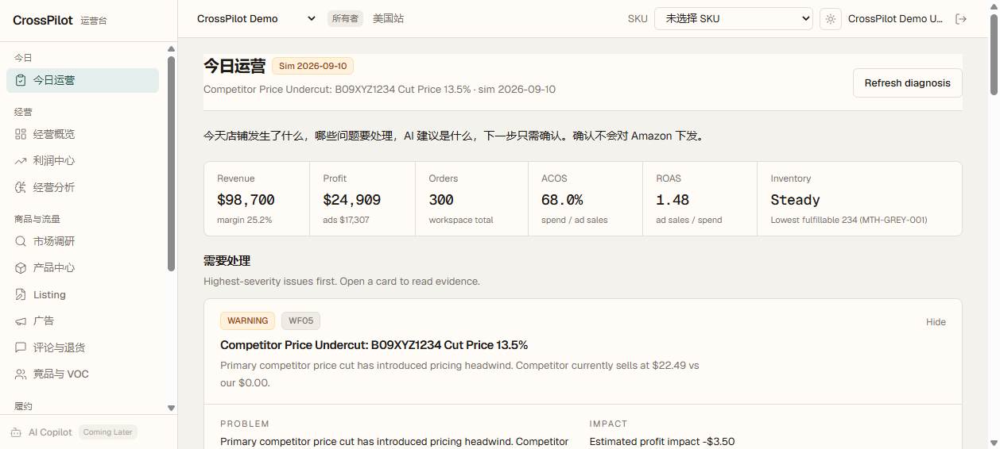
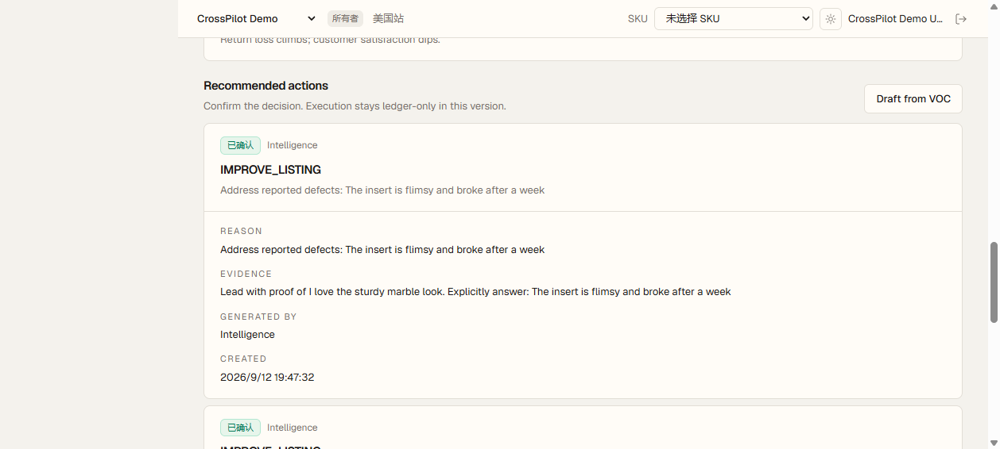

# V9.2.1 UI / Product Layer Release Report

**Date:** 2026-09-12  
**Live:** `http://116.198.230.217:2222`  
**Git:** `8c2f867`  
**Scope:** Presentation + interaction only. No V9.3 Action Layer, no Amazon Write, no WF-05 formula change.

---

## Verdict

CrossPilot 今日运营页从「WF-05 工作流后台」收成卖家每天打开要看的驾驶舱：

```text
今天发生了什么 → 哪些问题要处理 → AI 建议是什么 → 下一步只需确认
确认 ≠ Amazon 下发
```

状态：`V9.2.1 UI SHIPPED`（仍带 V9.2 已知限制）。

---

## 1. 新增 / 改动的页面

| 路径 | 变化 |
| :--- | :--- |
| `/app/operations/today` | 重做成 AI 运营驾驶舱（原 WF-05 表格式工作台让位） |
| 侧栏 | 「运营看板」→「今日运营」 |

页面结构（自上而下）：

1. Today's Business Overview（headline + Revenue / Profit / Orders / ACOS / ROAS / Inventory）
2. Critical Issues
3. AI Insights（Problem / Evidence / Impact / Recommendation）
4. Recommended Actions（WAITING_APPROVAL → 确认）
5. VOC
6. Recent Decisions

VIEWER：可读仪表盘与 Insight，不能确认、不能 Refresh diagnosis、不能 Draft from VOC。  
OWNER：可确认 Recommendation；确认后 `executionDispatched` 仍为 false。

---

## 2. API 变化

**没有重复造业务接口。** 新增的都是只读装配：

| Method | Path | 说明 |
| :--- | :--- | :--- |
| **NEW** GET | `/api/v1/operations/today` | 装配 profit / ads / inventory / orders / simulator / 最近 WF-05 / recs / VOC |
| **NEW** GET | `/api/v1/insights` | 同上的 insights 数组 |
| **NEW** GET | `/api/v1/voc` | 最近一次已落库的 VOC 快照 |
| 已有 POST | `/api/v1/voc/analyze` | 仍是分析入口，不是 GET |
| 已有 GET | `/api/v1/recommendations` | 未改 |
| 已有 POST | `/api/v1/recommendations/:id/approve` | 未改；仍不写 Amazon |
| 已有 POST | `/api/v1/operations/daily-diagnosis` | 未改；页头「Refresh diagnosis」调用 |

GET `/operations/today` **不会**自动启动 WF-05。

---

## 3. UI 截图

云上 `agent-browser` 实拍（OWNER 演示账号）：

| 文件 | 内容 |
| :--- | :--- |
| `v921_shots/01-login.png` | 登录 |
| `v921_shots/02-today-top.png` | 今日经营指标条 + 需要处理 |
| `v921_shots/05-recs.png` | AI 发现：Problem / Evidence / Impact / Recommendation |
| `v921_shots/07-voc.png` | Recommendation WAITING_APPROVAL + Confirm |
| `v921_shots/08-after-confirm.png` | 确认后状态「已确认」，Confirm 按钮消失 |
| `v921_shots/09-voc.png` | Customer voice + Recent decisions |
| `v921_shots/10-mobile.png` | 390×844 卡片纵向堆叠 |





---

## 4. Demo 流程（已在云上跑过）

```text
进入演示工作区
    ↓
/app/operations/today
    ↓
看到 Revenue $98,700 / Profit $24,909 / ACOS / Inventory
    ↓
看到 WF-05 + Simulator 问题卡，展开 Evidence
    ↓
Recommended actions：IMPROVE_LISTING 等待审批
    ↓
Confirm recommendation
    ↓
状态 → 已确认；Recent decisions 出现该条
    ↓
VIEWER GET today = 200；POST approve = 403
```

---

## 5. 已知限制

- WF-05 洞察文案里可能出现 `Our ASP: $0.00`、竞品数据 STALE（原诊断数据，本阶段未改 WF-05）
- ACOS/ROAS 是工作区全部 campaign 聚合（含 SIM- 与 scenario 历史），不是单活动
- Overview 页仍读 scenario，不读 simulator
- VOC 是英文正则，不是 Firecrawl/SP-API 实评
- 无 V9.2 专属其它页面；无 Amazon Write
- 空白 `03-today-full.png` 是一次失败的全页截图，不要当验收图

---

## 6. 下一阶段建议

V9.3 Action Layer（需人工下令）：

```text
Insight → Recommendation → Tool Execution
```

仍保持 Approval ≠ Execute。不要在确认按钮上偷偷接下发。

可选产品打磨（仍属 UI，不算 V9.3）：

- 把 WF-05「Our ASP $0.00」在展示层标成数据不足，而不是改诊断公式
- Simulator 控制台（simDate / 事件流）
- 中英混排文案统一
