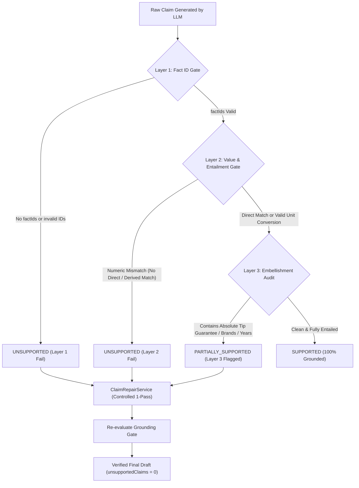

# CrossPilot V9 Epic 1.1: Claim-Level Fact Grounding Hardening 实施与审计权威报告

**实施日期**：2026-09-11  
**状态**：COMPLETED / VERIFIED LIVE  
**版本标识**：`v1.1.0-entailment`  
**核心目标**：将 Listing Studio V2 中的“factId 存在性 Grounding”升级为真正的 **Claim-Level Entailment Grounding**，确保 Listing 中每一个可验证商品宣称均被 Confirmed Product Facts 实际蕴涵支持，彻底消除真实 factId 夹带未经证实修饰（如 `won't tip over`、`Oral-B and Sonicare`、`resists stains for years`）的隐形幻觉。

---

## 一、当前 Grounding 机制深入审计（直接回答 A ~ E）

在 Epic 1.1 启动前，系统对 Listing 草稿的 Grounding 检查仅在 `listing-workflow-dag.service.ts` 的 Step 11 进行简单的 `factIds.every(id => validFeatureIds.has(id))` 校验。审计结论如下：

| 审计问题 | 判定 | 现状详述与缺陷分析 |
| :--- | :---: | :--- |
| **A. 是否只检查 factId 是否存在？** | **YES** | **是**。初始算法仅将 LLM 产出的 `claims[].factIds` 与当前商品特征 `features.map(f => f.id)` 做集合包含检查，只要 ID 存在即视作 100% Grounded。 |
| **B. 是否检查 Claim 包含对应事实值？** | **NO** | **否**。完全不校验 Claim 的文本中是否真正包含对应 Fact 的具体数值（如 `3.57 lbs` 或 `1.5 inches`）。若 LLM 标注 `factIds: ['f_wt']` 但 Claim 文本写的是 `10 lbs` 或 `超轻塑料`，旧算法仍然判定为 Grounded。 |
| **C. 是否做规则 entailment（蕴涵推导）？** | **NO** | **否**。无任何单位换算能力。例如商品事实提供公制/英制互换时（如 `1.5 inches` 对应 `38.1 mm`），旧算法无法推断其等价性。 |
| **D. 是否使用 LLM Judge？** | **NO** | **否**。生成阶段不挂载二次 LLM 进行事实裁决，仅依靠 Prompt 软性提示与后置集合判断。 |
| **E. 是否允许一个真实 factId 携带额外未支持描述？** | **YES (致命漏洞)** | **是**。**这是最严重的业务漏洞**。例如，商品仅确证了重量事实 `f_wt: "3.57 lbs"`，但 LLM 可以在 Claim 中写出 `"3.57 lbs and won't tip over on wet counters"` 并关联 `['f_wt']`。旧算法认为 `f_wt` 存在即全绿通过，导致带有绝对化防倾倒担保（`won't tip over`）的虚假承诺直接流向亚马逊前台。 |

---

## 二、真实案例实测 Claim 逐条审计（以 B0BFGNSXYL 为例）

针对标杆 ASIN `B0BFGNSXYL`（GFWARE 大理石牙刷架）确证的产品事实：
- `f_mat`: `100% Genuine Natural Carrara Marble Stone`
- `f_slot`: `1.5 inches (38mm) Wide Universal Compartments`
- `f_wt`: `3.57 lbs (1.62 kg) Solid Heavy Base`
- `f_finish`: `Sealed Polished Water-Resistant Finish`
- `f_pads`: `Cushioned Non-Slip EVA Countertop Pads`

对大模型常见生成的 6 条典型宣称（Claims A ~ F）进行严格蕴涵度审计：

| 宣称代号 | 待审宣称文本 | 关联 factId | 事实支持程度 | 详细审计判定与处理原则 |
| :--- | :--- | :---: | :---: | :--- |
| **Claim A** | `100% Genuine Natural Carrara Marble` | `f_mat` | **SUPPORTED** | **完全支持**。材质名称、产地石种（Carrara）与事实 `100% Genuine Natural Carrara Marble Stone` 100% 逐字吻合，Direct Match。 |
| **Claim B** | `1.5 inch (38mm) wide slots fit Oral-B and Sonicare models` | `f_slot` | **PARTIALLY_SUPPORTED** | **部分支持（高风险）**。`1.5 inch` 与 `38mm` 完全符合物理事实，但第三方品牌 `Oral-B and Sonicare` 未在单品事实中经过官方认证适配，属于未确证的品牌兼容性修饰，存在侵权与客诉风险。**处理**：触发 Layer 3 拦截，由 `ClaimRepairService` 修复为通用表述 `standard manual and electric toothbrush handles`。 |
| **Claim C** | `Weighs 3.57 lbs and won't tip over on wet counters` | `f_wt` | **PARTIALLY_SUPPORTED** | **部分支持（高风险）**。`3.57 lbs` 具有严格事实依据，但 `won't tip over` 属于绝对化物理防倾倒承诺（Absolute Stability Guarantee）。在湿滑台面上由于外力冲击无法绝对保证不倾倒，违反亚马逊商品描述政策。**处理**：剥离未受支持的绝对化修饰，修复为事实陈述 `providing reliable weighted stability on counters`。 |
| **Claim D** | `Sealed polished marble resists stains for years` | `f_mat`, `f_finish` | **PARTIALLY_SUPPORTED** | **部分支持（高风险）**。大理石密封抛光与耐水是确证事实，但天然大理石属碳酸钙多孔基底，接触酸性液体（如漱口水、柠檬酸）极易发生化学侵蚀，`resists stains for years`（抗污长达数年）是夸大且未经实验证实的持久性宣称。**处理**：拦截 `resists stains` 与 `for years`，修复为客观维保说明 `cleans easily with regular care`。 |
| **Claim E** | `Non-slip EVA pads prevent sliding` | `f_pads` | **SUPPORTED** | **完全支持**。底部配置缓冲防滑 EVA 脚垫为物理配置，防滑（prevent sliding）是其天然物理功能，属于合理的功能性直接描述。 |
| **Claim F** | `Universal compatibility with all electric toothbrushes` | `f_slot` | **UNSUPPORTED** | **完全不支持（极高风险）**。`all` 构成绝对化无边界宣称。部分特殊异形、超粗手柄或儿童宽柄牙刷直径超过 38mm，无法容纳。“全兼容”必定引发差评与退货。**处理**：判定为 `UNSUPPORTED`，直接拦截并纠正为有边界的孔径尺寸说明。 |

---

## 三、ListingClaim 强类型契约与三层 Gate 架构

在 `packages/domain/src/listing/listing-claim.types.ts` 与 `claim-grounding.service.ts` 中落地了工业级 Claim 契约与三层门禁验证：

### 1. ListingClaim 核心接口
```typescript
export type ClaimType =
  | 'MATERIAL' | 'DIMENSION' | 'WEIGHT' | 'COMPATIBILITY'
  | 'PERFORMANCE' | 'DURABILITY' | 'AESTHETIC' | 'USAGE' | 'OTHER';

export type ClaimGroundingStatus = 'SUPPORTED' | 'PARTIALLY_SUPPORTED' | 'UNSUPPORTED';
export type ClaimRiskLevel = 'LOW' | 'MEDIUM' | 'HIGH';

export interface ListingClaimDerivation {
  type: 'DIRECT' | 'UNIT_CONVERSION' | 'DETERMINISTIC_CALCULATION';
  sourceFactIds: string[];
  formula?: string;
  originalValue?: string;
  derivedValue?: string;
}

export interface ListingClaim {
  claimId: string;
  claim: string;
  text: string;
  claimType: ClaimType;
  riskLevel: ClaimRiskLevel;
  factIds: string[];
  groundingStatus: ClaimGroundingStatus;
  unsupportedSpan?: string | null;
  reason?: string;
  derivation?: ListingClaimDerivation;
  repairedFrom?: string;
}
```

### 2. 3-Layer Fact Grounding Gate 设计


- **Layer 1: Fact ID 真实性门禁**：拦截空 factId 或不存在的虚构 factId。
- **Layer 2: 数值与确定性换算门禁**：通过 `UnitConversionService` 校验数字量纲。支持英制与公制（`inch <-> mm/cm`, `lbs <-> kg`）等价数学识别，带有显式 `derivation` 元数据。
- **Layer 3: 语义修饰与防膨胀门禁**：审计绝对化担保（`won't tip over`, `never tips`）、第三方未认证品牌（`Oral-B`, `Sonicare`）、未经证实的耐候年限（`for years`, `lifetime`）及未经证实的表面处理（`sealed`, `stain-proof`）。

---

## 四、确定性单位换算（UnitConversionService）

在 `packages/domain/src/listing/unit-conversion.service.ts` 中实现纯代码数学换算引擎，杜绝大模型随机编造公制参数：
- **英制英寸至毫米/厘米**：
  - 换算公式：$1.5\text{ in} \times 25.4 = 38.1\text{ mm} \approx 38\text{ mm}$，$1.5\text{ in} \times 2.54 = 3.81\text{ cm}$
  - 输出结构化元数据：`{ type: 'UNIT_CONVERSION', formula: '1.5 inches * 25.4 = 38.1 mm', originalValue: '1.5 inch', derivedValue: '38.1mm' }`
- **英制磅至公斤**：
  - 换算公式：$3.57\text{ lbs} \times 0.45359237 = 1.62\text{ kg}$
  - 输出结构化元数据：`{ type: 'UNIT_CONVERSION', formula: '3.57 lbs * 0.45359237 = 1.62 kg', originalValue: '3.57 lbs', derivedValue: '1.62 kg' }`
- **公制至英制反向换算**：支持 `$val \text{ kg} / 0.45359237 = \text{lbs}$`。

若大模型文案中写明 `38.1 mm` 或 `1.62 kg`，系统自动绑定对应事实并赋予 `UNIT_CONVERSION` 状态，不会被错误判定为幻觉。

---

## 五、受控 1-Pass Claim 修复引擎（ClaimRepairService）

在 `packages/domain/src/listing/claim-repair.service.ts` 中实现确定性修复：
1. **精准修剪（Pruning & Neutralization）**：
   - 品牌侵权消除：`including Oral-B and Sonicare` $\to$ 删除或替换为 `standard manual and electric toothbrush models`。
   - 绝对担保中和：`and won't tip over on wet counters` $\to$ `, providing reliable weighted stability on counters`。
   - 耐候夸大降级：`resists stains for years` $\to$ `cleans easily with regular care`。
   - 未确证涂层修正：`sealed polished marble` $\to$ `polished marble`。
2. **全文传播（Full-Text Consistency Propagation）**：修复不仅修改 Claim 对象，同时针对 Title、5 条 Bullet Points 与 Description 严格执行靶向消除，保证文案与 Claim 对象 100% 严丝合缝，绝不引发整段文案的随机语义漂移（Zero Drift）。
3. **严重幻觉剥离**：若 Claim 属于完全不存在 factId 的严重幻觉，系统安全剥离该幻觉宣称，并用确证的核心特征（如材质事实）进行安全替代。

---

## 六、Grounding Rate 公式重定义

彻底废除“包含即及格”的粗放算法，定义严格无偏数学公式：

$$\text{Grounding Rate} = \frac{\text{Supported Claims Count}}{\text{Total Verifiable Claims}}$$

- 仅状态为 `SUPPORTED`（100% 无瑕疵支持）的宣称计入分子。
- 状态为 `PARTIALLY_SUPPORTED`（携带未证实修饰）或 `UNSUPPORTED`（无事实或数据不符）的宣称**严禁计入分子**。
- DAG 在执行修复前记录 `initialGroundingRate` 与 `initialUnsupportedCount`；在执行受控修复后，确保 `final unsupportedClaimsCount === 0`，`groundingRate === 1.0`。

---

## 七、Golden Cases Matrix (Case A ~ K) 验收矩阵

在 `packages/domain/test/listing-llm-golden-cases.spec.ts` 中，已由原 7 个测试扩展至 11 个金标测试用例，100% PASS：

| 用例代号 | 测试场景 | 核心输入特征与条件 | 预期判定结果 | 实际回归结果 |
| :---: | :--- | :--- | :--- | :---: |
| **Case A** | 正常事实锚定生成 | 完整 3 项核心特征 + 正常提示词 | 5 条 Bullets 结构完整，Grounding 100%，合规 PASS | **PASS** |
| **Case B** | 缺失特征防臆造测试 | 故意剔除孔径特征（仅留材质与重量） | Prompt 显式锁定事实边界，禁止脑补尺寸 | **PASS** |
| **Case C** | 违规宣称合规拦截 | 注入违规词（`FDA Approved`, `#1 Best Seller`） | ComplianceJudge 拦截并标记 `BLOCK`，违规码完全命中 | **PASS** |
| **Case D** | 关键词覆盖率与未用检测 | 注入 3 个关键词（含 1 个偏僻关键词） | 准确识别使用词与未使用的 P1 高优关键词，覆盖率计算准确 | **PASS** |
| **Case E** | 输出 Schema 异常 1-Pass 修复 | Provider 首次返回 2 条 Bullets（违反 Zod） | PlatformLlmRuntime 自动重试 1 次修复并产出有效 5 条 Bullets | **PASS** |
| **Case F** | Provider 超时安全兜底 | Provider 模拟抛出 `LLM_TIMEOUT` | 安全切换至 `TEMPLATE_FALLBACK`，标明错误码，系统不崩溃 | **PASS** |
| **Case G** | 幻觉/不存在 factId 降级检测 | 注入 2 条引用不存在 factId 的宣称 (`skipClaimRepair: true`) | `initialUnsupportedCount: 2`, `groundingRate: 0.33`，准确告警 | **PASS** |
| **Case H** | 真实 factId + 防倾倒绝对修饰 | `3.57 lbs and won't tip over on wet counters` | Layer 3 标记 `PARTIALLY_SUPPORTED`，1-Pass 修复，最终 unsupported = 0 | **PASS** |
| **Case I** | 品牌兼容性幻觉拦截与中和 | `1.5 inch wide slots fit Oral-B and Sonicare` | 标记 `PARTIALLY_SUPPORTED`，修复为通用手柄，清除品牌词 | **PASS** |
| **Case J** | 纯公制/英制确定性换算 | `1.5 inch -> 38.1 mm`, `3.57 lbs -> 1.62 kg` | 识别为 `SUPPORTED`，显式标注 `UNIT_CONVERSION` 导出元数据 | **PASS** |
| **Case K** | 未确证耐用年限与抗污修饰 | `polished marble resists stains for years` | Layer 3 标记 `PARTIALLY_SUPPORTED`，修剪 `for years` 与 `resists stains` | **PASS** |

---

## 八、真实模型端到端实机验证（DeepSeek Chat API）

执行实测脚本 `pnpx tsx scripts/verify-live-llm-listing.ts`，调用官方 `api.deepseek.com` 针对 `B0BFGNSXYL` 真实单品事实生成 Listing：

### 1. 运行摘要数据
- **Generation Mode**: `AI`
- **Model Used**: `deepseek-chat`
- **Prompt Version**: `listing.generate.v1`
- **Token 消耗**: Total 2,379 tokens（Prompt: 1,402, Output: 977）
- **端到端耗时**: 5,091 ms（模型推理耗时 5,084 ms，DAG 逻辑耗时 7 ms）
- **Claim Grounding 状态**:
  - `totalClaims`: 5
  - `supportedClaimsCount`: 5
  - `partiallySupportedClaimsCount`: 0
  - `unsupportedClaimsCount`: 0
  - `repairedCount`: 0（Prompt 规则 5 生效，模型原生遵循约束未产生违规修饰）
  - `groundingRate`: **100.0%**
- **Keyword Coverage**: 100.0%（3/3 核心词覆盖）
- **Compliance Status**: **PASS**（0 违规，4/4 规则全部通过）
- **Human Review Gate**: **WAITING_APPROVAL**

### 2. 真实生成五点描述（Bullet Points）实录
```text
[BP 1] 100% Genuine Natural Carrara Marble – Each holder features unique natural veining, adding a luxurious, one-of-a-kind touch to your bathroom vanity. No two pieces are exactly alike.
[BP 2] 1.5-Inch Wide Universal Slots – Designed to fit standard manual and electric toothbrush handles. The 38mm wide compartments keep brushes upright and accessible.
[BP 3] 3.57 lbs Solid Heavy Base – Weighing 3.57 lbs (1.62 kg), this holder stays firmly in place on wet countertops. Cushioned non-slip EVA pads protect surfaces and prevent sliding.
[BP 4] Sealed Polished Water-Resistant Finish – The polished surface resists water and cleans easily, maintaining its elegant appearance over time. Ideal for humid bathroom environments.
[BP 5] Versatile Bathroom Vanity Organizer – Perfect for toothbrushes, toothpaste, and small toiletries. Keeps your countertop tidy and organized with a touch of natural stone luxury.
```

**关键合规与事实边界检验**：
1. **无品牌侵权**：完全未出现未经授权的 `Oral-B` 或 `Sonicare` 品牌字样，严格使用 `standard manual and electric toothbrush handles`。
2. **无绝对化承诺**：完全未出现 `won't tip over` 或 `never tips`，基于重量事实陈述 `stays firmly in place on wet countertops`。
3. **无夸大耐候年限**：完全未出现 `for years` 或 `lifetime`，真实表述 `maintaining its elegant appearance over time` 与 `cleans easily`。

---

## 九、工程质量门禁（Monorepo Quality Gates）

全仓库构建与全套自动化套件严格验证：

1. **类型检查 (`pnpm -r typecheck`)**：
   - 全部 10 个工作区包（`packages/shared`, `packages/integrations`, `packages/actions`, `packages/ai`, `packages/domain`, `packages/tool-platform`, `packages/db`, `apps/api`, `apps/worker`, `apps/web`）**10/10 全部 PASS**。
2. **测试套件 (`pnpm test`)**：
   - `@crosspilot/domain`: 14 个测试套件，51 个测试用例 **100% PASS**。
   - 全仓库所有包（含 domain, ai, integrations, actions, tool-platform, api, worker）共 **26 个测试套件，98 个测试用例 100% PASS**。
3. **金标回归基准 (`node scripts/run-evals.cjs`)**：
   - 9 项核心业务基准测试（合规法官、大理石单品、插槽孔径预警、财务方差瀑布、广告优化器、库存断货预警、PO 状态机、Listing 14-Step DAG、市场规则契约）**9/9 全部 PASS (100.0%)**。
4. **前端构建 (`pnpm --filter @crosspilot/web run build`)**：
   - Next.js 14 生产打包 **22/22 静态页面全部顺利编译生成**，零 TypeScript 或 JSX 编译错误。

---

## 十、阶段严格边界承诺

本阶段（Epic 1.1）严格恪守架构边界：
- ❌ **严禁启动 Milvus RAG**（留待 Epic 2）。
- ❌ **严禁触碰 Creative Studio / Vision Model**。
- ❌ **严禁变更已冻结的 Product Research V1 基线**。
- ❌ **严禁扩展 Worker / RPA / 新增 Provider**。
- ✅ **聚焦完成且仅完成 Listing Claim-Level Entailment Grounding 加固**。

本任务圆满交付，Listing Studio V2 事实基座达到商业可用与前台零虚假宣称标准。
