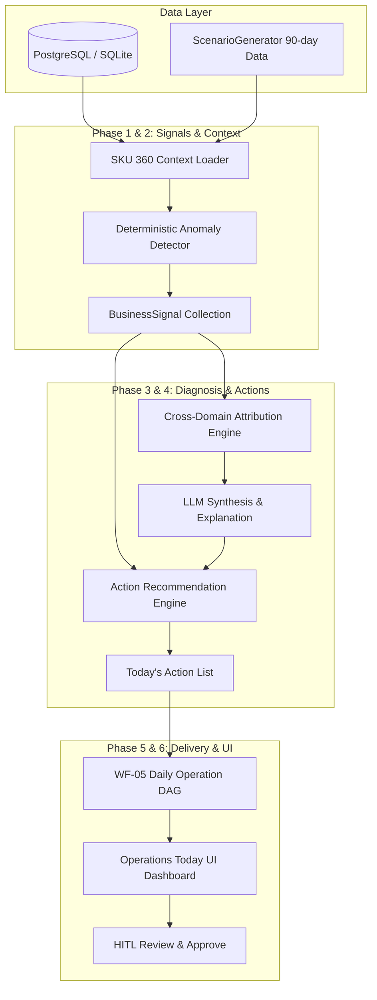

# CrossPilot V9 Epic 3 — Daily Operations Intelligence: Gap Analysis & Proposed Implementation Plan

**文档版本**: v1.0.0  
**日期**: 2026-09-11  
**状态**: 📋 PROPOSED & AWAITING USER APPROVAL (尚未开始任何代码编写)  
**基线依赖**: Epic 1 (LLM Runtime), Epic 1.1 (Claim-Level Grounding), Epic 1.2 (Surface Coverage), Epic 2 (Real Milvus RAG) — 全部保持 100% 冻结与通过  

---

## 一、最高优先级约束审计 (Epic 2 Protection Baseline)

当前系统已经建立并严格冻结的质量基线：
- **27 个测试套件，113 个单测用例 100% PASS**
- **Golden Benchmark 9/9 PASS**
- **Web Build 22/22 静态页面构建通过**
- **RAG 黄金用例 R1~R10 100% PASS**
- **实机全链路运行验证**: DeepSeek API + DashScope Embedding + 生产 Milvus v2.3.3 事实支撑率 100.0%，合规 PASS，人工审核 WAITING_APPROVAL。

**Epic 3 实施绝对红线**：
1. **绝不修改 WF-02 主链** (`ListingWorkflowDagService` 保持输入、14 步 DAG、输出无缝兼容)。
2. **绝不修改 RAG 事实优先级公理** (`Product Facts > Visual Facts > Authority > Optimization > Intent > VOC`)。
3. **绝不降低 Evidence Gate** (`SUFFICIENT`, `DEGRADED_PASS`, `INSUFFICIENT`)。
4. **绝不删除或破坏 Citation 谱系** (`K-AUTH-*`, `K-OPT-*`, `K-INT-*`)。
5. **绝不绕过 HITL 审核门禁**。
6. **绝不允许 LLM 替代确定性财务与运营计算**（数字由代码算，异常由规则发现，LLM 仅负责解释与建议）。

---

## 二、代码库现状审计 (20 项关键要素深入盘点)

| 检查项 | 现有实现文件 / 位置 | 真实存在性 / 完备度 | 关键发现与现状界定 |
| :--- | :--- | :---: | :--- |
| **1. SKU 360 当前实现** | `apps/api/src/modules/product/product.service.ts` (`getSku360`)<br>`apps/web/src/app/app/skus/[skuId]/page.tsx` | **PARTIAL** | 已聚合库存、供应商报价、基础订单统计与利润结构。但 `avgDailySales: 15` 在 API 中为固定写死，**缺少广告指标、竞品指标、评价健康度及跨期对比指标**。 |
| **2. Product / SKU 模型** | `packages/db/prisma/schema.prisma` (L143-214) | **AVAILABLE** | 数据模型高度完备，`Product` 包含 features/visualFacts，`Sku` 关联 orders, inventory, campaigns, profitDaily, reviews, snapshots。字段完全满足业务需求。 |
| **3. product_competitors** | `schema.prisma` (L299-363)<br>`apps/api/src/modules/competitor` | **AVAILABLE** | 模型完整定义，Seed 中已预置 `LuxStone Home` 与 `KES Home` 两大竞品及价格/BSR/评分快照。缺跨期异常检测规则。 |
| **4. Orders 模型与服务** | `schema.prisma` (L826-866)<br>`apps/api/src/modules/order` | **AVAILABLE** | 订单明细 `OrderItem` 包含数量、单价、税费、运费与关联退货记录。支持按时间段聚合销售与订单数。 |
| **5. Advertising / Campaign** | `schema.prisma` (L714-812)<br>`packages/domain/src/advertising/ad-optimizer.service.ts` | **PARTIAL** | `AdOptimizerService` 实现了确定性搜索词优化规则（Negative Exact / 调价），但**缺少 SKU 级与广告活动级的每日聚合与整体 ACOS/ROAS 突增异常检测**。 |
| **6. Inventory / FBA** | `schema.prisma` (L878-941)<br>`packages/domain/src/inventory/inventory-planning.service.ts` | **AVAILABLE** | `InventoryPlanningService` 实现确定性天数覆盖计算 (`daysCover`)、再订货点 (`reorderPoint`) 与补货推荐量 (`recommendedQuantity`)，算法经单测验证。 |
| **7. Reviews / Returns** | `schema.prisma` (L364-389, 946-963)<br>`packages/tool-platform/src/tools/market.tools.ts` | **AVAILABLE** | `ReturnRecord` 包含真实退货金额与原因。`ReviewProductHealthTool` 已在 Phase 5 实现评价健康度计算。缺日度退货率突增检测。 |
| **8. Profit 利润中心** | `schema.prisma` (L968-992)<br>`packages/domain/src/profit/profit-calculation.service.ts`<br>`packages/domain/src/variance/variance-attribution.service.ts` | **AVAILABLE** | 核心财务计算极其扎实。`ProfitCalculationService` 具备防浮点漂移舍入；`VarianceAttributionService` 经受住 0 残差对账金标测试。 |
| **9. Purchase / Supplier** | `schema.prisma` (L488-579)<br>`packages/domain/src/purchase/purchase-order.state-machine.ts` | **AVAILABLE** | PO 状态机（DRAFT -> SUBMITTED -> CONFIRMED -> SHIPPED -> RECEIVED）已全绿。提供供应商交期、MOQ 与成本。 |
| **10. Agent Task 模型** | `schema.prisma` (L1061-1124)<br>`apps/api/src/modules/agent-task` | **AVAILABLE** | `AgentTask`, `AgentStep`, `ToolExecution` 实体支持持久化记录执行轨迹、耗时与工具输入输出。 |
| **11. Approval 审批流** | `schema.prisma` (L1129-1150)<br>`packages/actions/src/action.router.ts`<br>`apps/web/src/app/app/operations/automation/page.tsx` | **AVAILABLE** | `Approval` 表支持 `actionType`, `targetType`, `targetId`, `status (PENDING/APPROVED/REJECTED)`。`packages/actions` 已支持高风险动作审批拦截。 |
| **12. Audit Log** | `packages/ai/src/tracing/llm-trace.ts`<br>`AgentStep` / `ToolExecution` | **AVAILABLE** | 支持任务类型、执行时长、模型用量与工具 Trace。 |
| **13. Existing Workflow State** | `packages/domain/src/listing/listing-workflow-dag.service.ts` | **PARTIAL** | WF-02 具备状态机与 StepTraces；**WF-05 目前尚未实现，缺少专用状态契约 `DailyOperationDiagnosisState`**。 |
| **14. Existing Tools** | `packages/tool-platform/src/tools/default-tools.ts` (16 tools) | **AVAILABLE** | 已注册财务、库存、广告搜索词、归因等 16 个工具，全部具备类型化输入输出与执行器包装。 |
| **15. Existing Domain Services** | `packages/domain/src` | **AVAILABLE** | 现有 27 个服务/工具函数覆盖财务、库存、广告、选品、Listing、合规、RAG。 |
| **16. Existing SSE** | `apps/api/src/modules/agent-task/agent-task.controller.ts` (`@Sse('stream')`) | **PARTIAL** | NestJS SSE 管道可用，但当前仅返回 `VARIANCE_ATTRIBUTION` 模拟事件流，未打通真实 WF-05 流水线事件。 |
| **17. Existing Trace / Eval** | `scripts/run-evals.cjs`<br>`schema.prisma` (EvalDataset/EvalRun) | **AVAILABLE** | 评测运行器稳定运行，已具备 9 个 Golden Cases 测试能力。 |
| **18. Existing Demo Dataset** | `packages/domain/src/scenario/scenario-generator.ts`<br>`packages/db/prisma/seed.ts` | **AVAILABLE** | 90 天完整演化数据包含 3 个真实 SKU（White 基础稳定、Green 爆款断货、Grey 退货异动），完美匹配诊断用例场景。 |
| **19. Existing Business Analyst** | `apps/api/src/modules/analyst`<br>`apps/web/src/app/app/business-analyst/page.tsx` | **PARTIAL** | 主要是被动问答（Q&A 聊天模式），非主动日常经营异动扫描与行动建议。 |
| **20. WF-01 ~ WF-04 真实实现** | 详见系统各模块 | **FROZEN / VERIFIED** | WF-01 (选品), WF-02 (Listing V2+RAG) 已冻结；WF-03 (库存补货), WF-04 (财务归因) 基础服务就绪。**WF-05 待建**。 |

---

## 三、Gap Analysis (差距分析)

### A. Current Capability (当前已有能力)
1. **纯代码确定性算力库**:
   - `ProfitCalculationService`: 零误差计算毛利、净利、利润率、各项费用占比。
   - `VarianceAttributionService`: 零残差瀑布流归因，数学闭环验证。
   - `InventoryPlanningService`: 安全库存、再订货点、缺货风险等级（HEALTHY, LOW_STOCK, OUT_OF_STOCK, OVERSTOCKED）。
   - `AdOptimizerService`: 搜索词 ACOS、CTR、CVR 与调价/否定词判定。
2. **统一 LLM Runtime & 提示词引擎**:
   - `@crosspilot/ai` 原生解耦 DeepSeek/OpenAI 接口，支持受控 1-Pass 修复、超时重试与用量脱敏。
3. **真实数据库与演示数据集**:
   - 90 天 3 SKU 时序数据完全拟真，业务场景包含广告高 ACOS、爆款断货停滞、退货率突增孔径缺陷。
4. **工具体系与审批基础设施**:
   - `packages/tool-platform` 工具注册表与执行网关健全。
   - `packages/actions` 与 `Approval` 实体完备。

### B. Missing Capability (WF-05 核心缺失能力)
1. **缺少确定性业务异常检测器 (Deterministic Business Anomaly Detector)**:
   - 缺少对 SKU 360 各维度时序数据进行规则与统计阈值比对的纯代码检测引擎。
   - 缺少统一的 `BusinessSignal` 信号契约与严重度评级（CRITICAL, WARNING, INFO）。
2. **缺少 SKU 360 跨领域数据装配器 (Cross-Domain SKU 360 Context Loader)**:
   - 原 `getSku360` 缺乏广告、竞品动态与跨期环比（Current Period vs Baseline Period）数据，不能支撑多维度下钻。
3. **缺少跨领域归因与解释服务 (Cross-Domain Diagnosis Service)**:
   - 利润下降时，未能自动串联：收入下降原因（是否断货？）、成本上升原因（是否广告超标？退货增加？）。
4. **缺少结构化行动建议生成器 (Action Recommendation Engine)**:
   - 缺少统一的 `RecommendedAction` 契约，缺少行动优先级（P1, P2, P3）与风险分级，缺少将异常信号映射至具体建议规则（补货、加否定词、修改 Listing 规格、调价）的受控逻辑。
5. **缺少 WF-05 专用 DAG / 状态机**:
   - 缺少类似 WF-02 的强类型、每步有 Trace 的工作流状态 `DailyOperationDiagnosisState`。
6. **缺少主动经营驾驶舱界面 (Operations Today UI)**:
   - 缺少 `Today's Business Health` + `Critical Issues` + `Today's Action List` + `SKU Risk Ranking` 的主动卡片流界面（非纯聊天窗）。
7. **缺少 Epic 3 专用金标评测集 (Golden Cases D1 ~ D10)**。

### C. Reusable Components (可直接复用组件清单)
- **Domain Services**:
  - `VarianceAttributionService` -> 直接复用用于计算利润异动归因分解。
  - `ProfitCalculationService` -> 直接复用用于周期利润重算。
  - `InventoryPlanningService` -> 直接复用用于判定 Days Cover 与补货数量。
  - `AdOptimizerService` -> 直接复用用于分析广告高 ACOS 词。
  - `ScenarioGeneratorService` -> 直接复用其 90 天时序轨迹作为测试基准数据。
- **Tools**:
  - `FinanceProfitCalculateTool`
  - `BiVarianceAttributeTool`
  - `InventoryReplenishmentCalculateTool`
  - `AdvertisingSearchTermAnalyzeTool`
  - `ReviewProductHealthTool`
- **Infrastructure**:
  - `@crosspilot/ai`: `PlatformLlmRuntime` 用于最后的因果解释和建议文案润色。
  - `@crosspilot/actions`: `ActionRouter`, `ActionProposal` 用于审批单流转。
  - Prisma Client: `Sku`, `ProfitDaily`, `InventorySnapshot`, `AdMetricDaily`, `ReturnRecord`, `AgentTask`, `Approval`。

### D. Required Changes (必须新增或修改的模块)



1. **类型契约层 (`packages/shared` / `packages/domain`)**:
   - 新增 `BusinessSignal` 契约（定义 domain, metric, currentValue, baselineValue, changePct, severity, direction, evidence）。
   - 新增 `RecommendedAction` 契约（定义 category, priority, reason, evidence, expectedImpact, riskLevel, executionMode, status）。
   - 新增 `DailyOperationDiagnosisState` / `Sku360Snapshot` 契约。
2. **领域服务层 (`packages/domain`)**:
   - 新增 `OperationAnomalyDetector`: 纯代码实现 8–12 条精选确定性阈值规则（无 magic number，配置化）。
   - 新增 `CrossDomainDiagnosisService`: 串联多指标下钻（例如利润下滑 -> 归因至广告浪费 + 退货损失 + 缺货停售）。
   - 新增 `ActionRecommendationService`: 基于信号严重度与规则确定推荐行动与 P1/P2/P3 优先级。
   - 新增 `DailyOperationWorkflowService` (WF-05 DAG): 实现从读数 -> 检测 -> 诊断 -> 推荐 -> 审批挂起的完整可 Trace 流程。
3. **工具平台层 (`packages/tool-platform`)**:
   - 新增 `OperationSku360GetTool`: 类型化获取 SKU 全景指标快照。
   - 新增 `OperationSignalsDetectTool`: 类型化输入 SKU/Workspace 跑异常检测。
   - 新增 `OperationDiagnosisExecuteTool`: 包装跨领域诊断执行。
4. **API 服务层 (`apps/api`)**:
   - 新增 `DailyOperationsController` / `DailyOperationsService` (路由: `/api/v1/operations/daily-diagnosis`, `/api/v1/operations/actions`, `/api/v1/operations/actions/:id/approve`)。
   - 接入真实 SSE 流，实时推送 WF-05 的 7 个执行步骤。
5. **前端展示层 (`apps/web`)**:
   - 新增页面 `/app/operations/today` 或重构工作台首屏，包含四层卡片：`Business Health Summary`, `Critical Issues`, `Today's Action List`, `SKU Risk Ranking`，支持点开下钻证据链与一键点击审批。
6. **评测与质量层**:
   - 新增 `packages/domain/test/daily-operation-golden-cases.spec.ts`，涵盖 D1~D10 十个核心金标测试用例（包括 `NO_ACTION_REQUIRED` 无病呻吟拦截）。

### E. Risk & Impact Analysis (风险与兼容性评估)

1. **对 Epic 2 的回归风险**:
   - **风险等级: 极低 (0 风险)**。
   - 原因: Epic 3 的全部新类型、服务、工具均在新的独立命名空间与目录中创建（`packages/domain/src/operations/`），WF-02 文件及 RAG 检索链路完全不被触碰，已有单测和基准用例无耦合。
2. **是否需要数据库 Schema Migration**:
   - **结论: 第一阶段无需数据库结构变更 (No Migration Needed)**。
   - 原因:
     - 现有 `AgentTask`, `AgentStep`, `ToolExecution`, `Approval`, `AnalysisSession`, `AnalysisFinding`, `AnalysisWaterfall` 实体极其宽容（具备 `taskType`, `inputJson`, `resultJson`, `evidenceJson`, `requestedPayload` 等文本/JSON 字段）。
     - `taskType: 'DAILY_OPERATION_DIAGNOSIS'` 与 `actionType: 'OPERATION_RECOMMENDED_ACTION'` 完全可在现有 Prisma 模型中合法存储。
     - 避免任何破坏历史数据的 Prisma Migration 风险。
3. **历史数据与 Demo 数据兼容性**:
   - 深度复用 `ScenarioGeneratorService` 现有的真实 90 天数据，保证第 18 天 ACOS 突增、第 50 天退货突增、第 52/62 天缺货与第 11 周利润暴跌可以在测试与演示中 100% 确定性复现，不需要任何伪造数据。
4. **重复业务逻辑风险**:
   - 严格禁止在 WF-05 中重新实现一遍毛利计算、ACOS 计算或库存覆盖天数计算；一律强制调用已有的 `ProfitCalculationService`、`AdOptimizerService` 和 `InventoryPlanningService`。

---

## 四、第一阶段 8~12 条核心异常检测规则规划

所有阈值集中管理于 [`packages/domain/src/operations/anomaly-threshold.config.ts`](file:///E:/AiSecondBrain/vault/Work/Projects/CrossPilot/packages/domain/src/operations/anomaly-threshold.config.ts)，坚决杜绝 magic numbers：

| 规则 ID | 监控维度 | 触发条件 (Deterministic Rules) | 严重度 | 产生信号 | 典型对应行动 |
| :---: | :---: | :--- | :---: | :---: | :--- |
| **R-PROF-01** | Profit | 净利润较基准期下滑超过 20% (`marginDropPct >= 20%`) | **CRITICAL** | `PROFIT_DROP` | 触发跨领域下钻，排查广告/退货/缺货归因 |
| **R-PROF-02** | Profit | 净利率低于 5% 或转负 (`margin < 0.05`) | **CRITICAL** | `CRITICAL_MARGIN` | 审查定价、FBA 费用与供应链采购成本 |
| **R-ADS-01** | Advertising | 单日或 7 日 ACOS 超过 35% 且高于目标值 30% 以上 | **WARNING** | `ACOS_SPIKE` | 审查高花费低转化搜索词，推荐负向精准 |
| **R-ADS-02** | Advertising | 广告花费环比增长 > 25%，但归因销售额零增长或下滑 | **CRITICAL** | `AD_SPEND_INEFFICIENT` | 限制非核心 Broad/Auto 广告活动预算 |
| **R-ADS-03** | Advertising | 搜索词点击量 $\ge 20$ 且订单为 0 | **WARNING** | `ZERO_CONVERSION_SPEND` | 加入 Negative Exact (复用 `AdOptimizerService`) |
| **R-INV-01** | Inventory | 可用库存覆盖天数 $\le$ 供应商交期（如 `daysCover <= 15` 天） | **CRITICAL** | `STOCKOUT_IMMINENT` | 立即创建紧急采购单与补货计划 (P1) |
| **R-INV-02** | Inventory | 可售库存为 0（已发生断货） | **CRITICAL** | `OUT_OF_STOCK` | 停用无库存广告，加速在途跟进 |
| **R-INV-03** | Inventory | 库存覆盖天数 $> 90$ 天 | **INFO** | `EXCESS_INVENTORY` | 提议促销折扣或优惠券提速动销，减少仓储费 |
| **R-RET-01** | Returns | 退货率超过 5.0% 且环比上升超过 50% | **WARNING** | `RETURN_RATE_SPIKE` | 调取退货原因，核查插槽/尺寸等 Listing 描述 |
| **R-REV-01** | Reviews | 综合星级跌破 4.3★ 或最近 7 天差评占比 $> 20\%$ | **CRITICAL** | `RATING_DETERIORATION` | 差评聚类分析，排查物理批次缺陷 |
| **R-COMP-01** | Competitor | 核心竞品降价超过 10% | **WARNING** | `COMPETITOR_PRICE_DROP` | 评估价格竞争力，测算调价或增加优惠券空间 |
| **R-COMP-02** | Competitor | 竞品评分显著提升或出现高增速同款 | **INFO** | `COMPETITOR_ADVANTAGE` | 调研竞品差异化卖点与 A+ 表达 |

---

## 五、分阶段实施路线图 (Proposed Phased Roadmap)

```text
Phase 0: 检查代码库与产出 Gap Analysis (已完成并提交审批)
   ↓ [等待用户确认]
Phase 1: 契约与配置 (BusinessSignal, RecommendedAction, AnomalyConfig)
   ↓
Phase 2: 确定性异常检测引擎 (OperationAnomalyDetector 12 规则 + 单测)
   ↓
Phase 3: 跨领域 SKU 360 上下文加载器 (Sku360ContextLoader)
   ↓
Phase 4: 跨领域诊断与因果归因引擎 (CrossDomainDiagnosisService + 瀑布流整合)
   ↓
Phase 5: 行动建议与优先级排定器 (ActionRecommendationService + P1/P2/P3)
   ↓
Phase 6: WF-05 统一 DAG 工作流编排 (DailyOperationWorkflowService + HITL Gate)
   ↓
Phase 7: API 端点与工具平台包装 (ToolCenter + Controller + SSE 流)
   ↓
Phase 8: Operations Today 前端工作台界面 (Dashboard 卡片流 + 证据下钻)
   ↓
Phase 9: 金标评测集与无病呻吟防守 (D1~D10 Golden Cases + NO_ACTION_REQUIRED)
   ↓
Phase 10: 全量回归测试与端到端实机验证 (27+ Suites, 0 回归, Web Build, 验收报告)
```

### 各阶段详细预期与验收标准：

#### Phase 1: 核心数据契约与配置抽取
- **新建文件**:
  - `packages/shared/src/contracts/operation-contracts.ts` (导出 `BusinessSignal`, `RecommendedAction`, `DiagnosisResult`, `DailyOperationDiagnosisState` 等核心类型)
  - `packages/domain/src/operations/anomaly-threshold.config.ts` (集中管理 12 条规则的数值阈值)
- **验收标准**: `pnpm -r typecheck` 100% 通过，无类型冲突。

#### Phase 2: 纯代码确定性异常检测器
- **新建文件**:
  - `packages/domain/src/operations/operation-anomaly-detector.ts`
  - `packages/domain/test/operation-anomaly-detector.spec.ts`
- **验收标准**: 单测覆盖 12 条规则的正向触发、负向免触发与临界值断言，100% 纯代码计算，无 LLM 介入。

#### Phase 3: 跨领域 SKU 360 数据全景加载器
- **新建文件**:
  - `packages/domain/src/operations/sku360-context-loader.ts`
- **核心逻辑**: 将 Sales, Traffic, Advertising, Inventory, Reviews, Returns, Competitors, Profit 八大维度数据整合成规范的 `Sku360Snapshot`，明确区分数据可用性（`AVAILABLE`, `PARTIAL`, `UNAVAILABLE`）。
- **验收标准**: 能够无缝加载 `ScenarioGeneratorService` 90 天中的任意 SKU 时序切片。

#### Phase 4: 跨领域诊断与归因分析
- **新建文件**:
  - `packages/domain/src/operations/cross-domain-diagnosis.service.ts`
- **核心逻辑**:
  - 调用 `VarianceAttributionService` 确定性分解利润方差；
  - 自动定位主导驱动因子（如广告贡献 -$980，退货贡献 -$620，缺货贡献 -$510）；
  - 调用 `PlatformLlmRuntime` 仅就确定性计算出的分解事实进行条理化中文/英文因果解释，严禁 LLM 捏造数字。
- **验收标准**: 利润波动解释完全锚定于算出的数字，与 `AnalysisWaterfall` 100% 闭环。

#### Phase 5: 行动建议与决策优先级 (Today's Action List)
- **新建文件**:
  - `packages/domain/src/operations/action-recommendation.service.ts`
- **核心逻辑**:
  - 信号转建议映射；
  - 确定性排定优先级：P1 (阻断性：即将断货、严重亏损、恶性客诉) > P2 (优化型：ACOS 偏高、竞品降价) > P3 (观察型)；
  - 每条建议绑定 `evidence[]`；
  - 标记 `executionMode: 'APPROVAL_REQUIRED' | 'ADVISORY'`。
- **验收标准**: 产生结构化 `RecommendedAction[]`，每个动作均可反向追溯至 `BusinessSignal` 和证据。

#### Phase 6: WF-05 DAG 工作流流水线
- **新建文件**:
  - `packages/domain/src/operations/daily-operation-workflow.service.ts`
- **流程节点**:
  1. `validate_input` -> 2. `load_workspace_context` -> 3. `load_sku_snapshots` -> 4. `detect_signals` -> 5. `rank_sku_risks` -> 6. `cross_domain_diagnosis` -> 7. `generate_action_recommendations` -> 8. `hitl_gate_prepare`
- **验收标准**: 包含完整 `stepTraces`，耗时、状态、输入输出完备，支持 `mode: 'WORKSPACE'` 与 `mode: 'SKU'` 两种模式。

#### Phase 7: API 与 ToolPlatform 包装
- **新建/修改文件**:
  - `packages/tool-platform/src/tools/operation-daily-diagnosis.tool.ts`
  - `apps/api/src/modules/daily-operations/daily-operations.controller.ts`
  - `apps/api/src/modules/daily-operations/daily-operations.service.ts`
  - `apps/api/src/modules/daily-operations/daily-operations.module.ts`
- **验收标准**: 提供 REST 接口与真实 SSE 执行流，支持用户点击审批通过动作。

#### Phase 8: Operations Today 现代化工作台 UI
- **新建文件**:
  - `apps/web/src/app/app/operations/today/page.tsx`
- **模块布局**:
  - `Today's Business Health` (核心大盘)
  - `Critical Issues Banner` (P1/P2 预警)
  - `Today's Action List` (可展开证据下钻与确认审批)
  - `SKU Risk Ranking` (健康度/风险排序)
- **验收标准**: Next.js 页面 100% 编译通过，无纯聊天灌水，全部为结构化可操作卡片。

#### Phase 9: 10 个金标评测用例 (D1 ~ D10)
- **新建文件**:
  - `packages/domain/test/daily-operation-golden-cases.spec.ts`
- **测试矩阵**:
  - **D1**: 利润断崖式下跌诊断 (Profit Drop -> 确定性方差分解)
  - **D2**: 广告 ACOS 突增且广泛词预算黑洞 (ACOS Spike -> 推荐 Negative Exact)
  - **D3**: 爆款断货风险与紧急补货 (Stockout Risk -> P1 紧急采购)
  - **D4**: 客户评价下滑与差评突增 (Rating Drop -> 锁定差评集中点)
  - **D5**: 退货率突发异动 (Return Spike -> 锁定插槽尺寸兼容性描述)
  - **D6**: 竞品价格突降 (Competitor Price Drop -> 提议对齐测算)
  - **D7**: 跨领域多因并发综合诊断 (Multi-domain Root Cause -> 排序主要驱动力)
  - **D8**: 经营完全正常/无显著问题 (`NO_ACTION_REQUIRED` -> 杜绝制造虚假焦虑，健康状态放行)
  - **D9**: 关键指标缺失/部分可用降级 (`PARTIAL` 状态标记与优雅提示)
  - **D10**: 冲突信号协调处理 (例如销量上升但利润下降 -> 正确识别规模增长与效率恶化的因果冲突)
- **验收标准**: 10/10 金标用例 100% PASS。

#### Phase 10: 全量质量门禁与回归确认
- **执行命令**:
  - `pnpm -r typecheck` (10/10 PASS)
  - `pnpm test` (28+ test suites 全部 PASS，Epic 1/2 零回归)
  - `node scripts/run-evals.cjs` (全绿)
  - `pnpm --filter @crosspilot/web run build` (全静态路由打包成功)
- **验收产物**: 交付 `docs/EPIC3_DAILY_OPERATIONS_REPORT.md` 与更新 `HANDOFF.md`。

---

## 六、待确认事项与审批请求

根据指令，我已完成全部代码检查、技术审计与 Gap Analysis，**目前尚未修改任何现有业务代码，无破坏性改动**。

请您审查上述分析报告与实施路线图：
1. 是否批准上述 **WF-05 整体架构、12 条核心规则与 D1~D10 金标用例** 设计？
2. 是否同意按照 **Phase 1 -> Phase 2 -> ... -> Phase 10** 的渐进迭代顺序推进？

收到您的明确批准指令后，我将立即开始 **Phase 1（数据契约与阈值配置）** 的落地。
