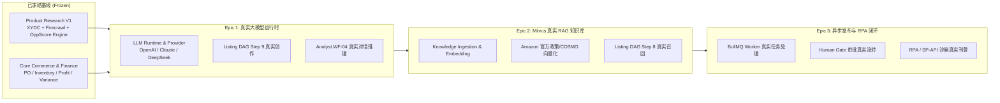

# CrossPilot 下一阶段研发规划：核心 3 大 Epic
## CrossPilot Next 3 Epics Implementation Roadmap

> **制定基准**：
> - 依据 `docs/90_historical/CROSSPILOT_V9_IMPLEMENTATION_AUDIT.md` 揭示的代码事实、关键债务与 Mock 清单；
> - 严格遵循“**Product Research V1 彻底冻结，坚决不写新选品功能**”的硬约束；
> - 核心原则：**集中资源打破假 AI 与静态 Mock，将断裂的业务链路打通为真实生产级端到端闭环**。

---

## 路线图总览

---

## Epic 1: 统一大模型运行时与真实 Listing 生成引擎 (Universal LLM Runtime & Grounded Listing Generation)

### 1.1 业务目标与立项背景
- **问题现状**：
  - 审查发现：目前整个 CrossPilot Monorepo 中**完全没有安装任何大模型 SDK**；
  - Listing Studio V2 虽然有完备的 14-Step DAG 结构，但 Step 9 (`generate_listing`) 内部**完全是用 JavaScript 模版字符串拼接出来的死文案**；
  - AI 经营分析师 (`AnalystService.askAnalyst`) 的回答也是根据数据库字段填入预设文案模版；
  - 无法向用户证明 CrossPilot 是真正具备多模态与生成式理解能力的 AI 运营平台。
- **目标期望**：
  - 建立统一的大模型集成适配层（支持 DeepSeek-V3/R1、OpenAI GPT-4o、Claude-3.5-Sonnet），由环境配置灵活切换；
  - 将 Listing Studio V2 改造为由真实大模型驱动的长文本生成引擎；
  - 严格受控于已经验证的 `ProductFeature`、`MarketplacePolicyProfile` 和 `ComplianceJudgeService`，杜绝一切幻觉与虚假尺寸。

### 1.2 核心范围与工作分解 (WBS)
1. **统一 LLM Runtime 客户端集成 (`packages/integrations`)**：
   - 引入标准轻量 LLM 驱动（如 Vercel AI SDK 或官方 OpenAI 兼容客户端），支持流式与结构化输出（JSON Schema）；
   - 在 `SecretProvider` 中配置 `OPENAI_API_KEY` / `DEEPSEEK_API_KEY`，支持 Token 级脱敏与使用量/成本追踪（Prompt Tokens, Completion Tokens, USD Cost）。
2. **Listing Studio Step 9 改造 (`packages/domain/src/listing/`)**：
   - 移除 `listing-workflow-dag.service.ts` 中的模版字符串拼接；
   - 注入强类型 Prompt 管道：将 Product Features、已核验的 Visual Facts、清洗后的 P1~P3 关键词、Rufus Q&A 上下文组装为结构化输入；
   - 强制使用结构化输出（Structured Outputs / Tool Calling），保证返回符合 `ListingDraftV2`（包含 Title, 5 Bullets, Description, Search Terms, 5 Image Briefs, 2 A+ Modules）；
   - 保留离线降级分支：当无 LLM 凭据或 API 异常时，安全回退到当前确定性模版，确保系统永不崩溃。
3. **AI 经营分析师动态对话集成 (`apps/api/src/modules/analyst/`)**：
   - 保留目前已验证的五大工具精确账目对账和确定性方差分解算法；
   - 将对账产出的结构化事实与数学残差注入 LLM，由大模型负责自然语言总结、归因解释与策略建议生成，彻底消灭写死应答。

### 1.3 质量门禁与验收指标
- `ListingWorkflowDagService` 单元测试通过，并在配置有效 API Key 时端到端成功调用真实大模型；
- 生成的标题与五点描述 100% 覆盖必须的 P1 关键词，字符长度严格不超出 `MarketplacePolicyProfile`（Title <= 200，Bullets <= 1000）；
- 自动通过 `ComplianceJudgeService` 合规判定，违规率 0%；
- 成本与 Token 消耗准确记录在返回信封的 `usage` 中。

---

## Epic 2: Milvus 真实向量知识库与三层 RAG 检索流水线 (Milvus Knowledge Pipeline & 3-Layer RAG Grounding)

### 2.1 业务目标与立项背景
- **问题现状**：
  - 审查发现：Milvus 2.4 虽然已经在云端服务器和 Docker 中部署且心跳探活通过，但在整个 `apps/api` 中**仅有健康检查在使用它**；
  - Listing Studio V2 宣称具备“三层 RAG 架构（最高权威政策层、生成优化层、意图上下文层）”，但 Step 8 (`retrieve_listing_knowledge`) 实际返回的是 4 条写死在代码里的静态字符串；
  - 数据库中的 `knowledge_documents` 表完全为空，没有知识摄取接口。
- **目标期望**：
  - 激活闲置的 Milvus 向量库，建立完整的文档切片（Chunking）、向量化（Embedding）与向量检索（Vector Search）流水线；
  - 将真实亚马逊官方政策、COSMO 推荐算法规范、合规禁售白皮书真实入库；
  - 让 Listing 生成与合规审查在执行时，真正从 Milvus 中进行 Top-K 语义召回，并将真实引用（`sourceId`, `authorityLevel`, `quotedText`）注入 Prompt 和审查凭据链。

### 2.2 核心范围与工作分解 (WBS)
1. **Embedding 服务与 Milvus Collection 自动化管理 (`packages/integrations/src/vector/`)**：
   - 封装文本向量化客户端（支持 OpenAI `text-embedding-3-small` 或开源本地轻量模型）；
   - 在 `MilvusVectorStore` 中完善 Collection 自动初始化、索引建立（IVF_FLAT / HNSW）与标量过滤；
   - 设计统一的 Knowledge Chunk 存储契约（`id`, `documentId`, `sourceType`, `authorityLevel`, `content`, `vector`, `metadata`）。
2. **知识库管理 API 与文档摄取服务 (`apps/api/src/modules/knowledge/`)**：
   - 新增 `KnowledgeModule`，提供文档上传、文本分块（Markdown / 纯文本按语义或段落切分）、向量化落盘至 Milvus 和 PostgreSQL；
   - 灌装基准种子知识：将 Amazon Detail Page Rules (Sec. 2.1)、FDA 医疗器械禁令、COSMO 关键词意图对齐准则真实向量化入库。
3. **Listing DAG Step 8 改造为真实向量检索 (`packages/domain/src/listing/`)**：
   - 替换 Step 8 内部的静态数组，根据商品类目、关键词与主要卖点，向 Milvus 发起 Top-K 向量语义检索；
   - 按照 V9 规范执行三层优先级重排序（权威政策 > 优化准则 > 意图上下文），将召回证据真实注入后续大模型生成与合规审查。

### 2.3 质量门禁与验收指标
- `MilvusVectorStore` 具备自动化集成测试（插入向量 -> 相似度检索 -> 距离断言）；
- 知识库真实入库不少于 20 条权威电商规范；
- Listing 生成与合规审查执行时，输出的 `knowledgeEvidence` 必须携带真实 Milvus 记录的 `id` 与相似度 `score`；
- Milvus 服务不可用或离线时，系统具备自动降级至数据库本地关键词匹配或内置基础规则的容灾保护。

---

## Epic 3: 异步发布流水线与端到端自动化刊登交付 (End-to-End Async Publishing & Action Execution)

### 3.1 业务目标与立项背景
- **问题现状**：
  - 审查发现：后台 BullMQ Worker 处于空置状态（Processor 为仅返回空结果的骨架）；
  - 操作自动化流水线（WF-Operation-01）虽然实现了前端 UI 与数据库 Human Gate 审批落盘，但审批通过后直接调用 `MockRpaAdapter`，输出写死的 `feedId: '8192049102'`；
  - 自动化工作流实例只保存在内存数组中（`this.workflows = []`），服务重启后历史丢失。
- **目标期望**：
  - 激活 BullMQ Worker 作为生产级异步任务中枢，负责处理耗时的长任务；
  - 将操作自动化流水线的运行实例持久化到数据库中；
  - 完善 RPA 适配器与执行端点，实现真实的脚本执行或亚马逊 SP-API 沙箱直连，完成从“用户点击发布 -> 人工审批生效 -> 异步队列排队 -> 自动化刊登执行 -> 真实回执确认 -> 商品状态变更为 ACTIVE”的端到端真实交付。

### 3.2 核心范围与工作分解 (WBS)
1. **工作流状态持久化与数据库对齐 (`apps/api/src/modules/operation-automation/`)**：
   - 将内存数组 `workflows` 改造为写入 Prisma 已有的 `AgentTask` 与 `AgentTaskStep` 模型，确保流水线状态历史可持久化追踪与重启恢复；
   - 完善 SSE 事件流（`AgentTaskService.streamTaskExecution`），将其改造为监听真实的 Redis Pub/Sub 事件，消灭基于 `setTimeout` 的假流。
2. **生产级 BullMQ 异步任务消费 (`apps/worker/src/processors/`)**：
   - 在 `apps/worker` 中落地真实的 `PublishWorkflowProcessor` 与 `BatchOperationProcessor`；
   - 支持任务重试（指数退避）、超时熔断与失败告警，减轻 API 进程负担。
3. **真实 RPA / 刊登动作适配器打通 (`packages/integrations/src/rpa/`)**：
   - 完善 `YingdaoRpaAdapter` 的真实调用链路与参数映射，或提供标准的 Puppeteer / Playwright 自动化浏览器无头刊登脚本；
   - 消灭写死的 `feedId`，由 RPA 或接口真实返回任务流水号与截图凭据；
   - 刊登成功后，触发 Core Commerce 领域事件，将对应 SKU 在数据库中的状态由 `DEVELOPING` 正式跃迁为 `ACTIVE`，并在前端工作台上展现真实的闭环状态。

### 3.3 质量门禁与验收指标
- Worker 异步消费具备真实端到端集成测试，支持 Redis 队列消息触发与状态回写；
- 经过 Human Gate 审批通过后，发布任务能够真实进入队列并执行；
- 执行过程中的每一步（Copy -> Compliance -> Creative -> Approval -> RPA -> Feed）均产出真实时间戳与结构化日志；
- 刊登完成后，数据库中的 SKU 状态与发布历史真实可查，系统重启后数据不丢失。

---

## 4. 三大 Epic 实施时序与依赖关系

| Epic 编号 | 核心主题 | 预计工期 | 外部前置依赖 | 核心风险与阻碍 | 减缓策略 |
| :---: | :--- | :---: | :---: | :--- | :--- |
| **Epic 1** | **统一大模型运行时与真实 Listing 生成引擎** | 1~2 周 | 需要配置有效大模型 API Key | 大模型输出格式偶尔不符合 JSON Schema | 使用 Zod 强校验，不合规时自动重试或触发本地规范器修复 |
| **Epic 2** | **Milvus 真实向量知识库与三层 RAG** | 1~2 周 | Epic 1 完成 (需要 Embedding 客户端) | 知识文档分块不合理导致检索噪音 | 采用按章节层级切分，严格标注政策层级权重 |
| **Epic 3** | **异步发布流水线与自动化刊登闭环** | 1~2 周 | Epic 1 & 2 完成 (发布需要高质量 Listing) | 亚马逊后台 UI 变动或 RPA 验证码阻碍 | 维持 Human Gate 审批底线，支持操作员介入接管与手动回填 FeedId |

---

## 5. 战略原则回顾与红线

1. **绝对红线：禁止在 Product Research 域画蛇添足**
   - Product Research V1 已经达到双 Provider 真实联通与数学确定性基线（得分 58/100，置信度 85% HIGH），且通过了回归锁死测试。后续绝对不再增加选品三方接口或修改评分权重。
2. **核心导向：由“表象完备”走向“内核真实”**
   - 优先消灭代码中的 `MOCK_ONLY`、静态字符串与假流，让 CrossPilot 真正成为一个由“真实电商业务模型 + 确定性算法 + 真实大模型 + 真实向量库 + 受控自动化”构成的工业级跨境电商 AI 运营平台。
