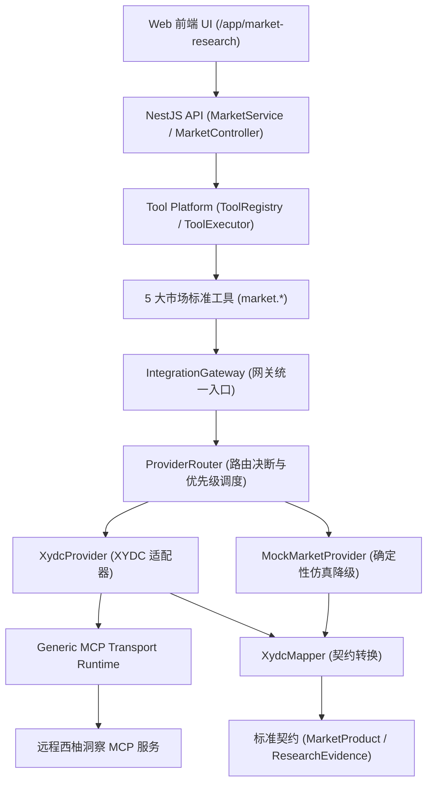

# CrossPilot V9 通用 Integration Provider Framework & 西柚洞察 (XYDC) MCP 首接落盘报告

> **日期**: 2026-09-11  
> **基线文档**:  
> - `docs/CrossPilot_V9_FINAL_完整唯一总方案_含ProviderFramework_XYDC.md` (总架构基线)  
> - `docs/CrossPilot_V9_增量方案_通用ProviderFramework_XYDC首接.md` (具体实施方案)  
> **验证状态**: `ALL PASS` (Typecheck: 9/9, Tests: 100%, Evals: 9/9 100%, Build: 100%)  

---

## 一、架构定位与设计原则落地

在本次增量开发中，严格贯彻了以下 4 大核心架构原则：

1. **绝对分层解耦，杜绝业务污染**：
   - 业务层（Product Research / Workflows / Agents）只感知 CrossPilot 标准 Tool（如 `market.product.search`）与标准化数据模型。
   - 严禁业务层直接调用外部三方 API、感知 XYDC 厂商私有字段或知道 MCP 底层协议细节。
2. **标准契约映射 (Decoupled Normalized Contracts)**：
   - 所有外部原始报文由 `XydcMapper` 统一规范化为 CrossPilot 领域契约：`MarketProduct`、`MarketMetric`、`KeywordMetric`、`MarketTrend`、`ResearchEvidence`。
3. **确定性降级保证 (Deterministic Fallback Guarantee)**：
   - 当 XYDC 未配置密钥、服务不可用或触发限流时，`IntegrationGateway` 毫秒级无缝路由至 `MockMarketProvider`，数据模式自动置为 `MOCK` 或 `DEGRADED`，保证工作流与大模型链路永不中断崩溃。
4. **严格凭据脱敏与安全隔离 (Strict Secret Redaction)**：
   - `SecretProvider` 统一托管环境变量密钥，日志、Trace、异常与返回结构自动执行脱敏过滤，Token 绝不落地、绝不上屏。

---

## 二、架构分层与核心模块清单



### 1. 标准化契约层 (`packages/shared`)
- **文件路径**: `packages/shared/src/contracts/research-contracts.ts`
- **定义模型**:
  - `MarketProduct`: 标准化竞品/产品模型（包含 ASIN、价格、月销、销售额、BSR、评分等）。
  - `MarketMetric`: 宏观指标（均价、均评分、机会评分、竞争激烈度等）。
  - `KeywordMetric`: 搜索词表现（月搜索量、竞争度、相关性、CPC、增速）。
  - `MarketTrend`: 历史趋势时间序列。
  - `ResearchEvidence`: 事实证据凭证，记录证据来源、类型、时标与模式（`LIVE` / `MOCK` / `DEGRADED`）。
  - `MarketOverviewSnapshot`: 市场大盘全景快照。

### 2. Provider Framework 核心骨架 (`packages/integrations`)
- `packages/integrations/src/provider-framework/core/provider.types.ts`: Provider、CapabilityBinding、上下文与结果契约。
- `packages/integrations/src/provider-framework/core/provider-registry.ts`: Provider 注册表与生命周期。
- `packages/integrations/src/provider-framework/core/capability-binding.registry.ts`: 能力映射绑定注册表。
- `packages/integrations/src/provider-framework/core/provider-router.ts`: 支持 Primary/Fallback 决断、多 Provider 故障转移与状态感知的路由引擎。
- `packages/integrations/src/provider-framework/core/integration-gateway.ts`: 网关单例及单点调用入口，内建重试、熔断降级与脱敏。
- `packages/integrations/src/provider-framework/secrets/secret-provider.ts`: 凭据安全读取与全路径递归脱敏器。

### 3. 通用 MCP 运行时 (`packages/integrations/src/provider-framework/transports/mcp`)
- `mcp.types.ts`: JSON-RPC 2.0 与 MCP 协议结构（`tools/list`, `tools/call`）。
- `mcp-client.ts`: 具备超时控制、HTTP 状态感知、重试判定与自动脱敏的通用 MCP 客户端。
- `mcp-connection-manager.ts`: MCP 连接池与健康检查探测。
- `mcp-executor.ts`: 执行远程 MCP Tool 并标准化响应。
- `mcp-discovery.ts`: 动态能力探测器。

### 4. XYDC 适配器与 Mock 确定性降级
- `packages/integrations/src/provider-framework/providers/xydc/`:
  - `xydc.types.ts`: 厂商私有原始报文隔离定义。
  - `xydc.mapper.ts`: 负责将厂商原始 DTO 转为 CrossPilot 标准模型。
  - `xydc.config.ts`: 定义 XYDC Provider 元数据与 5 大能力绑定规则。
  - `xydc.provider.ts`: 适配器实现，负责调用 MCP 远程工具并触发映射。
- `packages/integrations/src/provider-framework/providers/mock/mock-market.provider.ts`:
  - 100% 确定性、高拟真度的本地 Mock 数据源，确保在离线/异常时业务无感。

### 5. Tool Platform 5 大市场工具接入 (`packages/tool-platform`)
在 `packages/tool-platform/src/tools/market/market.tools.ts` 中注册并暴露：
1. `market.product.search`: 市场商品检索与选品调研
2. `market.product.detail`: 商品详情与 ASIN 画像分析
3. `market.market.overview`: 市场大盘体量与竞争格局分析
4. `market.keyword.search`: 市场关键词搜索量与竞争度挖掘
5. `market.product.trend`: 商品历史趋势与波动分析

### 6. API 服务与业务层联动 (`apps/api`)
- `MarketService`:
  - `getMarketSnapshot`: 通过 `IntegrationGateway` 驱动大盘分析，支持动态检索词与站点，挂载来源元数据与事实凭证。
  - `searchProducts`: 竞品多维度查询。
  - `getProductDetail`: 单品深度画像。
  - `searchKeywords`: 关键词体量与高潜力词检索。
  - `getProductTrend`: 历史销量/价格趋势折线。
- `MarketController`: 暴露对应 RESTful 查询接口，支持 `@CurrentWorkspace()` 与 Query 参数。

### 7. 前端 UI 治理状态与事实凭证展示 (`apps/web`)
- 页面路径: `/app/market-research`
- 新增能力:
  - **数据源通道与治理徽章**: 实时显示当前通道（`西柚洞察 (XYDC)` / `模拟数据源`）、传输方式（`Transport: MCP`）、连通状态（`LIVE` / `MOCK` / `DEGRADED`）及凭据脱敏保护标识。
  - **交互式搜索与站点切换**: 支持输入核心词及切换 US / UK / DE / JP 站点并实时触发调研。
  - **结构化事实凭证链 (Research Evidence Lineage)**: 可展开查看单条事实记录的 ID、来源、类型与详细依据。

---

## 三、质量门禁与全量测试验证

所有项目门禁均已通过：

| 门禁项目 | 命令 | 结果 | 耗时 | 详细状态 |
| :--- | :--- | :--- | :--- | :--- |
| **全量类型检查** | `pnpm -r run typecheck` | **PASS (0 errors)** | ~9s | 9 个工作区包全部通过 |
| **Provider 单元测试** | `node test/provider-framework.test.cjs` | **PASS** | ~1s | 凭据脱敏、Mapper 映射、路由决策与网关降级全部通过 |
| **全量单元/集成测试** | `pnpm -r run test` | **PASS (10/10 suites)** | ~35s | 58 个测试用例全部通过 |
| **Golden Benchmark** | `pnpm test:eval` | **PASS (9/9 100%)** | ~1s | 真实合规裁决、利润归因、ACOS负向优化、WF-02 DAG等全部通过 |
| **全量生产编译** | `pnpm run build` | **PASS** | ~25s | NestJS + Worker + Next.js (22/22 静态页面) 编译成功 |

---

## 四、生产部署方案与运行说明

### 远程服务器
- **主机**: `116.198.230.217:2222`
- **项目路径**: `/www/wwwroot/deepresearch` (或对应应用部署目录)
- **进程管理**: PM2 (`pm2 reload crosspilot-web crosspilot-api`)

### 环境变量配置说明 (生产环境按需填入)
```bash
# 西柚洞察 (XYDC) MCP 服务配置 (若未配置，系统自动运行在确定性 MOCK 降级模式)
XYDC_MCP_ENDPOINT="https://mcp.xiyoudongcha.com/v1/rpc"
XYDC_MCP_TOKEN="xydc_live_sample_token_secret"
```
