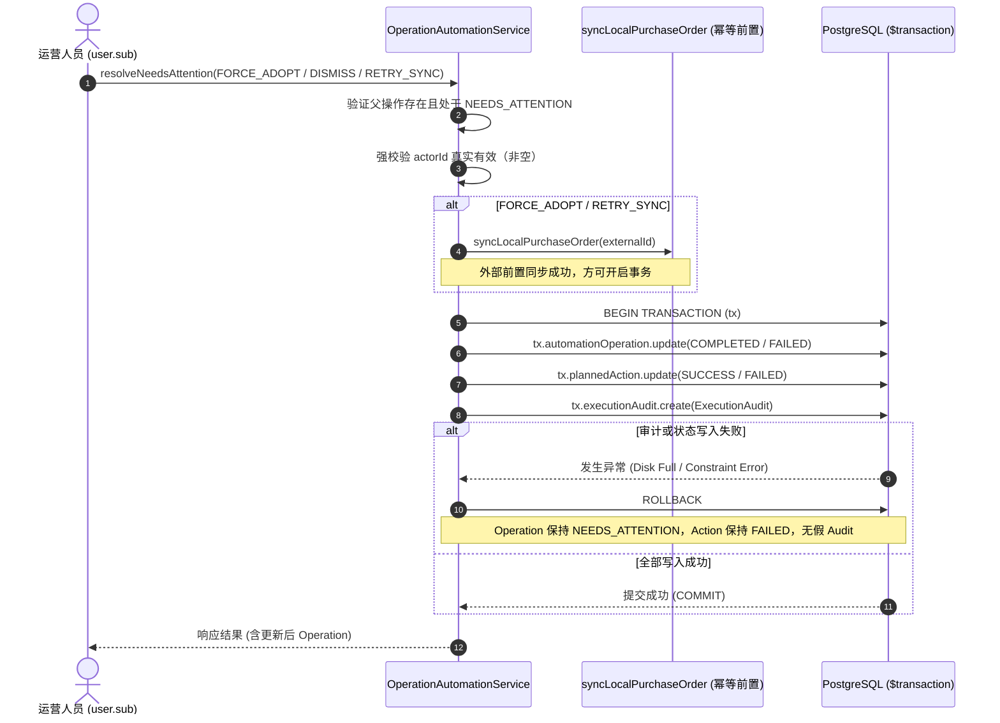

# CrossPilot Automation Runtime: Human Audit Trail (Phase 6)

## 1. 架构定位与核心背景

在 CrossPilot 自动化执行生命周期中，`AutomationOperation` 会因为外部故障（如 ERP 远端单据不匹配、本地单据同步前置条件缺失等）进入 `NEEDS_ATTENTION` 挂起状态，等待人工介入核验并处理。

在 Phase 6 之前，人工处理结果主要覆写保存在 `AutomationOperation.evidence.manualResolution` JSON 字段中。该字段本质上是一个“最新状态快照”，随着操作被多次人工介入或重试，旧有的核验记录与决策原因会被无情覆盖，缺乏不可篡改的法律级审计流水（Immutable Audit Trail）。

为此，Phase 6 引入了专门记录人工与管理状态变更的持久化审计流水表：**`ExecutionAudit`**。

---

## 2. 四类执行历史体系边界矩阵 (Four-History Responsibility Matrix)

为了防止概念混淆与职责蔓延，CrossPilot 严格划分了四类历史实体的核心定位：

| 实体模型 | 核心问题 / 业务职责 | 触发时机 | 是否包含机器执行 / 错误 | 是否允许应用层修改 |
| :--- | :--- | :--- | :--- | :--- |
| **`Approval`** | “这个 Action 是否被批准执行？”（事前门禁闸门） | Action 派发执行前 | 否（仅记录审批人和授权凭证） | 仅在 PENDING -> APPROVED / REJECTED 流转 |
| **`ActionExecution`** | “这个 PlannedAction 执行过哪些通用动作？” | ActionRouter 调度前后 | 记录动作类型与高层业务结果 | 是（记录状态机更新） |
| **`ExecutionAttempt`** | “这个 AutomationOperation 第几次外部执行/反查/重试发生了什么？”（事中技术尝试） | 真实调用外部 Adapter (HTTP / GraphQL / Playwright) 时 | 是（记录 Provider 耗时、错误码、错误分类） | 仅在终态时补全耗时与结果，无二次修改 |
| **`ExecutionAudit`** | “哪个人，在什么时间，基于什么原因，手工改变了 AutomationOperation 的状态？”（事后不可变人工审计） | 运营人员调用 `resolveNeedsAttention`（FORCE_ADOPT, DISMISS, RETRY_SYNC）时 | **否（禁止将机器重试/Worker巡检塞入）** | **严格不可变（Append-only，无 updatedAt，禁止修改/删除）** |

> [!IMPORTANT]
> **绝对隔离原则**：
> `ExecutionAudit` 绝非执行状态机（Execution State Machine），也绝非 `ExecutionAttempt`。
> 人工处理绝不会自动创建伪 `ExecutionAttempt`；机器自愈重试也绝不允许混入 `ExecutionAudit`。

---

## 3. 数据模型设计 (Prisma Schema)

```prisma
model ExecutionAudit {
  id           String   @id @default(uuid())

  workspaceId  String   @map("workspace_id")
  operationId  String   @map("operation_id")
  actionId     String?  @map("action_id")

  actorId      String   @map("actor_id")
  actorType    String   @map("actor_type")

  auditAction  String   @map("audit_action")
  reason       String?  @db.Text

  beforeState  Json     @map("before_state")
  afterState   Json     @map("after_state")
  metadata     Json?

  traceId      String?  @map("trace_id")

  createdAt    DateTime @default(now()) @map("created_at")

  operation    AutomationOperation @relation(fields: [operationId, workspaceId], references: [id, workspaceId], onDelete: Cascade)

  @@index([workspaceId, operationId, createdAt])
  @@index([workspaceId, actorId, createdAt])
  @@index([operationId, createdAt])

  @@map("execution_audits")
}
```

### 模型设计亮点：
1. **零 `updatedAt`**：表结构物理上不提供更新时间戳，从 Schema 层面确立 Append-only 语义。
2. **数据库级复合外键租户隔离**：
   复用 Phase 5.1 在 `AutomationOperation` 建立的 `@@unique([id, workspaceId])`，复合外键 `@relation(fields: [operationId, workspaceId], references: [id, workspaceId], onDelete: Cascade)` 确保物理层任何审计记录绝不可能关联到其他租户的操作。

---

## 4. 核心不变式与安全策略

### 4.1 Append-only 不可篡改语义 (Immutability)
`ExecutionAuditStore` 仅提供：
- `appendAudit(params, txClient?)`
- `listAudits(workspaceId, operationId)`
- `getAudit(workspaceId, auditId)`

严禁提供任何 `updateAudit`、`deleteAudit`、`overwriteAudit` 方法。历史事件一旦落盘，永久锁定。

### 4.2 真实 Actor 身份强制验真 (Actor Authenticity)
1. **认证上下文唯一来源**：`actorId` 必须且只能来自认证上下文中的 `user.sub`（由 Controller 提取注入）。
2. **禁止客户端欺骗**：客户端 Request Body 中即便提交 `userId` 或 `actorId`，Controller 也会硬编码使用 `user.sub` 覆盖。
3. **Fail-Closed 缺省拒绝**：如果请求中无有效认证用户（`actorId` 为空、未定义或纯空白），`resolveNeedsAttention` **直接抛出 400 BadRequestException 拒绝执行**，严禁使用类似 `userId || 'manual-operator'` 的匿名 fallback。

### 4.3 租户严格隔离 (Workspace Isolation)
Store 层与 DB 层双重防线：
- `appendAudit` 首先校验父 `AutomationOperation` 必须在当前 `workspaceId` 下存在；
- 查询方法（`listAudits` / `getAudit`）强制绑定 `workspaceId` 参数，跨租户查询返回空结果。

### 4.4 敏感凭据脱敏防护 (Secret Redaction)
人工输入的 `reason`（来自 `body.comment`）以及 `metadata` 必须经过 Phase 3 建立的脱敏防护网：
- `reason`：通过 `sanitizeString` 抹除 Bearer Token、Basic Auth、Shopify `shpat_` 令牌、数据库连接密码等，并截断至 `<= 2000` 字符；
- `metadata`：通过 `sanitizeLogData` 深度递归扫描敏感字段（`password`, `secret`, `authorization`, `apiKey`, `token` 等），记录时仅保存安全审计元数据（如 `resolution`, `externalId`, `localSync`）。

### 4.5 双轨兼容与存量策略 (Backward Compatibility & No-Backfill)
- **兼容快照保留**：每次人工处理后，`AutomationOperation.evidence.manualResolution` 仍保持原有格式回填，确保未升级的旧 UI / API 端点读取不受影响。
- **历史数据无伪造（No Backfill）**：Phase 6 部署前发生的人工处理不依据旧快照伪造 `ExecutionAudit`。正式策略为：`ExecutionAudit history available from Phase 6 deployment forward`。

---

## 5. 事务原子性与执行流程 (Transaction Atomicity)

人工干预是高危写操作，不同于技术日志和监控指标（它们可以 fail-safe 忽略），**Human Audit 必须 Fail-Closed**：
> 不允许出现“操作状态已被人工改动，但审计记录落库失败”的不一致情况。

`AutomationOperation` 状态更新、`PlannedAction` 状态流转以及 `ExecutionAudit` 插入操作**必须在同一个 `prisma.$transaction` 事务内完成**。若 Audit 写入失败，整个事务立即 Rollback！



### 三大业务场景详细流转：
1. **`FORCE_ADOPT`（强制采纳）**：
   - 依赖外部凭证 `externalId`，前置执行 `syncLocalPurchaseOrder`（该操作具备幂等性）；
   - 事务内：`Operation` -> `COMPLETED / APPLIED / NONE`（版本号原子递增），`PlannedAction` -> `SUCCESS`，记录 `FORCE_ADOPT` 审计；
   - 若事务失败，`Operation` 维持 `NEEDS_ATTENTION`，下次重试安全无副作用。
2. **`DISMISS`（人工废弃）**：
   - 无外部网络调用；
   - 事务内：`Operation` -> `FAILED / NOT_APPLIED / NONE`，`PlannedAction` -> `FAILED`，记录 `DISMISS` 审计。
3. **`RETRY_SYNC`（重试同步）**：
   - 前置重试本地 PurchaseOrder 同步，若失败立即中断，不产生错误审计；
   - 同步成功后进入事务：`Operation` -> `COMPLETED / APPLIED / NONE`，`PlannedAction` -> `SUCCESS`，记录 `RETRY_SYNC` 审计（附带 `localSync: "SUCCEEDED"` 元数据）。

---

## 6. Before / After State 快照规格

为了节约存储空间并杜绝敏感业务数据泄露，`beforeState` 与 `afterState` 仅采集极小且关键的状态字段：

```ts
export interface ExecutionAuditState {
  phase: string;             // 如 "NEEDS_ATTENTION" -> "COMPLETED"
  effect: string;            // 如 "UNKNOWN" -> "APPLIED"
  recovery: string;          // 如 "MANUAL" -> "NONE"
  lastErrorCode?: string | null;
  externalId?: string | null;
  operationVersion: number;  // 乐观锁版本号
  actionStatus?: string | null; // PlannedAction 状态
}
```

---

## 7. 质量门禁与测试覆盖

- **测试套件**：`packages/actions/test/human-audit-trail.spec.ts`（17 个用例全面覆盖）
  1. **不可变语义**：禁止更新/删除，连续追加生成两条独立按序记录；
  2. **租户硬隔离**：跨工作区查询隔离，跨工作区追加抛 `AutomationOperationNotFoundError`；
  3. **Actor 真实性**：空/空白 actorId 拒绝，非法 Action / ActorType 拦截；
  4. **敏感凭据脱敏**：`reason` 与 `metadata` 中 Token / Password / DB 凭据自动替换为 `[REDACTED]`；
  5. **FORCE_ADOPT**：状态机正确流转，关联 Action 正确完成，单条审计生成；
  6. **DISMISS**：状态机流转为 FAILED / NOT_APPLIED / NONE，生成单条审计；
  7. **RETRY_SYNC**：本地同步成功流转 COMPLETED / APPLIED，同步失败拒绝写审计；
  8. **P0 事务回滚**：高保真模拟 Audit 写入失败，证明 Operation 与 Action 100% 完整回滚，无幽灵状态；
  9. **Controller 身份防篡改**：证实客户端 Body 无法篡改 `user.sub` 真实身份；
  10. **四类历史互不干扰**：验证与 Approval、ActionExecution、ExecutionAttempt 的清晰界限；
  11. **真实 PostgreSQL 事务回滚**：提供针对真实数据库环境的事务回滚集成支持。
