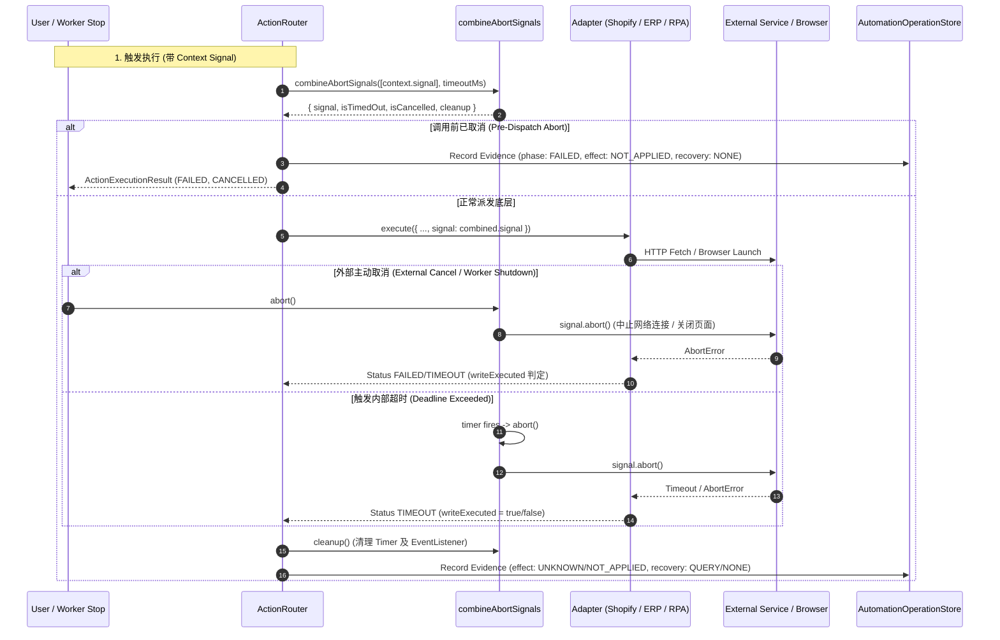

# CrossPilot Automation Runtime: Timeout, Cancellation & AbortSignal Propagation

本文档定义 CrossPilot 自动化运行时（Automation Runtime）的统一超时控制与取消信号（`AbortSignal`）传播协议。作为 Phase 2 的核心交付，本文档明确了超时、主动取消、Worker 停机等场景下的安全屏障与远端副作用判定原则。

> [!IMPORTANT]
> **核心安全公理：`TIMEOUT ≠ 确认失败`**
> 
> 在分布式及外部自动化场景中，任何有副作用的写操作一旦发送，超时仅代表**本地等待响应截止**，不代表远端未执行。
> 
> ```text
> TIMEOUT
>   → effect: UNKNOWN
>   → recovery: QUERY
>   → Worker 校验远端真实状态 (IDEMPOTENCY / GET)
>   → 确认未生效方可 RETRY；确认已生效则标记 COMPLETED；确认冲突或无法判定则进入 MANUAL / NEEDS_ATTENTION
> ```
> 任何可能产生外部副作用的写操作，超时后**严禁直接重放**。

---

## 一、统一超时配置表

系统所有 HTTP 请求、ActionRouter 调度、远端验证及 Playwright 页面导航均遵循统一配置源：

| 配置项 | 环境变量名 | 默认值 | 允许边界 | 适用范围 | 保护说明 |
| :--- | :--- | :--- | :--- | :--- | :--- |
| **HTTP 请求超时** | `AUTOMATION_HTTP_TIMEOUT_MS` | `10,000ms` (10s) | `[100ms, 600,000ms]` | Shopify GraphQL, ERP API, OAuth Token Exchange | 防止 HTTP 连接或下游服务挂起阻塞 Node.js 进程 |
| **动作执行总超时** | `AUTOMATION_EXECUTION_TIMEOUT_MS` | `60,000ms` (60s) | `[100ms, 600,000ms]` | ActionRouter 调度全过程（包含排队、准备与底层执行） | 防止单个 Action proposal 占用 Worker 锁无法自愈 |
| **远端验证超时** | `AUTOMATION_VERIFY_TIMEOUT_MS` | `15,000ms` (15s) | `[100ms, 600,000ms]` | 写入后的 Read-Back 校验、页面状态重新检索 | 限制验证步骤时长，超时不推翻写操作已发生的事实 |
| **RPA 页面导航超时** | `AUTOMATION_RPA_NAVIGATION_TIMEOUT_MS` | `30,000ms` (30s) | `[100ms, 600,000ms]` | Playwright `page.goto`, 等待 Seller Central 关键 DOM 加载 | 适配跨国网络及高延迟页面加载场景 |

### 边界保护机制
- **负数 / 零 / 非数值 / NaN**：自动回退至系统内置默认值（如 `DEFAULT_AUTOMATION_TIMEOUT_CONFIG`）。
- **小于 100ms**：自动强制钳位至 `MIN_AUTOMATION_TIMEOUT_MS` (100ms)，避免因偶发配置错误导致请求瞬间超时。
- **大于 600,000ms (10分钟)**：自动强制钳位至 `MAX_AUTOMATION_TIMEOUT_MS` (600,000ms)，杜绝无限悬挂。

---

## 二、AbortSignal 组合与全链路传递

系统通过 `combineAbortSignals(signals, timeoutMs)` 提供统一且无内存泄漏的信号组合器，支持同时聚合来自调用方（用户主动 Cancel）、Worker 进程停机（`WorkerService.stop()`）以及内部超时计时器的多源中断。

### 信号流转时序图



---

## 三、超时与取消安全矩阵 (Safety Matrix)

不同执行阶段遇到超时或主动取消时，对系统状态、副作用及恢复决策有严格的强约束：

| 执行阶段 (Execution Phase) | 触发原因 (Trigger) | 证据状态 (Phase) | 外部副作用 (Effect) | 恢复策略 (Recovery) | 核心安全约束 |
| :--- | :--- | :--- | :--- | :--- | :--- |
| **Pre-Write (写前阶段)**<br>• 参数校验<br>• 页面导航<br>• 查找 SKU / 表单定位 | **主动取消 (Cancel)** | `FAILED` | `NOT_APPLIED` | `NONE` | 明确未对外部发出任何写操作，无需 Worker 介入补偿，允许用户重新发起。 |
| **Pre-Write (写前阶段)**<br>• 页面导航超时<br>• 查找元素超时 | **超时 (Timeout)** | `FAILED` | `NOT_APPLIED` | `RETRY` (幂等只读步骤) 或 `MANUAL` | 仅定位与查询超时，未触发写操作。 |
| **In-Flight (网络传输中)**<br>• ERP POST 采购单<br>• Shopify GraphQL 提交 | **超时 (Timeout)** | `SUBMITTED` | `UNKNOWN` | **`QUERY`** | **严禁直接 RETRY**。数据可能已达远端但响应断开，必须由 Recovery Worker 凭 IdempotencyKey 查询远端确认。 |
| **In-Flight (网络传输中)** | **主动取消 (Cancel)** | `SUBMITTED` | `UNKNOWN` | **`QUERY`** | 连接可能已被远端接收，外部已处于不确定状态，必须走 Query 查证。 |
| **Post-Write (写后阶段)**<br>• Playwright 已点击 Save<br>• HTTP 已返回 200 但落库失败 | **超时 / 取消** | `SUBMITTED` | `UNKNOWN` | **`QUERY`** | 严禁当做 `NOT_APPLIED`。Save 按钮已触发，远端已开始持久化。 |
| **Post-Write Verify (校验阶段)**<br>• Read-Back 校验超时 | **超时 (Timeout)** | `SUBMITTED` | `UNKNOWN` | **`QUERY`** | 写操作确已发生，仅回读未及时确认。由后台自愈比对确认。 |

---

## 四、适配器层实现细节

### 1. Shopify Adapter (`HttpShopifyGraphQLTransport` & `defaultShopifyTokenExchanger`)
- 将 `CommerceContext.signal` 与 `CommerceContext.timeoutMs` 通过 `createCombinedAbortSignal` 传递给底层 `fetch`。
- **响应体流读取超时全覆盖**：将 HTTP 状态码校验与 `await res.json()` 完整封装在 `try { ... } finally { combined.cleanup(); }` 作用域内。即使 HTTP Response Header 正常到达，若后续 response body 流式传输卡死或中断，`combined.signal` 的超时定时器依然生效，杜绝流读取无限挂起。
- **嵌套分页流透传 (Phase 2.1)**：`fetchAllVariants`, `fetchAllOrderLineItems`, `fetchAllInventoryLevels` 等分页聚合工具函数全面接受 `options?: ShopifyGraphQLRequestOptions`，并将 `signal` 与 `timeoutMs` 贯穿传递至每一次 GraphQL 请求中。任一页发生外部取消或超时，即刻终止后续网络请求并抛出强类型错误。
- 区分捕获错误：
  - `isTimedOut()` 或 `TimeoutError` $\rightarrow$ `CommercePortError('TIMEOUT', ..., retryable: false)`。
  - `isCancelled()` 或 `AbortError` $\rightarrow$ `CommercePortError('CANCELLED', ..., retryable: false)`。
  - 无论何时，`TIMEOUT` 与 `CANCELLED` 的 `retryable` 必须严格为 `false`。

### 2. ERP Adapter (`HttpERPAdapter`)
- 所有请求统一包裹在 `createCombinedAbortSignal` 中。
- 支持依赖注入 `fetchFn`，便于沙箱测试与隔离。
- 请求超时输出强类型：
  - `errorCode: 'TIMEOUT'`
  - `normalizedError: { class: 'TIMEOUT', code: 'TIMEOUT', retryable: false }`
- 外部取消输出强类型：
  - `errorCode: 'TIMEOUT'`
  - `normalizedError: { class: 'TIMEOUT', code: 'CANCELLED', retryable: false }`

### 3. Playwright RPA Adapter (`PlaywrightRpaAdapter` & `ListingUpdateWorkflow`)
- **Pre-flight 检查**：在启动浏览器前率先检查 `signal.aborted`，若已取消则立即退出并标注 `writeExecuted: false`。
- **阶段性协作检查**：在打开页面后、查找 SKU 后、填表前、以及**点击 Save 按钮正前方**，均显式调用 `signal.throwIfAborted()`。
- **页面级 Abort 监听器 (Phase 2.1)**：在页面创建后，主动向 `params.signal` 注册 `onAbort = () => { page?.close().catch(() => {}); }` 事件监听器，当外部取消发生时主动关闭 Page，强行打断底层正在阻塞等待的 Chromium CDP 调用（如长导航、元素等待等），并在 `finally` 阶段可靠执行 `removeEventListener` 防止内存泄漏。
- **写标志位锁死**：一旦点击 Save，`writeExecuted = true` 立即置位。此后任何异常（包括回读验证超时）均禁止回退为 `NOT_APPLIED`。
- **自动资源回收**：在 `finally` 块中确保 `browser.close()`，杜绝孤儿 Chromium 进程占用服务器内存。

### 4. Background Worker (`WorkerService` & `processAutomationRecovery`)
- `WorkerService` 维护统一生命周期 `shutdownController = new AbortController()`。
- **重启生命周期重置 (Phase 2.1)**：在 `WorkerService.start()` 中检测 `shutdownController.signal.aborted`，若此前经历过 `stop()`，自动重置为全新的 `AbortController` 实例，确保服务重启后新任务不会被误判为中止。
- 在 `stop()` 触发时执行 `shutdownController.abort()`，向正在进行的自愈循环广播停机信号。
- `processAutomationRecovery` 在每轮处理前检查 `options.signal?.aborted`，并把信号透传给 `getPurchaseOrder` 和 `createPurchaseOrder`，确保优雅停机。

### 5. ActionRouter 副作用防线 (Phase 2.1)
- **派发前已中止**：在调用 `adapter.execute(...)` 之前如果 `combined.signal.aborted` 已为 true，证据安全记录为 `effect: 'NOT_APPLIED'`，`recovery: 'NONE'`。
- **派发后异常与三方抛错**：一旦进入 `await adapter.execute(...)` 派发执行，任何捕获的 `AbortError` / `TimeoutError` 或未受信第三方异常，除非异常对象明确证明未写（`err?.writeExecuted === false || err?.output?.writeExecuted === false`），否则严格定性为：
  - `effect: 'UNKNOWN'`
  - `recovery: adapter.getStatus ? 'QUERY' : 'MANUAL'`
  杜绝任何未经验证将进行中或已发出的写操作误判为 `NOT_APPLIED` 的安全漏洞。

---

## 五、已知限制与后续演进 (Limitations & Future Roadmap)

1. **不支持 Idempotency-Key 的三方平台**：
   - 现阶段若外部三方接口既不支持幂等键，又不提供反查订单状态的 API，超时后将安全降级为 `recovery: MANUAL`，转由人工介入核实，杜绝资金双花。
2. **Playwright 极端崩溃 (Page Crash / OOM)**：
   - 若 Chromium 进程在 Save 触发瞬间遭系统 OOM Killer 杀掉，`writeExecuted` 依据触发前时间戳与 Save 执行状态保守判定为 `UNKNOWN`，引导进入 Query 校验。
3. **Phase 3 演进衔接**：
   - Phase 3 将在此链路中注入标准结构化追踪：`traceId`, `operationId`, `spanId`, `attempt`, `timeoutMs`, `abortReason`，实现全链路链路指标与日志可观测性。

